# Mecánica del Continuo — Apunte integrado de estudio
## Unidades 3 a 10: el curso completo

> **Cómo usar este apunte:** cada desarrollo matemático va acompañado de su lectura física inmediata. Los bloques marcados 💡 son la interpretación ("qué significa esto"), los marcados ⚠️ son trampas conceptuales típicas de parcial, y los marcados 🔗 son conexiones entre unidades. La matemática sin el bloque 💡 es solo álgebra; el bloque 💡 sin la matemática es solo verso. Estudiá los dos juntos.

---

# UNIDAD 3 — TENSIONES

## 3.0 El problema que organiza la unidad

Hasta acá (U1-U2) el continuo era geometría pura: vectores, tensores, sistemas de referencia. Ahora entra la física de "qué le pasa a un cuerpo cuando algo lo toca": cómo una parte del material empuja o tira de la parte vecina. La apuesta central, que hace posible tratar un continuo (infinitas partículas) sin la complejidad de la mecánica de partículas discretas: la interacción entre el "adentro" y el "afuera" de una superficie imaginaria, en el límite, **solo puede depender del área y de la normal** de esa superficie — no de su forma ni de su tamaño. Esa apuesta es el **postulado de Cauchy**, y todo el capítulo es sacarle el jugo.

## 3.1 Dos tipos de fuerza

- **Fuerzas de cuerpo** $\mathbf X$ (por unidad de volumen): acciones a distancia — gravedad, electromagnetismo, centrífuga. Fuerza total sobre una porción $B$: $\int_B \mathbf X\,dV$.
- **Fuerzas de superficie**: acciones de contacto, a través de una superficie $S$. Se definen por unidad de área.

💡 Esta dicotomía volumen/superficie es la misma que organiza **todas** las leyes de balance de U9-U10: cada una tiene su término de volumen (fuente, inercia) y su término de superficie (flujo, tracción), y el teorema de Gauss es la máquina que convierte uno en el otro. 🔗 Acá nace la distinción que ese bloque entero explota.

## 3.2 El vector de tensión y el principio de Cauchy

**Postulado de Euler-Cauchy:** cuando $\Delta S\to 0$ alrededor de un punto, el cociente $\Delta\mathbf F/\Delta S$ tiende a un límite que depende del punto $\mathbf x$ y de la normal $\boldsymbol\nu$ — no de la forma de $\Delta S$:

$$\boxed{\overset{\nu}{\mathbf T}(\mathbf x) = \lim_{\Delta S\to 0}\frac{\Delta\mathbf F}{\Delta S}}$$

Se la llama **tracción de superficie** o **vector de tensión**. Segunda hipótesis: el momento de $\Delta\mathbf F$ en torno a cualquier punto de $\Delta S$ se anula en el límite (sin esto aparecerían "tensiones de par", modelos más exóticos que un continuo clásico no necesita).

💡 La hipótesis fuerte acá no es que "exista tensión": es que el vector de tensión **no depende de la forma de la superficie**, solo de su normal. Eso es lo que permite reducir las infinitas superficies posibles por un punto a una función de un solo vector $\boldsymbol\nu$.

## 3.3 Notación: tensiones normales y de corte

Se ordenan las tracciones sobre las 3 caras coordenadas en una matriz $\tau_{ij}$ (o $\sigma_{ij}$): el primer índice indica la cara (normal según $x_i$), el segundo la dirección de la componente. Diagonal = **tensiones normales** ($\tau_{ii}>0$ tracción, $<0$ compresión); fuera de diagonal = **tensiones de corte**.

## 3.4 Fórmula de Cauchy (la fórmula fundamental del capítulo)

Con un tetraedro diferencial (3 caras coordenadas + una cara oblicua de normal $\boldsymbol\nu$), planteando equilibrio de fuerzas y achicando el tetraedro a un punto ($h\to0$: las fuerzas de cuerpo, que van con el volumen, se anulan antes que las de superficie):

$$\boxed{T_i = \tau_{ji}\,\nu_j} \qquad \textbf{(fórmula de Cauchy)}$$

💡 Esto es lo importante: **9 números ($\tau_{ji}$) alcanzan para calcular la tracción en *cualquier* dirección posible** por ese punto — infinitas superficies, un solo objeto. Como $T_i$ es un vector y la fórmula vale para $\boldsymbol\nu$ arbitrario, $\tau_{ji}$ son las componentes de un **tensor**: el **tensor de tensiones**.

🔗 Esta fórmula reaparece sin cambios en U9-U10 como el paso "Cauchy + Gauss" de cada demostración de balance (momento lineal → ecuación de Cauchy; momento angular → simetría de σ) — ahí se la da por conocida y se la usa directo.

Corolario inmediato (pastilla de espesor $\to0$ apoyada sobre una superficie interna): $\overset{\nu(-)}{\mathbf T} = -\overset{\nu(+)}{\mathbf T}$ — acción y reacción, punto a punto: la versión continua de la 3ª ley de Newton.

## 3.5 Ecuaciones de equilibrio: traslación y rotación

Planteando equilibrio de **fuerzas** sobre un cubo diferencial (Taylor a primer orden en cada cara):

$$\boxed{\tau_{ji,j} + X_i = 0} \qquad \text{(equilibrio en traslación)}$$

Planteando equilibrio de **momentos** sobre el mismo cubo:

$$\boxed{\tau_{ij} = \tau_{ji}} \qquad \text{(equilibrio en rotación} \Rightarrow \text{el tensor de tensiones es simétrico)}$$

💡 6 componentes independientes, no 9.

🔗 Esta demostración —equilibrio de momentos en un diferencial de volumen— es el caso **estático** de la demostración de balance de momento angular de U9-U10 (§2.3 de ese apunte): allá se repite el mismo argumento pero con inercia ($\rho D\mathbf v/Dt \neq 0$ en vez de equilibrio puro) y con una integral sobre un volumen arbitrario en vez de un diferencial. Si esta demo te sale de memoria, esa otra te sale casi gratis.

🔗 Y $\tau_{ji,j}+X_i=0$ es literalmente el caso $\rho D\mathbf v/Dt = 0$ de la ecuación de Cauchy dinámica de U9-U10 ($\rho Dv_i/Dt = \sigma_{ji,j}+X_i$): la misma cuenta (equilibrio de fuerzas en un cubo diferencial), solo que allá el cubo se mueve y acá está quieto.

## 3.6 Transformación de coordenadas

Bajo una rotación de ejes ($\beta_{ki}$ = cosenos directores de los nuevos ejes respecto de los viejos), el tensor de tensiones transforma como todo tensor de rango 2:

$$\boxed{\tau'_{km} = \tau_{ji}\,\beta_{kj}\,\beta_{mi}}$$

🔗 Es exactamente la misma ley que usa U5 para rotar $\varepsilon$, U6 para $V$, y que U8 explota para *definir* isotropía ("tensor isótropo = el que no cambia bajo esta transformación, para todo $\beta$"). La demostración del teorema de isotropía de U8 es, literalmente, aplicar esta fórmula con rotaciones especiales (180°, 90°) y ver qué sobrevive.

## 3.7 Condiciones de borde en tensiones

En la interfaz entre dos medios, el vector de tensión debe equilibrarse: $\overset{\nu}{\mathbf T}^{(1)} = -\overset{\nu}{\mathbf T}^{(2)}$. Las componentes que "atraviesan" la superficie (normal y las de corte alineadas con ella) son continuas; la componente paralela a la superficie **puede ser discontinua** (⚠️ trampa típica: asumir que todo $\sigma$ es continuo en una interfaz). Caso límite de frontera libre (contacto con un medio mucho más blando, ej. acero-aire): $\overset{\nu}{\mathbf T}=\mathbf 0$.

🔗 Esta es exactamente la condición de borde natural $\Gamma_\sigma$ de todo el bloque variacional de U9-U10 (sección 4 de ese apunte): "$\sigma_{ij}n_j=\overset{n}{T}_i$ en $\Gamma_\sigma$" no es un dato nuevo ahí — es esta misma ecuación, con el lado "(2)" reemplazado por el valor de tracción prescripto.

## 📝 Cómo cae la U3 en el parcial

- Rara vez se pregunta sola: aparece **adentro** de casi todos los ejercicios de tensión (Airy, verificación de un $\sigma$ propuesto, demostraciones de U9-U10) como el paso "plantear equilibrio $\tau_{ji,j}+X_i=0$" o "usar Cauchy $T_i=\tau_{ji}\nu_j$", sin que el enunciado lo repita.
- Teóricas: derivar la fórmula de Cauchy (tetraedro), derivar la simetría de σ (cubo, equilibrio de momentos), condición de borde libre vs. interfaz entre medios.

---

# UNIDAD 4 — TENSIONES Y DIRECCIONES PRINCIPALES

## 4.0 El problema

U3 dejó 9 (6 independientes) números por punto. La pregunta de U4: ¿hay una orientación especial de los ejes en la que ese lío de 6 números se simplifique al máximo? Sí — y la respuesta es un **problema de autovalores**, el mismo problema que va a reaparecer, casi sin cambiar una letra, para $\varepsilon$ en U5 y para $V$ en U6.

## 4.1 Estado plano: rotación y extremos

Rotando ejes un ángulo $\theta$ en el plano:

$$\sigma'_{xx} = \frac{\sigma_{xx}+\sigma_{yy}}{2} + \frac{\sigma_{xx}-\sigma_{yy}}{2}\cos2\theta + \sigma_{xy}\sin2\theta \qquad (\text{y análogas para }\sigma'_{yy},\ \sigma'_{xy})$$

💡 Invariante inmediato, sin necesidad de resolver nada: $\sigma'_{xx}+\sigma'_{yy}=\sigma_{xx}+\sigma_{yy}$ — la traza no rota (primer invariante, antes de que la sección siguiente lo nombre formalmente).

Pidiendo $\partial\sigma'_{xx}/\partial\theta=0$ sale $\tan2\theta^*=\dfrac{2\sigma_{xy}}{\sigma_{xx}-\sigma_{yy}}$: el ángulo de los **ejes principales**, donde el corte se anula y las normales toman sus valores extremos:

$$\boxed{\sigma_{\substack{\max\\\min}} = \frac{\sigma_{xx}+\sigma_{yy}}{2} \pm \sqrt{\left(\frac{\sigma_{xx}-\sigma_{yy}}{2}\right)^2+\sigma_{xy}^2}}$$

El corte máximo ocurre a $45°$ de los ejes principales ($\theta^{**}=\theta^*+45°$) y vale $\tau_{\max}=(\sigma_{\max}-\sigma_{\min})/2$, con las normales asociadas iguales al promedio $(\sigma_{xx}+\sigma_{yy})/2$.

💡 Esto **es** el Círculo de Mohr — acá se llega por cálculo directo (derivar e igualar a cero) en vez de geométricamente, mismo resultado.

## 4.2 Tensiones principales en 3D: el problema de autovalores

Se busca una dirección $\boldsymbol\nu$ tal que $\overset{\nu}{\mathbf T}$ sea **paralelo** a $\boldsymbol\nu$ (sin componente de corte):

$$T_i = \sigma\,\nu_i \quad\text{y}\quad T_i=\sigma_{ji}\nu_j \quad\Longrightarrow\quad \boxed{(\sigma_{ji}-\sigma\delta_{ji})\,\nu_j = 0}$$

Solución no trivial $\iff \det(\sigma_{ji}-\sigma\delta_{ji})=0$: ecuación cúbica (**ecuación característica**)

$$-\sigma^3 + I_1\sigma^2 - I_2\sigma + I_3 = 0, \qquad I_1=\mathrm{tr}\,\sigma,\quad I_2 = \text{(suma de menores)},\quad I_3=\det\sigma$$

$I_1,I_2,I_3$ son los **invariantes principales**: no cambian con la rotación de ejes (son los coeficientes de un polinomio que no depende de en qué base escribiste la matriz — por eso *tienen* que ser invariantes). Sus 3 raíces $\sigma_K$ son las **tensiones principales**; los autovectores $\boldsymbol\nu^{(K)}$ asociados, los **ejes principales**.

**Por qué son reales y ortogonales** (demostración corta, conviene tenerla a mano): de $(\sigma_{ji}-\sigma_1\delta_{ji})\nu_j^{(1)}=0$ y su análoga con $\sigma_2$, restando y usando $\sigma_{ij}=\sigma_{ji}$ (🔗 la simetría de U3 — sin ella esto no cierra) se llega a $(\sigma_2-\sigma_1)\,\boldsymbol\nu^{(1)}\cdot\boldsymbol\nu^{(2)}=0$. Si los autovalores son distintos, los autovectores son ortogonales. Si $\sigma_1$ fuera compleja, su conjugada $\sigma_2=\bar\sigma_1$ también sería autovalor con autovector conjugado, y $\boldsymbol\nu^{(1)}\cdot\boldsymbol\nu^{(2)}=\boldsymbol\nu^{(1)}\cdot\overline{\boldsymbol\nu^{(1)}}>0$ haría imposible satisfacer la identidad — de ahí que los autovalores de un tensor simétrico son necesariamente reales.

En la base principal, $\sigma$ es diagonal: $\mathrm{diag}(\sigma_1,\sigma_2,\sigma_3)$, con $I_1=\sigma_1+\sigma_2+\sigma_3$, $I_2=\sigma_1\sigma_2+\sigma_2\sigma_3+\sigma_3\sigma_1$, $I_3=\sigma_1\sigma_2\sigma_3$.

💡 **Este problema —autovalor/autovector de un tensor simétrico de rango 2— es un solo problema matemático que U4 resuelve una vez, y que se reutiliza sin repetir la demostración para:** deformaciones y direcciones principales de $\varepsilon$ y $E$ (U5, sección 5.8), y direcciones principales de $V$ (U6). 🔗 Cuando U5 hable de "deformaciones principales, desviador e invariantes" sin volver a demostrar nada, es porque ya está probado acá.

## 4.3 Tensión normal, tangencial, y el desviador

Sobre un plano de normal $\boldsymbol\nu$ arbitraria: $\overset{\nu}{\mathbf T} = \sigma^{(n)}\boldsymbol\nu + \boldsymbol\tau$, con $\sigma^{(n)}=\sigma_{ji}\nu_j\nu_i$ (tensión normal) y $\tau=\sqrt{|\overset{\nu}{\mathbf T}|^2-(\sigma^{(n)})^2}$ (tensión de corte).

**Desviador de tensión:** $\sigma'_{ij} = \sigma_{ij} - \sigma_0\delta_{ij}$, con $\sigma_0=\tfrac13\mathrm{tr}\,\sigma=\tfrac13 I_1$ la **tensión media** (parte hidrostática/esférica). Por construcción $\sigma'_{ii}=0$: el desviador no tiene parte esférica. Invariantes propios $J_1=0$, $J_2=\tfrac12\sigma'_{ij}\sigma'_{ij}$, $J_3=\det\sigma'$; sus autovalores son $\sigma'_K=\sigma_K-\sigma_0$, con los mismos autovectores que $\sigma$.

💡🔗 **Esta es la separación tamaño/forma que organiza medio apunte.** U4 la introduce para la tensión — antes de que U5 introduzca la misma construcción (mismo nombre, "desviador") para la deformación, y antes de que U7 la use como "la clave del capítulo" para partir Hooke en dos leyes desacopladas: $K$ para $\sigma_0\leftrightarrow\varepsilon_0$, $2\mu$ para $\sigma'\leftrightarrow\varepsilon'$ (ver [`U7/fig_vol_desviador.png`](U7/fig_vol_desviador.png)). No es una idea nueva en cada unidad: es la misma descomposición (esférico + desviador), aplicada en orden a la tensión (U4), a la deformación (U5), y a la ley que las conecta (U7).

## 📝 Cómo cae la U4 en el parcial

- **Tipo clásico**: dado $\sigma_{ij}$, hallar tensiones y direcciones principales (autovalores/autovectores 3×3, o el atajo 2D directo si es estado plano).
- Teóricas: por qué los autovalores de un tensor simétrico son reales y sus autovectores ortogonales (demo corta de 4.2); qué es el desviador y por qué su traza es nula; relación entre ejes principales y de máximo corte ($45°$).
- 🔗 Reconocé cuándo un ejercicio de U5/U6 ("hallar deformaciones principales de $\varepsilon$") es **literalmente este mismo problema**, con otra letra en vez de $\sigma$.

---

# UNIDAD 5 — DEFORMACIONES

## 5.0 El problema que organiza toda la unidad

Un cuerpo puede moverse mucho sin deformarse (trasladarse, rotar). Hooke: *ut tensio sic vis* — la tensión responde a la deformación, no al movimiento. Necesitamos una medida que sea:

1. **Ciega al movimiento de cuerpo rígido** (dé cero exacto),
2. **Sensible al cambio de forma y tamaño**.

Lo único que un movimiento rígido preserva son las **distancias entre puntos**. Por lo tanto, la medida de deformación se construye sobre el cambio de distancias entre puntos vecinos: $ds^2 - ds_0^2$. Esta elección no es conveniencia: **es la definición misma de deformar**.

---

## 5.1 Medidas simples (caso 1D)

Cuerda de longitud inicial $L_0$, longitud actual $L$.

**Relación de estiramiento:**
$$\lambda = \frac{L}{L_0}, \qquad \lambda = 1 \iff \text{sin deformar}$$

**Medidas simples** (adimensionales, nulas sin deformación):

$$\epsilon = \frac{L-L_0}{L_0} \quad \text{(ref. inicial)}, \qquad \epsilon' = \frac{L-L_0}{L} \quad \text{(ref. actual)}$$

**Medidas cuadráticas** (las que generalizan a 3D):

$$\varepsilon = \frac{1}{2}\left(\frac{L^2-L_0^2}{L_0^2}\right) \quad \text{(→ Green-Lagrange)}, \qquad e = \frac{1}{2}\left(\frac{L^2-L_0^2}{L^2}\right) \quad \text{(→ Almansi)}$$

**Ejemplo numérico clave (memorizalo, es la moraleja del capítulo):**

| | $L=2,\ L_0=1$ | $L=1{,}01,\ L_0=1$ |
|---|---|---|
| $\epsilon$ | $1$ | $0{,}01$ |
| $\epsilon'$ | $1/2$ | $0{,}01$ |
| $\varepsilon$ | $3/2$ | $0{,}01$ |
| $e$ | $3/8$ | $0{,}01$ |

💡 **Interpretación:** para deformaciones grandes las medidas son *preguntas distintas* con respuestas distintas ("¿cuánto te estiraste respecto de lo que eras?" vs "…respecto de lo que sos?"). Para deformaciones pequeñas **todas coinciden**: la distinción Lagrange/Euler desaparece. Todo el régimen infinitesimal descansa en este hecho.

---

## 5.2 Campo de desplazamientos

Configuración inicial $B_0$ (coordenadas materiales $a_i$), configuración deformada $B$ (coordenadas espaciales $x_i$). Transformación continua, 1-a-1, con inversa:

$$x_i = x_i(a_1,a_2,a_3) \qquad \Longleftrightarrow \qquad a_i = a_i(x_1,x_2,x_3)$$

**Desplazamiento:**
$$u_i = x_i - a_i$$

- **Visión Lagrangiana** (sigo a la partícula): $u_i(a_1,a_2,a_3) = x_i(a_1,a_2,a_3) - a_i$
- **Visión Euleriana** (miro el punto del espacio): $u_i(x_1,x_2,x_3) = x_i - a_i(x_1,x_2,x_3)$

💡 La hipótesis "cambio de configuración continuo, sin agujeros" parece decorativa pero es la que garantiza que la transformación tenga inversa, y reaparecerá en la Unidad 6 como **compatibilidad**: Saint-Venant es la versión matemática de "sin agujeros" cuando vas en el sentido inverso ($\varepsilon \to u$).

⚠️ **Los desplazamientos NO se relacionan con la tensión.** Rotá una barra 90°: $u$ enorme, tensión cero. El desplazamiento es información cruda; la deformación es la parte de esa información que el material "siente".

---

## 5.3 Tensor de Green-Lagrange (visión Lagrangiana)

**Paso 1.** Puntos vecinos $P(a_i)$ y $P'(a_i + da_i)$ en $B_0$; sus imágenes $Q(x_i)$, $Q'(x_i+dx_i)$ en $B$. Longitudes:

$$ds_0^2 = da_i\, da_i, \qquad ds^2 = dx_i\, dx_i$$

**Paso 2.** Regla de la cadena (todo en función de $a$):

$$dx_i = \frac{\partial x_i}{\partial a_j}\, da_j \quad \Longrightarrow \quad ds^2 = \frac{\partial x_\alpha}{\partial a_i}\frac{\partial x_\alpha}{\partial a_j}\, da_i\, da_j$$

**Paso 3.** Diferencia de longitudes:

$$ds^2 - ds_0^2 = \left(\frac{\partial x_\alpha}{\partial a_i}\frac{\partial x_\alpha}{\partial a_j} - \delta_{ij}\right) da_i\, da_j$$

**Paso 4.** Definición:

$$\boxed{E_{ij}(a_1,a_2,a_3) = \frac{1}{2}\left(\frac{\partial x_\alpha}{\partial a_i}\frac{\partial x_\alpha}{\partial a_j} - \delta_{ij}\right)} \qquad \Longrightarrow \qquad ds^2 - ds_0^2 = 2E_{ij}\, da_i\, da_j$$

**En función de desplazamientos:** con $x_\alpha = a_\alpha + u_\alpha$, es $\partial x_\alpha/\partial a_k = \delta_{\alpha k} + \partial u_\alpha/\partial a_k$. Sustituyendo y expandiendo el producto:

$$\boxed{E_{ij} = \frac{1}{2}\left[\frac{\partial u_i}{\partial a_j} + \frac{\partial u_j}{\partial a_i} + \frac{\partial u_\alpha}{\partial a_i}\frac{\partial u_\alpha}{\partial a_j}\right]}$$

💡 **El término cuadrático no es decoración:** es exactamente lo que hace que $E$ dé cero ante rotaciones *finitas* de cuerpo rígido. Si lo tachás, perdés esa propiedad.

## 5.4 Tensor de Almansi (visión Euleriana)

Mismo esquema con los roles invertidos ($da_i = \frac{\partial a_i}{\partial x_j}dx_j$, todo en función de $x$):

$$\boxed{e_{ij}(x_1,x_2,x_3) = \frac{1}{2}\left(\delta_{ij} - \frac{\partial a_\alpha}{\partial x_i}\frac{\partial a_\alpha}{\partial x_j}\right)} \qquad \Longrightarrow \qquad ds^2 - ds_0^2 = 2e_{ij}\, dx_i\, dx_j$$

Con $a_\alpha = x_\alpha - u_\alpha$:

$$\boxed{e_{ij} = \frac{1}{2}\left[\frac{\partial u_i}{\partial x_j} + \frac{\partial u_j}{\partial x_i} - \frac{\partial u_\alpha}{\partial x_i}\frac{\partial u_\alpha}{\partial x_j}\right]}$$

⚠️ La única diferencia formal con Green-Lagrange: derivadas respecto de $x$ (no $a$) y **signo menos** en el término cuadrático.

**Verificación de diseño (movimiento rígido):** $ds^2 - ds_0^2 = 0$ para todo par de puntos $\Longrightarrow E_{ij} = 0\ \forall\, \mathbf{a}\in B_0$ y $e_{ij}=0\ \forall\, \mathbf{x}\in B$. ✔ Los tensores cumplen su especificación.

---

## 5.5 Deformaciones infinitesimales

**Hipótesis:** las componentes del gradiente de desplazamiento son pequeñas:

$$\left|\frac{\partial u_i}{\partial a_j}\right| \ll 1, \qquad \left|\frac{\partial u_i}{\partial x_j}\right| \ll 1$$

Entonces los términos cuadráticos son despreciables frente a los lineales, y además $\partial/\partial a \simeq \partial/\partial x$ (evaluar en la configuración inicial o final da lo mismo). Resulta:

$$\boxed{e_{ij} \simeq E_{ij} \simeq \varepsilon_{ij} = \frac{1}{2}\left(\frac{\partial u_i}{\partial x_j} + \frac{\partial u_j}{\partial x_i}\right)} \qquad \text{tensor de deformaciones infinitesimales de Cauchy}$$

⚠️ **Trampa clásica:** la condición es sobre el **gradiente completo** de $u$, que contiene deformación *y rotación*. La teoría infinitesimal exige deformaciones **y rotaciones** pequeñas. Una rotación rígida grande le produce a $\varepsilon$ "deformación" espuria (el término cuadrático que la cancelaba fue tachado).

**Notación extendida:**

$$\varepsilon_{xx} = \frac{\partial u}{\partial x}, \quad \varepsilon_{yy} = \frac{\partial v}{\partial y}, \quad \varepsilon_{zz} = \frac{\partial w}{\partial z}$$

$$\varepsilon_{xy} = \frac{1}{2}\left(\frac{\partial u}{\partial y}+\frac{\partial v}{\partial x}\right), \quad \varepsilon_{yz} = \frac{1}{2}\left(\frac{\partial v}{\partial z}+\frac{\partial w}{\partial y}\right), \quad \varepsilon_{zx} = \frac{1}{2}\left(\frac{\partial w}{\partial x}+\frac{\partial u}{\partial z}\right)$$

**Deformaciones ingenieriles:** $\gamma_{xy} = 2\varepsilon_{xy}$, etc.

⚠️ Las $\gamma$ **no son componentes de un tensor**: el factor 2 rompe la ley de transformación $\varepsilon' = \beta\,\varepsilon\,\beta^T$. Con $\varepsilon$ podés rotar ejes, sacar valores principales, invariantes; con $\gamma$ no. El $\tfrac{1}{2}$ de $\varepsilon_{ij}$ es el precio de que el corte viva dentro de un objeto tensorial.

---

## 5.6 Interpretación geométrica (qué mide cada componente)

**Componentes diagonales.** Fibra diferencial orientada según el eje 1: $ds_0 = da_1$. Tras deformar,

$$ds^2 = \left(1 + 2\frac{\partial u_1}{\partial a_1} + \left(\tfrac{\partial u_1}{\partial a_1}\right)^2 + \left(\tfrac{\partial u_2}{\partial a_1}\right)^2 + \left(\tfrac{\partial u_3}{\partial a_1}\right)^2\right) ds_0^2$$

$$\Longrightarrow \quad E_{11} = \mathbf{j_1}\!\cdot\!\mathbf{E}\,\mathbf{j_1} = \frac{1}{2}\frac{ds^2 - ds_0^2}{ds_0^2}$$

En el caso infinitesimal, con $ds \simeq ds_0$:

$$\frac{1}{2}\frac{ds^2-ds_0^2}{ds_0^2} = \frac{(ds+ds_0)(ds-ds_0)}{2\,ds_0^2} \simeq \frac{2\,ds_0(ds-ds_0)}{2\,ds_0^2} = \frac{ds-ds_0}{ds_0}$$

$$\boxed{\varepsilon_{11} = \frac{ds - ds_0}{ds_0} = \text{estiramiento relativo de la fibra en dirección 1}}$$

💡 Es una cantidad medible con regla. $\varepsilon_{11}=0{,}002$ = la fibra se alargó 0,2%.

**Componentes de corte.** Fibras según direcciones 1 y 2, inicialmente perpendiculares. Tras deformar, los segmentos imagen forman ángulos $\alpha \simeq \partial u_2/\partial a_1$ y $\beta \simeq \partial u_1/\partial a_2$ con sus direcciones originales. El cambio del ángulo recto:

$$\gamma = \frac{\pi}{2} - \left(\frac{\pi}{2} - \alpha - \beta\right) = \frac{\partial u_2}{\partial a_1} + \frac{\partial u_1}{\partial a_2} \qquad \Longrightarrow \qquad \boxed{\varepsilon_{12} = \frac{\gamma}{2}}$$

💡 $\varepsilon_{12}$ = **la mitad** de lo que se cerró el ángulo entre dos fibras que eran perpendiculares. Medible con transportador. El tensor es un empaquetado de mediciones geométricas concretas, no un objeto abstracto.

### 🖼️ Visualización 3D: flexión de una viga (por qué 3D importa)

Todo lo de 5.6 se verificó en un punto o en una fibra. Para verlo actuar en un **campo continuo real**, tomemos la flexión pura de una viga rectangular con el campo de desplazamientos de Saint-Venant:

$$u_x = -\kappa\,x\,y, \qquad u_y = \frac{\kappa}{2}\left(x^2+\nu y^2-\nu z^2\right), \qquad u_z = -\kappa\,\nu\,y\,z$$

con $\kappa=1/R$ la curvatura impuesta. Derivando (es un ejercicio directo, hacelo vos): $\varepsilon_{xx}=-\kappa y$, $\varepsilon_{yy}=\varepsilon_{zz}=-\nu\varepsilon_{xx}$, el resto nulo.

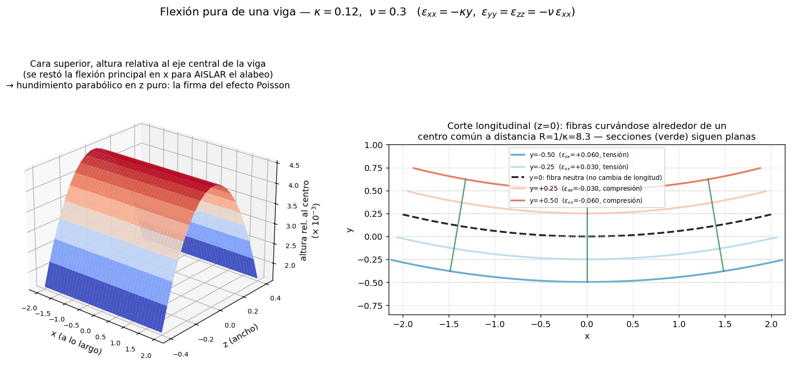

**Panel derecho** es 5.6 puro y en 2D: cada fibra horizontal se convierte en un arco alrededor de un centro común a distancia $R=1/\kappa$; la de $y=0$ (fibra neutra) no cambia de longitud; las de $y>0$ se acortan (compresión, $\varepsilon_{xx}<0$); las de $y<0$ se alargan (tensión, $\varepsilon_{xx}>0$) — literalmente $\varepsilon_{11}=(ds-ds_0)/ds_0$ de la sección 5.6, con signo, para cada altura. Las secciones verdes confirman "planas y perpendiculares a la fibra neutra se mantienen": la hipótesis clásica de vigas no es un axioma aparte, sale de este mismo campo de $u$.

**Panel izquierdo es la razón para pasar a 3D:** $\varepsilon_{yy}=\varepsilon_{zz}=-\nu\varepsilon_{xx}$ es el efecto Poisson (🔗 sección 7.3) actuando **en simultáneo en las dos direcciones transversales**, y eso es estructuralmente invisible en una teoría de vigas 2D (que solo mira el plano $x$-$y$). El resultado es que la cara superior de la viga, originalmente plana, se alabea en una **silla de montar** (curvatura anticlástica): sube en el sentido de la flexión principal, pero baja en el sentido transversal. El panel resta la tendencia dominante en $x$ para aislar justo ese efecto — lo que queda es un hundimiento parabólico puro en $z$, la firma geométrica exacta de $\varepsilon_{zz}=-\nu\varepsilon_{xx}\neq0$.

💡 **La moraleja:** el efecto Poisson no es "una corrección menor que se agrega al final" — es una consecuencia geométrica de que $\varepsilon$ es un **tensor** (actúa en todas las direcciones a la vez, sección 5.8), y solo se vuelve visible como *forma* cuando mirás las tres dimensiones juntas. En 2D, el efecto Poisson es una fórmula; en 3D, es una silla de montar que podés dibujar.

*(Generado con `U5/visualizacion_viga_flexion.py`.)*

---

## 5.7 Rotación infinitesimal: la descomposición del gradiente

Cualquier matriz = parte simétrica + parte antisimétrica. Aplicado al gradiente de $u$:

$$du_i = \frac{\partial u_i}{\partial x_j}dx_j = \underbrace{\frac{1}{2}\left(\frac{\partial u_i}{\partial x_j}+\frac{\partial u_j}{\partial x_i}\right)}_{\varepsilon_{ij}} dx_j \; - \; \underbrace{\frac{1}{2}\left(\frac{\partial u_j}{\partial x_i}-\frac{\partial u_i}{\partial x_j}\right)}_{\omega_{ij}} dx_j$$

**Tensor de rotación** $\omega_{ij}$: antisimétrico ($\omega_{ij}=-\omega_{ji}$, diagonal nula, 3 componentes independientes). **Vector dual:**

$$\omega_k = \frac{1}{2} e_{kij}\,\omega_{ij} \qquad \Longleftrightarrow \qquad \omega_{lm} = e_{lmk}\,\omega_k$$

**Verificación de que $\omega$ es una rotación:** si $\varepsilon = 0$,

$$du_i = -\omega_{ij}dx_j = e_{ikj}\,\omega_k\, dx_j = (\boldsymbol{\omega}\times d\mathbf{x})_i$$

que es exactamente el campo de desplazamientos de una rotación infinitesimal de ángulo $|\boldsymbol\omega|$ alrededor de un eje por $P$ en dirección $\boldsymbol\omega$.

💡 **El entorno de cada punto hace tres cosas a la vez:** se traslada ($u$), rota ($\omega$) y se deforma ($\varepsilon$). Solo la tercera genera tensión.

---

## 5.8 Deformaciones principales, desviador e invariantes

Como $\varepsilon$ es simétrico, todo lo del tensor de tensiones aplica:

**Valores principales:** raíces de $\left|\varepsilon_{ij} - e_k\,\delta_{ij}\right| = 0$, con direcciones $\left[\varepsilon_{ij} - e_k\delta_{ij}\right]\nu_j^{(k)} = 0$. Siempre existen 3 direcciones principales mutuamente ortogonales; en esos ejes el tensor es diagonal: $\mathrm{diag}(e_1,e_2,e_3)$.

💡 En cada punto existen tres direcciones perpendiculares que **solo se estiran, sin distorsionarse entre sí**. Todo estado de deformación es, localmente y en los ejes adecuados, tres estiramientos puros.

**La traza mide el cambio de volumen.** Cubito $dx\,dy\,dz$ alineado con los ejes:

$$V = V_0\,(1+\varepsilon_{xx})(1+\varepsilon_{yy})(1+\varepsilon_{zz}) \simeq V_0\,(1 + \varepsilon_{xx}+\varepsilon_{yy}+\varepsilon_{zz})$$

$$\boxed{\frac{\Delta V}{V_0} = \varepsilon_{kk} = \mathrm{tr}(\boldsymbol\varepsilon) = I_1}$$

💡 Los cortes no aparecen: a primer orden, cizallar no cambia volumen (el rombo tiene el área del cuadrado). Y $I_1$ es **invariante** porque el volumen es una propiedad física real que no puede depender de tus ejes.

**Tensor desviador:**

$$\varepsilon'_{ij} = \varepsilon_{ij} - \frac{1}{3}\varepsilon_{kk}\,\delta_{ij} \qquad \Longrightarrow \qquad J_1 = \varepsilon'_{kk} = \varepsilon_{kk} - \frac{1}{3}\varepsilon_{kk}\underbrace{\delta_{kk}}_{=3} = 0 \;\; \text{(por diseño)}$$

**La descomposición fundamental:**

$$\boxed{\varepsilon_{ij} = \underbrace{\tfrac{1}{3}\varepsilon_{kk}\,\delta_{ij}}_{\text{volumétrica: cambia tamaño, no forma}} + \underbrace{\varepsilon'_{ij}}_{\text{desviador: cambia forma, no tamaño}}}$$

💡 Esfera → esfera más grande (volumétrica) vs. esfera → elipsoide del mismo volumen (desviador). Los materiales responden **por separado** a cada parte: es la anatomía del tensor en los dos modos que la física distingue. 🔗 Esta descomposición es la clave de lectura de la ley de Hooke (U7) y de la incompresibilidad (U6).

**Invariantes:** $I_1 = \varepsilon_{kk}$, $I_2$, $I_3$ para $\varepsilon$; $J_1 = 0$, $J_2$, $J_3$ para $\varepsilon'$. Son los números "de verdad" del estado, independientes del sistema de ejes ($J_2$ reaparece en plasticidad: criterio de von Mises).

---

## 5.9 Coordenadas polares

**Transformación de componentes** (vale para cualquier tensor de rango 2):

$$\boldsymbol\varepsilon' = \boldsymbol\beta\, \boldsymbol\varepsilon\, \boldsymbol\beta^T, \qquad \boldsymbol\beta = \begin{bmatrix}\cos\theta & \sin\theta & 0\\ -\sin\theta & \cos\theta & 0\\ 0&0&1\end{bmatrix}$$

**Deformaciones en función de los desplazamientos polares** — resultado final (el desarrollo pasa por: $\mathbf{u} = \boldsymbol\beta^T\mathbf{u}'$, regla de la cadena $\partial_x = \cos\theta\,\partial_r - \tfrac{\sin\theta}{r}\partial_\theta$, etc.):

$$\boxed{\begin{aligned}
\varepsilon_{rr} &= \frac{\partial u_r}{\partial r} & \varepsilon_{r\theta} &= \frac{1}{2}\left(\frac{1}{r}\frac{\partial u_r}{\partial\theta} + \frac{\partial u_\theta}{\partial r} - \frac{u_\theta}{r}\right)\\
\varepsilon_{\theta\theta} &= \frac{u_r}{r} + \frac{1}{r}\frac{\partial u_\theta}{\partial\theta} & \varepsilon_{rz} &= \frac{1}{2}\left(\frac{\partial u_r}{\partial z} + \frac{\partial u_z}{\partial r}\right)\\
\varepsilon_{zz} &= \frac{\partial u_z}{\partial z} & \varepsilon_{\theta z} &= \frac{1}{2}\left(\frac{1}{r}\frac{\partial u_z}{\partial\theta} + \frac{\partial u_\theta}{\partial z}\right)
\end{aligned}}$$

💡 **¿Por qué aparecen términos "raros" como $u_r/r$?** Porque los versores polares cambian de dirección punto a punto: derivar componentes ya no es directo. El término $u_r/r$ en $\varepsilon_{\theta\theta}$ tiene lectura física limpia: un anillo que se expande radialmente ($u_r$ uniforme, $u_\theta = 0$) pasa de perímetro $2\pi r$ a $2\pi(r+u_r)$ — **se estiró circunferencialmente aunque nadie se movió "en θ"**: $\varepsilon_{\theta\theta} = u_r/r$.

## 📝 Cómo cae la U5 en el parcial

- **Fibra que cambia de longitud con ε uniforme** (cae SIEMPRE): la interpretación geométrica 5.6 generalizada, $\Delta L = L_0\,(\mathbf{n}\cdot\boldsymbol\varepsilon\,\mathbf{n})$ → **resolución en II.2**.
- **Green-Lagrange/Almansi de una deformación homogénea leída de figura**: construir F con aristas, $E = \tfrac12(F^TF-I)$ → **resolución en II.3**. Que pidan Green-Lagrange (y no Cauchy) es pista de rotación grande: el término cuadrático de 5.3 trabaja.
- **Teóricas**: diferencia ε vs V (5.5 + 6.1), características del tensor esférico $\alpha\delta\Delta T$ (5.8 + 8.1).

---

# UNIDAD 6 — VELOCIDADES Y COMPATIBILIDAD

## 6.0 La idea organizadora

La U5 comparaba dos **fotos** (inicial y final). La U6 mira la **película**: ¿a qué ritmo cambia la forma *ahora*? En el intervalo $dt$, la partícula se desplaza $v_i\,dt$: el campo de velocidades por $dt$ **es** un campo de desplazamientos infinitesimales. Todo el capítulo 5 se traslada con el diccionario:

> 🎛️ **Explorador interactivo:** [Explorador del gradiente de velocidad](https://claude.ai/code/artifact/cbf2918f-ddbc-4b45-add2-4b40ed3be776) — modo **2D**: elegí uno de los 6 flujos canónicos o armá tu propia matriz $\nabla v$ con sliders, y mirá en vivo la descomposición $V-\Omega$, $\mathrm{div}\,v$/$\mathrm{rot}\,v$, y una boyita de trazadores deformándose/girando. Modo **3D** (cámara arrastrable): una esfera+ejes con flujos 3D (incluida la rotación de eje oblicuo de II.10(c)), la viga a flexión de 5.7 con sliders de $\kappa$ y $\nu$, y el tubo de Poiseuille de 6.3 con sus flechas de velocidad/vorticidad.
>
> 📝 **Autoevaluación:** [Quiz — gradiente de velocidad](https://claude.ai/code/artifact/188dbf72-c3b0-4c94-9552-109d7c2f3eb7) — te muestra un campo $v$ (con fórmulas tipográficas, no texto plano) y te pregunta div $v$, rot $v$, las componentes de $V$, y si es incompresible/irrotacional/rígido, con corrección automática. Banco de 8 ejercicios: los 6 flujos canónicos + los 2 rescatados de recuperatorios viejos (II.10).

| U5 (deformaciones) | U6 (velocidades) |
|---|---|
| desplazamiento $u_i$ | velocidad $v_i$ |
| $\partial u_i/\partial x_j$ | $\partial v_i/\partial x_j$ |
| $\varepsilon$ (deformación) | $V$ (tasa de deformación) |
| $\omega$ (rotación) | $\Omega$ (vorticidad/spin) |

## 6.1 Gradiente de velocidad y su descomposición

Partículas vecinas $P$, $P'$:

$$dv_i = \frac{\partial v_i}{\partial x_j}\, dx_j$$

Descomposición simétrica + antisimétrica:

$$\frac{\partial v_i}{\partial x_j} = \underbrace{\frac{1}{2}\left(\frac{\partial v_i}{\partial x_j}+\frac{\partial v_j}{\partial x_i}\right)}_{V_{ij}=V_{ji}} - \underbrace{\frac{1}{2}\left(\frac{\partial v_j}{\partial x_i}-\frac{\partial v_i}{\partial x_j}\right)}_{\Omega_{ij}=-\Omega_{ji}}$$

💡 Movimiento relativo del entorno = **parte que deforma** ($V$) + **parte que gira rígidamente** ($\Omega$). Idéntico a $du = (\varepsilon + \omega)\,dx$.

💡 **Sutileza clave que el apunte no subraya:** en la U5, $\varepsilon$ era una *aproximación* (válida solo para gradientes pequeños). Acá $V$ es **exacto siempre**, incluso en flujos violentos, porque en un $dt$ el desplazamiento $v\,dt$ es genuinamente infinitesimal sin importar cuánto movimiento se acumule. Por eso la mecánica de fluidos usa $V$ sin restricciones, mientras que sólidos con grandes deformaciones debe volver a Green-Lagrange.

💡 **Por qué fluidos usa tasas y no deformaciones:** un fluido no tiene configuración de referencia (el agua no "recuerda" su forma inicial). "¿Cuánto te deformaste desde el principio?" no tiene sentido físico para un fluido; "¿a qué tasa te deformás ahora?" sí — y es a lo que responde la viscosidad (🔗 U7).

### 🖼️ Visualización: el corte simple partido en sus dos piezas

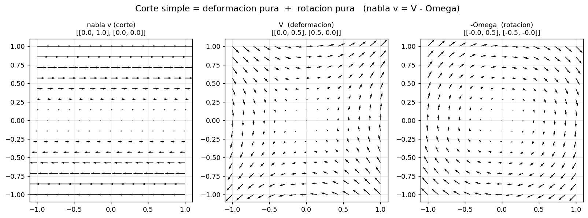

Campo $v_x = ky$, $v_y=0$ (corte simple, $k=1$). El panel izquierdo dibuja $\nabla v$ tal cual (todas las flechas apuntan en $x$, con magnitud creciente en $y$: así "se ve" un gradiente de velocidad crudo, sin descomponer). Los paneles central y derecho son la **misma matriz** partida en su parte simétrica y antisimétrica:

$$\nabla v = \begin{bmatrix}0&1\\0&0\end{bmatrix} = \underbrace{\begin{bmatrix}0&0{,}5\\0{,}5&0\end{bmatrix}}_{V} \;-\; \underbrace{\begin{bmatrix}0&0{,}5\\-0{,}5&0\end{bmatrix}}_{\Omega}$$

💡 El panel central ($V$) es un campo tipo "silla" — estira a 45° y comprime a $-45°$: pura deformación, sin preferencia de giro. El panel derecho ($-\Omega$) es un campo de rotación rígida pura alrededor del origen. Sumados (con el signo del apéndice, $\nabla v = V - \Omega$) dan exactamente el corte simple del panel izquierdo. **Esto es la sección 6.1 hecha dibujo:** un mismo gradiente de velocidad admite una sola lectura algebraica (la matriz) pero dos lecturas físicas simultáneas (estira + gira), y la figura las separa para que se vean por separado.

*(Generado con `U6/visualizacion_cinematica.py`, función `figura_descomposicion_shear()`. Corré el script para regenerar o cambiar `k`.)*

## 6.2 Vorticidad y el factor 2

**Vector dual de $\Omega$** — ⚠️ definido **sin el ½** (a diferencia de $\omega_k = \tfrac{1}{2}e_{kij}\omega_{ij}$ en U5):

$$\Omega_k = \varepsilon_{kij}\,\Omega_{ij} = \varepsilon_{kij}\frac{1}{2}\left(\frac{\partial v_j}{\partial x_i}-\frac{\partial v_i}{\partial x_j}\right) = \varepsilon_{kij}\frac{\partial v_j}{\partial x_i} = [\mathrm{rot}\,\mathbf{v}]_k$$

$$\boxed{\boldsymbol\Omega = \mathrm{rot}\,\mathbf{v} = \textbf{2}\times(\text{velocidad angular local})}$$

⚠️ Se define así para que la vorticidad coincida con el rotor (objeto estándar del cálculo vectorial). El precio: **el factor 2**. Si un elemento fluido rota con velocidad angular $\dot\theta$, su vorticidad es $2\dot\theta$. Trampa de parcial clásica.

## 6.3 Los tres casos canónicos (calculados)

**(a) Rotación rígida pura: $V=0$, $\Omega\neq 0$.** Campo $v_x = -\dot\theta\, y$, $v_y = \dot\theta\, x$:

$$V_{xy} = \tfrac{1}{2}(-\dot\theta + \dot\theta) = 0, \quad V_{xx}=V_{yy}=0 \qquad \Omega_{xy} = \tfrac{1}{2}(\dot\theta - (-\dot\theta)) = \dot\theta \quad\Rightarrow\quad \Omega_3 = 2\dot\theta$$

💡 El fluido se mueve mucho pero como cuerpo rígido: nadie cizalla a nadie → **cero tensión viscosa** (la viscosidad responde a $V$, no a $\Omega$).

**(b) Deformación pura / flujo irrotacional: $\Omega=0$, $V\neq 0$.** Campo $v_x = kx$, $v_y = -ky$:

$$V = \begin{bmatrix} k & 0\\ 0 & -k\end{bmatrix}, \qquad \Omega_{xy} = 0, \qquad \mathrm{tr}(V) = k - k = 0$$

💡 Se estira en $x$ y se comprime en $y$ a la misma tasa: mucha deformación de forma, ninguna rotación, **y volumen constante** (¡es incompresible!).

**(c) Corte simple (Couette): mitad y mitad.** Campo $v_x = ky$, $v_y = 0$:

$$V_{xy} = \frac{k}{2}, \qquad |\Omega_{xy}| = \frac{k}{2}$$

💡 Trayectorias **rectas**, y sin embargo hay vorticidad: corte simple = deformación pura + rotación pura en partes iguales. ⚠️ Mata la intuición "trayectoria recta = sin rotación" y su espejo: el **vórtice irrotacional** ($v_\theta \propto 1/r$) tiene trayectorias circulares y vorticidad cero (cabina de vuelta al mundo: gira alrededor del eje manteniendo su orientación).

### 🖼️ Visualización: soltar una "boyita" en cada flujo

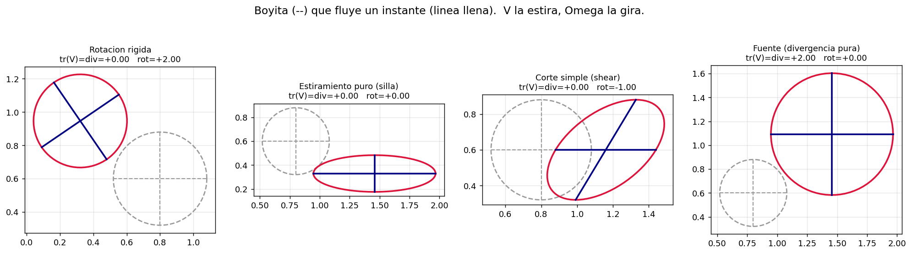

Se toma un círculo de trazadores con una cruz adentro (línea gris punteada = estado inicial) y se lo deja "flotar" un instante corto en cada campo de velocidad (integración numérica de trayectorias), dejando el resultado en color:

- **Rotación rígida** ($v=(-\dot\theta y,\dot\theta x)$): el círculo sigue siendo círculo (no cambia de forma, $V=0$) pero la cruz **giró** un ángulo — es rotación pura, $\Omega\neq0$.
- **Estiramiento puro/silla** ($v=(kx,-ky)$): el círculo se volvió elipse alineada con los ejes (se estiró en $x$, se comprimió en $y$) pero la cruz **no giró** — deformación pura sin rotación, $\Omega=0$.
- **Corte simple**: el círculo se hizo elipse **inclinada a 45°** y además la cruz giró — la mezcla mitad-mitad de la sección 6.3(c): acá se ve literalmente en el mismo dibujo la elipse (deformación) y la inclinación de sus ejes respecto de la diagonal (rotación).
- **Fuente**: el círculo creció manteniéndose círculo (cambio de tamaño isótropo, sin distorsión ni rotación) — $\mathrm{tr}(V)>0$ puro.

💡 **La lectura clave de la figura:** la *forma final* (círculo → elipse, con qué inclinación) es la huella visual de $V$; el *giro de la cruz* respecto de los ejes de la elipse es la huella visual de $\Omega$. Es literalmente la descomposición algebraica de 6.1 puesta a fluir.

*(Generado con `figura_deformacion()` en `U6/visualizacion_cinematica.py`.)*

### 🖼️ Visualización 3D: la contraparte fluida de la viga — Poiseuille en un tubo

Si la viga de la sección 5.7 es el ejemplo 3D del lado sólido, el análogo del lado fluido —y el ejemplo real más importante de la trampa de 6.3(c)— es el flujo de Poiseuille en un tubo circular:

$$v_x = v_{max}\left(1-\frac{r^2}{a^2}\right), \qquad v_y=v_z=0, \qquad r^2=y^2+z^2$$

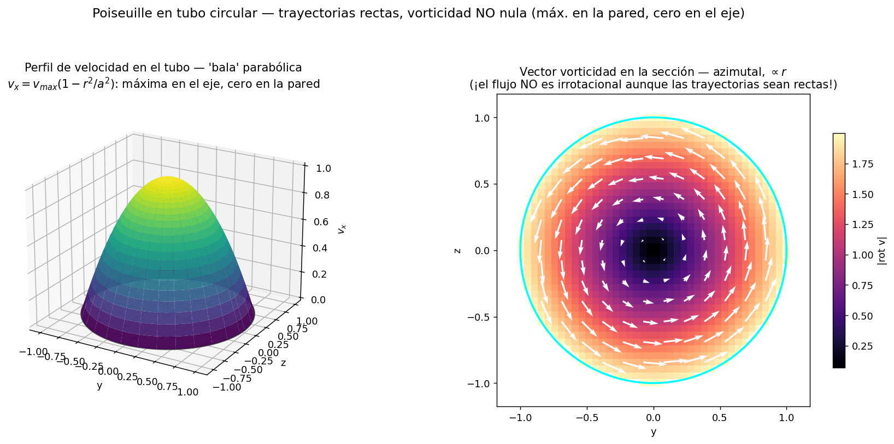

**Panel izquierdo:** el perfil "bala" clásico de cualquier curso de fluidos — velocidad máxima en el eje, cero en la pared (condición de no deslizamiento).

**Panel derecho — el punto real de la figura:** todas las partículas viajan en **línea recta** (es un flujo unidireccional, $v_y=v_z=0$ en todo punto). Y sin embargo:

$$\mathrm{rot}\,\mathbf{v} = \left(0,\ \frac{\partial v_x}{\partial z},\ -\frac{\partial v_x}{\partial y}\right) = \left(0,\ -\frac{2v_{max}z}{a^2},\ \frac{2v_{max}y}{a^2}\right) \qquad\Longrightarrow\qquad |\mathrm{rot}\,\mathbf{v}| = \frac{2v_{max}}{a^2}\,r \ \neq 0$$

El campo de vorticidad es **azimutal** (rodea el eje del tubo) y crece linealmente con $r$: nulo en el centro, máximo en la pared. Cada elemento de fluido, aunque viaja en línea recta, **gira sobre sí mismo** a medida que avanza — más rápido cuanto más cerca de la pared.

💡 **Por qué esto no es un detalle de examen sino LA idea de 6.3(c):** "trayectoria recta" describe el camino del *centro* de un elemento de fluido; "irrotacional" describe si ese elemento gira *sobre su propio eje* mientras viaja. Son preguntas independientes, y Poiseuille —el flujo real más estudiado de toda la mecánica de fluidos elemental— las separa con total claridad: recta con vorticidad máxima en la pared, cero solo exactamente en el eje. 🔗 Es el mismo argumento que el vórtice irrotacional del zoológico (fig1) pero **al revés**: allá trayectorias curvas con vorticidad nula; acá trayectorias rectas con vorticidad no nula. Tené los dos ejemplos a mano: cualquier combinación de "¿la trayectoria es recta/curva?" con "¿es irrotacional?" tiene un contraejemplo construible.

*(Generado con `U6/visualizacion_poiseuille_3d.py`.)*

## 6.4 Incompresibilidad: la traza de V

$$\nabla\cdot\mathbf{v} = \frac{\partial v_x}{\partial x}+\frac{\partial v_y}{\partial y}+\frac{\partial v_z}{\partial z} = \mathrm{tr}(\mathbf{V}) = \text{tasa de cambio relativo de volumen}$$

🔗 Es el análogo en tasas de $\mathrm{tr}(\varepsilon) = \Delta V/V_0$ (U5). La divergencia del cálculo vectorial encuentra su lugar: es la traza de la parte simétrica del gradiente. **Divergencia = traza de V; rotor = vorticidad.**

**Mapa completo del gradiente (tres piezas independientes):**

$$\nabla\mathbf{v} \;\to\; \underbrace{\tfrac{1}{3}\mathrm{tr}(\mathbf{V})\,\boldsymbol\delta}_{\text{expansión (tamaño)}} + \underbrace{\mathbf{V}'}_{\text{distorsión (forma)}} + \underbrace{(-\boldsymbol\Omega)}_{\text{rotación (orientación)}}$$

| Condición | Significado | Qué se anula |
|---|---|---|
| Cuerpo rígido | ni tamaño ni forma cambian | $\mathbf{V}=0$ completo |
| **Incompresible** | forma cambia, volumen no | $\mathrm{tr}(\mathbf{V})=0$ (¡solo la traza!) |
| Irrotacional | no hay giro local | $\boldsymbol\Omega = 0$ |

⚠️ Son condiciones **independientes**: incompresible + con vorticidad (corte simple, casi toda la hidráulica real), incompresible + irrotacional (flujo potencial), compresible + irrotacional (expansión pura $v_x=kx,\ v_y=ky$: $\mathrm{tr}=2k\neq0$, $\Omega=0$).

### 🖼️ Visualización: el zoológico completo de flujos 2D

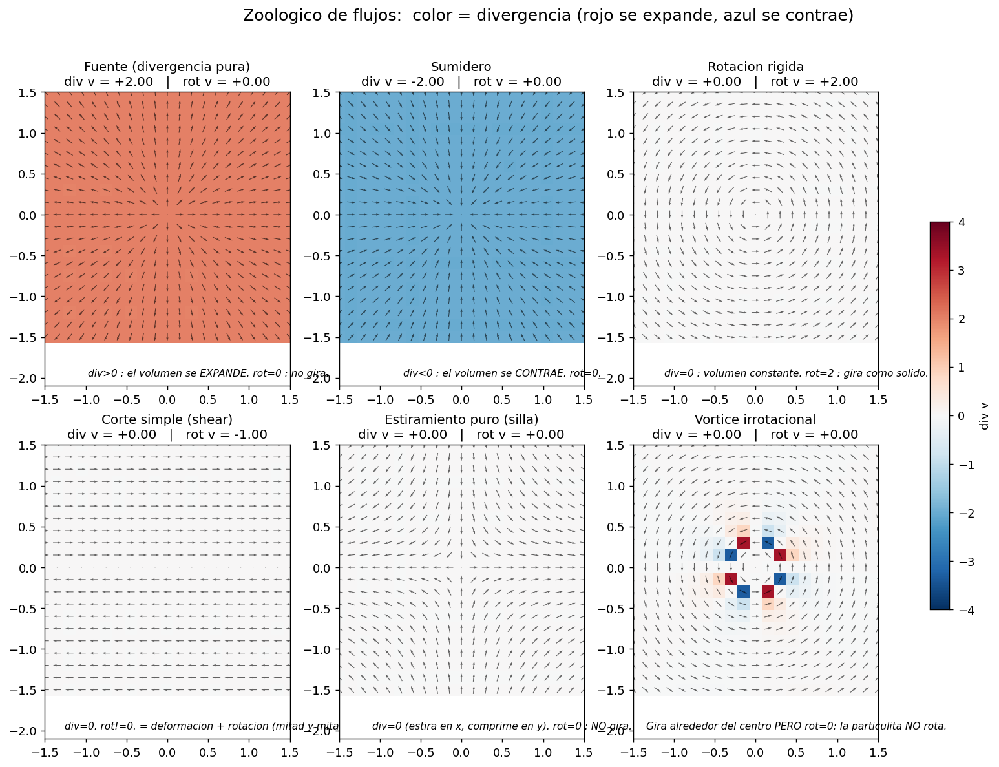

Seis campos de velocidad canónicos, con **color = divergencia** (rojo se expande, azul se contrae, blanco = incompresible) y flechas = dirección del flujo:

| Flujo | $\mathrm{div}\,v$ | $\mathrm{rot}\,v$ | Clasificación (fila "Condición" de la tabla de arriba) |
|---|---|---|---|
| Fuente $v=(x,y)$ | $+2$ | $0$ | compresible, irrotacional |
| Sumidero $v=(-x,-y)$ | $-2$ | $0$ | compresible, irrotacional |
| Rotación rígida $v=(-y,x)$ | $0$ | $+2$ | incompresible, con vorticidad (cuerpo rígido) |
| Corte simple $v=(y,0)$ | $0$ | $-1$ | incompresible, con vorticidad |
| Estiramiento puro/silla $v=(x,-y)$ | $0$ | $0$ | incompresible **e** irrotacional (flujo potencial) |
| Vórtice irrotacional $v=(-y,x)/r^2$ | $0$ | $0$ (salvo el origen) | incompresible e irrotacional, pero con **trayectorias circulares** |

💡 **El panel que rompe la intuición** es el último: gira alrededor del centro (las flechas describen círculos) y sin embargo el mapa de color da blanco en todo punto salvo el origen — vorticidad cero. Confirma numéricamente lo que dice el texto de 6.3(c): *trayectoria curva* no es lo mismo que *elemento que rota sobre sí mismo*. Compará ese panel con "Rotación rígida" (mismo aspecto de giro global, vorticidad $+2$ en todos lados): son el par de ejemplos que hay que tener listos si el parcial pregunta "¿puede un flujo con trayectorias circulares ser irrotacional?".

*(Generado con `figura_zoologico()` en `U6/visualizacion_cinematica.py`; corré `tabla_resumen()` del mismo script para ver estos números impresos en consola.)*

## 6.5 Compatibilidad: la pregunta inversa

**Dirección directa (U5):** dado $u$ → derivo → obtengo $\varepsilon$. Siempre funciona.
**Dirección inversa:** dado $\varepsilon$ (p.ej. medido con strain gauges) → ¿existe $u$?

**Conteo:** $\varepsilon$ tiene 6 componentes, $u$ tiene 3 → sistema **sobredeterminado**: 6 funciones arbitrarias casi seguro NO provienen de ningún $u$. Deben cumplir restricciones entre sí.

**Prototipo (integrabilidad):** el sistema $\partial u/\partial x = f$, $\partial u/\partial y = g$ tiene solución $u(x,y)$ si las derivadas cruzadas coinciden:

$$\frac{\partial}{\partial y}\frac{\partial u}{\partial x} = \frac{\partial}{\partial x}\frac{\partial u}{\partial y} \quad\Longrightarrow\quad \frac{\partial f}{\partial y} = \frac{\partial g}{\partial x}$$

**Caso plano.** De $\varepsilon_{xx} = \partial u/\partial x$, $\varepsilon_{yy} = \partial v/\partial y$, $2\varepsilon_{xy} = \partial u/\partial y + \partial v/\partial x$, derivando:

$$\frac{\partial^2\varepsilon_{xx}}{\partial y^2} = \frac{\partial^3 u}{\partial y^2\partial x}, \qquad \frac{\partial^2\varepsilon_{yy}}{\partial x^2} = \frac{\partial^3 v}{\partial x^2\partial y}, \qquad 2\frac{\partial^2\varepsilon_{xy}}{\partial x\partial y} = \frac{\partial^3 u}{\partial x\partial y^2} + \frac{\partial^3 v}{\partial x^2\partial y}$$

$$\boxed{\frac{\partial^2\varepsilon_{xx}}{\partial y^2} + \frac{\partial^2\varepsilon_{yy}}{\partial x^2} = 2\frac{\partial^2\varepsilon_{xy}}{\partial x\partial y}}$$

(La misma ecuación, textualmente, vale para $V_{xx}, V_{yy}, V_{xy}$ con velocidades: el diccionario U5↔U6 una vez más.)

**Caso 3D — Saint-Venant.** El truco general: escribir $\varepsilon_{ij,kl} + \varepsilon_{kl,ij}$ y $\varepsilon_{jl,ik} + \varepsilon_{ik,jl}$ en términos de terceras derivadas de $u$ y notar que dan lo mismo (el orden de derivación conmuta):

$$\boxed{\varepsilon_{ij,kl} + \varepsilon_{kl,ij} = \varepsilon_{jl,ik} + \varepsilon_{ik,jl}}$$

De las $3^4 = 81$ ecuaciones a priori, las simetrías ($\varepsilon_{ij}=\varepsilon_{ji}$, conmutación de derivadas) dejan **6 independientes** (3 del tipo "diagonal" y 3 del tipo "corte", listadas en la lámina 14).

💡 **Significado físico de la incompatibilidad:** cortá el cuerpo en cubitos, deformá cada uno según ese $\varepsilon$, tratá de re-pegarlos: quedan huecos o superposiciones. Compatibilidad = el rompecabezas deformado cierra = el cuerpo sigue siendo continuo. 🔗 Es la traducción matemática de la hipótesis "sin agujeros" de la U5, en el viaje de vuelta.

💡 **Qué te da y qué no:** te dice si existe $u$, no te lo da (encontrarlo es integrar); y queda determinado **a menos de un movimiento rígido** — exactamente la parte que $\varepsilon$ no ve. El círculo con la lección central de U5 se cierra.

💡 **Relevancia computacional:** si tu método calcula $u$ o $v$ y deriva (FEM estándar, CFD), la compatibilidad se cumple gratis, por construcción. Si el dato son deformaciones/tensiones (mediciones, formulaciones mixtas), es una ecuación más que hay que imponer.

## 📝 Cómo cae la U6 en el parcial

- **¿Irrotacional / incompresible?**: calcular rot v y div v = tr(V) → **resolución en II.6** (incluye la función de corriente del recuperatorio y la dualidad potencial↔corriente).
- **Verificar compatibilidad** dado un σ (vía Hooke inverso) → **resolución en II.4**. Atajo: ε uniforme o lineal en coordenadas ⟹ compatible trivialmente.
- **Teóricas**: qué garantiza compatibilidad (que exista u continuo y univaluado — el rompecabezas cierra), rotor = vorticidad = 2× velocidad angular local, demostrar rot(∇φ) = 0 con el argumento simétrico×antisimétrico → **respuestas modelo en II.9**.

---

# UNIDAD 7 — ECUACIONES CONSTITUTIVAS

## 7.0 Por qué existe este capítulo: el cierre del sistema

Todo lo anterior (equilibrio, cinemática, compatibilidad) vale para **cualquier** continuo — y por eso mismo no alcanza para resolver nada: las mismas cargas sobre acero y sobre miel dan resultados distintos. **Conteo:** 6 tensiones + 6 deformaciones (o tasas) + 3 desplazamientos (o velocidades) = 15 incógnitas; las ecuaciones universales no llegan a 15. **La constitutiva aporta las 6 que faltan.** Sin ella, el problema es matemáticamente indeterminado.

💡 **Estatus epistemológico distinto:** equilibrio y compatibilidad son *exactos* (Newton + geometría); las constitutivas son **modelos** — idealizaciones empíricas con rango de validez. "Fluido Newtoniano" y "sólido Hookeano" no existen en la naturaleza. Cuando el cálculo falla contra la realidad, el sospechoso habitual es la constitutiva.

## 7.1 Los tres modelos y la observación central

**Fluido invíscido:**
$$\sigma_{ij} = -p\,\delta_{ij}$$
Presión dada por la ecuación de estado $f(p,\rho,T)=0$ (gas ideal: $p = RT\rho$; incompresible: $p$ = incógnita determinada por condiciones de borde y movimiento).

**Fluido Newtoniano:** tensión lineal en la tasa de deformación:
$$\sigma_{ij} = -p\,\delta_{ij} + D_{ijkl}V_{kl}$$

**Sólido Hookeano:** tensión lineal en la deformación:
$$\sigma_{ij} = C_{ijkl}\,\varepsilon_{kl}$$

En ambos: $3^4 = 81$ coeficientes a priori; las simetrías de $\sigma_{ij}$ y de $V_{kl}$ (o $\varepsilon_{kl}$) reducen a **36 como máximo**. La isotropía (U8) los colapsa a **2**.

**Caso isótropo — derivación del colapso.** Con $D_{ijkl} = \lambda\,\delta_{ij}\delta_{kl} + \mu(\delta_{ik}\delta_{jl} + \delta_{il}\delta_{jk})$:

$$\sigma_{ij} = -p\delta_{ij} + \lambda\,\delta_{ij}\underbrace{\delta_{kl}V_{kl}}_{=V_{kk}} + \mu\underbrace{\delta_{ik}\delta_{jl}V_{kl}}_{=V_{ij}} + \mu\underbrace{\delta_{il}\delta_{jk}V_{kl}}_{=V_{ji}=V_{ij}}$$

$$\boxed{\sigma_{ij} = -p\,\delta_{ij} + \lambda\, V_{kk}\,\delta_{ij} + 2\mu\, V_{ij}} \quad\text{(Newtoniano isótropo)}$$

$$\boxed{\sigma_{ij} = \lambda\,\varepsilon_{kk}\,\delta_{ij} + 2\mu\,\varepsilon_{ij}} \quad\text{(Hooke isótropo, constantes de Lamé)}$$

💡 **La observación central de la unidad:** las dos leyes tienen **exactamente la misma estructura**. La única diferencia es a qué variable cinemática se acopla la tensión:
- **Sólido → $\varepsilon$**: le importa cuánto se apartó de su forma de referencia (memoria de forma).
- **Fluido viscoso → $V$**: no tiene referencia; solo importa a qué velocidad se deforma ahora.
- **Invíscido → nada distorsional**: solo presión.

🔗 Esto responde matemáticamente "¿qué es un sólido y qué es un fluido?" (pregunta flotando desde la lámina 2 de U5). Y explica por qué la U6 construyó $V$ en paralelismo tan estricto con $\varepsilon$: era la preparación para este momento. (Los materiales intermedios —viscoelásticos: polímeros, tejidos— combinan ambos términos.)

### 🖼️ Visualización: los tres modelos ante la misma historia de deformación

Para que la diferencia deje de ser una fórmula y se vea como comportamiento, impongamos la **misma** historia cinemática de corte a los tres modelos (rampa → meseta → rampa inversa → cero) y grafiquemos la tensión resultante:

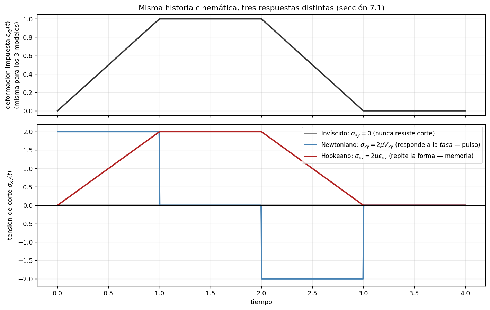

El invíscido nunca responde (línea plana en cero: sin respuesta al desviador). El **Newtoniano** produce un pulso rectangular — porque $\sigma\propto V$ (la tasa), y la tasa de una rampa es una constante, así que la tensión "salta" al empezar y al terminar cada tramo y vale exactamente cero durante las mesetas (ahí $V=0$ aunque la deformación acumulada sea máxima). El **Hookeano** literalmente repite la forma de la entrada — porque $\sigma\propto\varepsilon$, no le importa la velocidad, solo cuánto se apartó de su referencia *ahora*. Esa es la "memoria de forma" de 7.1 hecha curva.

*(Generado con `U7/visualizacion_constitutivas.py`.)*

## 7.2 Lectura volumétrico/desviador de Hooke (la clave del capítulo)

Tomando traza de $\sigma_{ij} = \lambda\varepsilon_{kk}\delta_{ij} + 2\mu\varepsilon_{ij}$ (usar $\delta_{kk}=3$):

$$\boxed{\sigma_{kk} = (3\lambda + 2\mu)\,\varepsilon_{kk}} \qquad (2)$$

Restando de la ley completa su parte esférica se obtiene la relación entre desviadores:

$$\boxed{\sigma'_{ij} = 2\mu\,\varepsilon'_{ij}}$$

💡 **Hooke isótropo son dos leyes escalares desacopladas:**

1. **Presión media ↔ cambio de volumen**, rigidez $K = \tfrac{3\lambda+2\mu}{3}$ (módulo volumétrico),
2. **Tensión desviadora ↔ distorsión**, rigidez $2\mu$ (por eso $\mu$ = módulo *de corte*).

En un isótropo, apretar volumétricamente no distorsiona y distorsionar no cambia volumen. 🔗 Los dos modos que la U5 separó geométricamente (tamaño/forma) son exactamente los que el material acopla por separado. **Dos modos → dos precios → dos constantes.** La descomposición en desviador era anticipar la anatomía de la respuesta material.

### 🖼️ Visualización: separando un cuadrado en "cuánto crece" y "cuánto se distorsiona"

Tomemos una deformación 2D genérica $\varepsilon$ y separémosla en $\varepsilon_{vol}=\tfrac{\varepsilon_{kk}}{2}\delta_{ij}$ (análogo 2D de $\varepsilon_{kk}/3$) y $\varepsilon' = \varepsilon-\varepsilon_{vol}$:

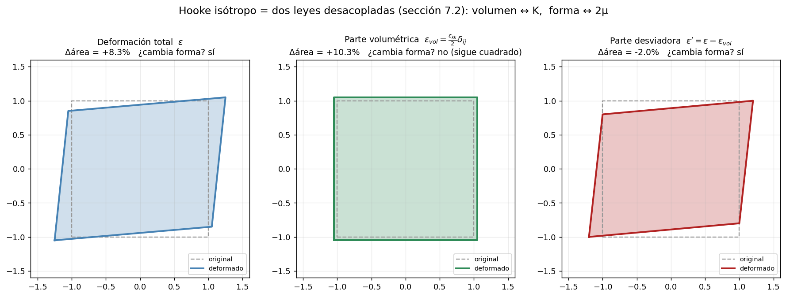

El panel del medio (solo la parte volumétrica) **sigue siendo un cuadrado** — cambió de área pero no de forma. El panel derecho (solo la parte desviadora) es un paralelogramo cuya área casi no cambió — cambió de forma pero no de tamaño. Esa es la lectura geométrica exacta de "apretar no distorsiona, distorsionar no cambia volumen".

⚠️ El pequeño remanente de cambio de área en el panel desviador (no exactamente 0%) **no es un error**: es un efecto de segundo orden, $\det(I+\varepsilon')-1 = \det(\varepsilon')\neq 0$ para $\varepsilon'$ finito. La teoría lineal (U5, sección 5.5) es exacta solo a primer orden — por eso se llama "deformaciones **infinitesimales**". Con un $\varepsilon$ realmente pequeño ese remanente desaparece; acá se exageró la magnitud para que la figura se vea.

*(Generado con `U7/visualizacion_constitutivas.py`.)*

## 7.3 Relación inversa y constantes de laboratorio

**Despeje.** De (1) $\varepsilon_{ij} = \tfrac{1}{2\mu}(\sigma_{ij} - \lambda\varepsilon_{kk}\delta_{ij})$ y (2) $\varepsilon_{kk} = \sigma_{kk}/(3\lambda+2\mu)$:

$$\varepsilon_{ij} = \frac{1}{2\mu}\sigma_{ij} - \frac{\lambda}{2\mu(3\lambda+2\mu)}\sigma_{kk}\,\delta_{ij} \;=\; \boxed{\frac{1+\nu}{E}\,\sigma_{ij} - \frac{\nu}{E}\,\sigma_{kk}\,\delta_{ij}}$$

con las conversiones:

$$\lambda = \frac{E\nu}{(1+\nu)(1-2\nu)}, \qquad \mu = \frac{E}{2(1+\nu)}$$

**Notación extendida (la forma "de laboratorio"):**

$$\varepsilon_{xx} = \frac{1}{E}\sigma_{xx} - \frac{\nu}{E}(\sigma_{yy}+\sigma_{zz}), \qquad \varepsilon_{xy} = \frac{1+\nu}{E}\sigma_{xy} \quad (\text{y cíclicas})$$

💡 **Efecto Poisson:** tirás en $x$ y el material se encoge en $y, z$ aunque nadie lo toque ahí. Es el contenido físico del término $\lambda\varepsilon_{kk}\delta_{ij}$: la traza mete a todas las direcciones en la conversación. $(E,\nu)$ = constantes de laboratorio (ensayo de tracción); $(\lambda,\mu)$ o $(K,\mu)$ = constantes estructurales (los dos modos). Dos coordenadas del mismo espacio de 2 parámetros.

⚠️ **$\nu \to \tfrac{1}{2}$: incompresibilidad.** Mirá el denominador de $\lambda$: explota con $(1-2\nu)$. $\nu = \tfrac{1}{2}$ ⟺ la contracción lateral compensa el estiramiento axial ⟺ volumen constante ⟺ $K\to\infty$. La goma anda en $\nu\approx 0{,}499$ y causa problemas numéricos reales en FEM (*locking* volumétrico). 🔗 "Incompresible" reaparece del lado sólido.

### 🖼️ Visualización: el despegue de K y λ cuando ν→1/2

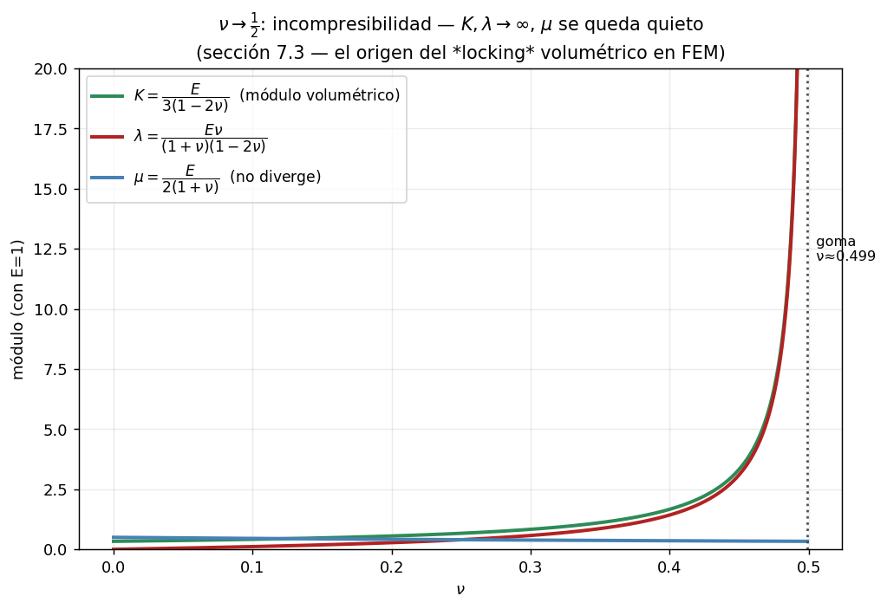

$\mu$ es una curva mansa, acotada entre $E/3$ y $E/2$: nunca "se entera" de la incompresibilidad. $K$ y $\lambda$, en cambio, se disparan a medida que $\nu$ se acerca a $1/2$, ambas arrastradas por el mismo denominador $(1-2\nu)$. Es la firma numérica exacta de por qué materiales casi incompresibles (goma, tejido biológico, agua) son un dolor de cabeza en simulación: cualquier error pequeño en $\nu$ cerca de $0{,}5$ se amplifica brutalmente en $K$.

*(Generado con `U7/visualizacion_constitutivas.py`.)*

## 7.4 Casos particulares = apagar términos

| Modelo | Condición | Ley resultante | Lectura |
|---|---|---|---|
| Newtoniano isótropo **incompresible** | $V_{kk}=0$ (🔗 U6) | $\sigma_{ij} = -p\delta_{ij} + 2\mu V_{ij}$ | El término $\lambda V_{kk}$ muere solo; queda respuesta pura al desviador. ⚠️ $p$ deja de ser función de estado: es **incógnita**, el multiplicador que fuerza la incompresibilidad. |
| Fluido de **Stokes** | $\sigma_0 = \tfrac{1}{3}\sigma_{kk}$ independiente de $V_{kk}$: de $3\sigma_0 = -3p + (3\lambda+2\mu)V_{kk}$ sale $3\lambda + 2\mu = 0 \Rightarrow \lambda = -\tfrac{2}{3}\mu$ | $\sigma_{ij} = -p\delta_{ij} - \tfrac{2}{3}\mu V_{kk}\delta_{ij} + 2\mu V_{ij}$ | Viscosidad volumétrica nula: el mecanismo viscoso vive solo en el desviador; la tensión media es solo $-p$. |
| **Invíscido** | $\mu = 0$ | $\sigma_{ij} = -p\delta_{ij}$ | Sin respuesta al desviador: **no puede transmitir corte jamás** → tensión isótropa en cada punto. |

## 7.5 Efecto de la temperatura

$$\sigma_{ij} = C_{ijkl}\left(\varepsilon_{kl} - \alpha_{kl}(T-T_0)\right), \qquad \text{isótropo: } \alpha_{ij} = \alpha\,\delta_{ij}$$

💡 La deformación térmica se **resta**: la parte de $\varepsilon$ que es dilatación térmica libre no genera tensión (un cuerpo libre calentado uniformemente se agranda sin tensionarse; la tensión aparece si algo le impide dilatarse). 🔗 Que $\alpha_{ij}$ *deba* ser $\alpha\delta_{ij}$ en un isótropo es un teorema de la U8 (rango 2 isótropo = escalar × delta).

## 📝 Cómo cae la U7 en el parcial

- **Es el corazón de la demostración estrella**: Navier-Stokes (constitutiva Newtoniana + incompresibilidad) y ecuación de Navier (Hooke) → **resolución paso a paso en II.8**, con las justificaciones que el enunciado exige ("indique la razón de las simplificaciones").
- **Hooke inverso** (σ → ε) es el paso obligado del ejercicio de Airy/compatibilidad → **II.4**.
- **Teóricas**: nombre e interpretación de μ (viscosidad dinámica = precio de la distorsión, $\sigma_{xy} = 2\mu V_{xy}$), qué se asume para reducir continuidad a $\nabla\cdot\mathbf{v}=0$ → **II.9**.

---

# UNIDAD 8 — ISOTROPÍA

## 8.0 El rol de la unidad

La U7 usó dos veces, sin justificar, $C_{ijkl} = \lambda\delta_{ij}\delta_{kl} + \mu(\delta_{ik}\delta_{jl}+\delta_{il}\delta_{jk})$. La U8 demuestra que **esa forma no es una elección: es una obligación**. Es el teorema que sostiene al capítulo anterior.

**Definiciones.**
- *Material isótropo:* propiedades mecánicas idénticas en toda dirección (dos probetas talladas en distintas orientaciones dan ensayos idénticos). Formalmente: $C'_{ijkl} \equiv C_{ijkl}$ ante toda transformación ortogonal.
- *Tensor isótropo:* componentes inalteradas ante rotaciones arbitrarias del marco: $\beta_{ik}\beta_{jl}\cdots A_{kl\ldots} \equiv A_{ij\ldots}$ para todo $\beta$ ortogonal ($\beta_{ik}\beta_{jk} = \delta_{ij}$; $|\beta| = +1$ propia/rotación, $-1$ impropia/reflexión).

## 8.1 La técnica de demostración (vale registrarla como método)

Para probar que componentes *deben* anularse no hace falta imponer **todas** las rotaciones: alcanza con **elegir unas pocas rotaciones astutas** (180° y 90° alrededor de ejes coordenados) y acumular las restricciones. Es el truco estándar de los argumentos de simetría en toda la física: la simetría restringe, y pocas instancias bien elegidas exprimen todas las restricciones.

**Rango 1 (vectores).** $v'_i = \beta_{ij}v_j \equiv v_i$ para todo $\beta$:
- Rotación 180° alrededor de $x_1$: $(v_1, -v_2, -v_3) = (v_1,v_2,v_3) \Rightarrow v_2 = v_3 = 0$.
- Rotación 180° alrededor de $x_2$: $\Rightarrow v_1 = v_3 = 0$.

$$\boxed{\mathbf{v} = \mathbf{0} \text{ es el único vector isótropo}}$$

💡 Un vector *es* una dirección; "dirección igual en todas las direcciones" es contradictorio. Por eso ninguna propiedad de un material isótropo puede ser vectorial.

**Rango 2.** $A'_{ij} = \beta_{ik}\beta_{jl}A_{kl} \equiv A_{ij}$:
- 180° alrededor de $x_1$: sobreviven solo $A_{12}=A_{21}=A_{23}=A_{32}=0$… combinando con 180° alrededor de $x_2$: **toda componente no diagonal es nula**.
- 90° alrededor de $x_3$: la matriz transformada intercambia $A_{11} \leftrightarrow A_{22}$ ⟹ $A_{11} = A_{22}$. 90° alrededor de $x_2$: $A_{11} = A_{33}$.

$$\boxed{A_{ij} \text{ isótropo} \iff A_{ij} = \alpha\,\delta_{ij}, \ \alpha \text{ escalar}}$$

(Verificación directa de que $\delta$ califica: $\delta'_{ij} = \beta_{ik}\beta_{jl}\delta_{kl} = \beta_{ik}\beta_{jk} = \delta_{ij}$ ✔ — es la ortogonalidad misma.)

💡 **Ya lo usaste dos veces sin nombre:** la tensión del fluido en reposo ($-p\delta$: un fluido quieto no tiene dirección privilegiada → su tensión no tiene más remedio que ser $\propto\delta$ → **la presión es escalar por teorema, no por obviedad**) y la dilatación térmica $\alpha_{ij} = \alpha\delta_{ij}$.

**Rango 3.** El símbolo de permutación $\varepsilon_{ijk}$ es isótropo **respecto de rotaciones propias solamente** (ante reflexiones cambia de signo, porque aparece $|\beta| = -1$). Todo tensor isótropo de rango 3: $B_{ijk} = \alpha\,\varepsilon_{ijk}$.

💡 La letra chica "solo propias" es la puerta a los materiales **quirales**, donde las reflexiones sí distinguen. Para materiales comunes no importa (ver abajo: $\gamma = 0$ elimina el problema antes).

**Rango 4.** Todo tensor isótropo de rango 4 es combinación de tres generadores:

$$C_{ijkl} = \lambda\,\underbrace{\delta_{ij}\delta_{kl}}_{(1)} + \mu\,\underbrace{(\delta_{ik}\delta_{jl}+\delta_{il}\delta_{jk})}_{(2),\ \text{simétrico}} + \gamma\,\underbrace{(\delta_{ik}\delta_{jl}-\delta_{il}\delta_{jk})}_{(3),\ \text{antisimétrico}}$$

**Eliminación de $\gamma$:** intercambiando $i \leftrightarrow j$, el término (1) y el (2) no cambian, pero (3) cambia de signo: $C_{jikl} = \lambda(1) + \mu(2) - \gamma(3)$. Como la simetría de $\sigma_{ij}$ (🔗 ¡que viene del balance de momento angular, capítulo de tensiones!) exige $C_{ijkl} = C_{jikl}$:

$$\gamma = 0 \qquad \Longrightarrow \qquad \boxed{C_{ijkl} = \lambda\,\delta_{ij}\delta_{kl} + \mu\,(\delta_{ik}\delta_{jl}+\delta_{il}\delta_{jk})}$$

### 🖼️ Visualización: el test de rotación, para todo ángulo (no solo 180°/90°)

8.1 usa un puñado de rotaciones astutas (180°, 90°) porque alcanzan para la demostración. Para verlo sin atajos, apliquemos **todos** los ángulos $\theta\in[0,2\pi)$ y grafiquemos cómo responde cada objeto:

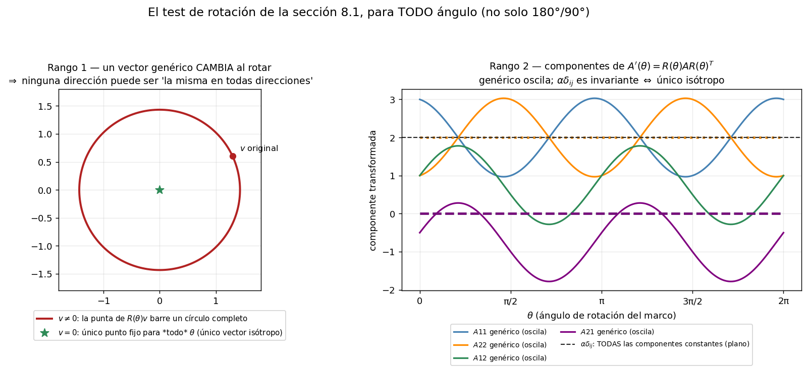

**Panel izquierdo (rango 1):** un vector genérico $v\neq 0$ rotado barre un círculo completo — cambia con $\theta$. El único punto que se queda quieto para *todo* ángulo es $v=\mathbf{0}$: literalmente no hay otra opción, por eso "el único vector isótropo es el nulo".

**Panel derecho (rango 2):** las cuatro componentes de un tensor genérico $A'(\theta)=R(\theta)AR(\theta)^T$ oscilan senoidalmente (período $\pi$, no $2\pi$ — dos vueltas del marco por cada vuelta del tensor, la firma de un objeto de rango 2). Superpuestas, las componentes de $\alpha\,\delta_{ij}$: **rectas perfectamente planas**, invariantes ante cualquier $\theta$. Esa es la propiedad que define a un tensor isótropo, y la única forma de rango 2 que la cumple.

💡 Fijate que $A_{12}$ y $A_{21}$ (líneas verde y violeta) son curvas *distintas* para el tensor genérico (no es simétrico, así que $A_{12}\neq A_{21}$) pero **ambas** colapsan a la misma recta en cero para el isótropo: en un tensor isótropo no sobrevive ni la parte simétrica no-diagonal ni la antisimétrica.

*(Generado con `U8/visualizacion_isotropia_rotacion.py`.)*

## 8.2 La cadena lógica completa (para tener clarísima)

$$\begin{array}{c}
\text{isotropía física (el material no distingue direcciones)}\\
\Downarrow\\
C_{ijkl} \text{ debe ser tensor isótropo}\\
\Downarrow \text{ (teorema de representación, rango 4)}\\
\text{espacio de dimensión 3: } \lambda, \mu, \gamma\\
\Downarrow \text{ (simetría de } \sigma \text{, momento angular)}\\
\gamma = 0\\
\Downarrow\\
\boxed{\textbf{exactamente 2 constantes: } \lambda \text{ y } \mu}
\end{array}$$

💡 **Por qué dos y no una, ni cinco, ni 21:** no es empírico ni convención — es un teorema. Y coincide, no por casualidad, con el conteo físico de la U7: dos modos independientes (volumen y forma) → dos precios → dos constantes. **El álgebra y la física dicen lo mismo por caminos distintos.** (Anisótropos: el caso general sin simetrías llega a 21 constantes; ortótropos como la madera, 9. El teorema da el piso: 2.)

## 8.3 Tabla resumen de tensores isótropos

| Rango | Tensores isótropos |
|---|---|
| 0 (escalar) | todos |
| 1 (vector) | solo $\mathbf{0}$ |
| 2 | $\alpha\,\delta_{ij}$ |
| 3 | $\alpha\,\varepsilon_{ijk}$ (solo rotaciones propias) |
| 4 | comb. lineal de $\delta_{ij}\delta_{kl}$, $\;\delta_{ik}\delta_{jl}+\delta_{il}\delta_{jk}$, $\;\delta_{ik}\delta_{jl}-\delta_{il}\delta_{jk}$ |

## 📝 Cómo cae la U8 en el parcial

- **Verificar que un tensor dado es isótropo** (ej. 2024 Q3: $A_{ijkl} = \delta_{ik}\delta_{jl}$): transformar con β y usar ortogonalidad dos veces → **resolución en II.5**. La manipulación de índices es la misma de la sección 8.1: practicala hasta que sea automática.
- **Dentro de Navier-Stokes**: justificar por qué el $C_{ijkl}$ general colapsa a 2 constantes (el parcial 2025-06-26 da el tensor de cuarto orden completo y espera esta cita) → **II.8, paso 0**.
- **Teóricas**: homogéneo vs isótropo (⚠️ *dónde* vs *hacia dónde* — pueden coexistir), por qué la presión es escalar (rango 2 isótropo = αδ) → **II.9**.

---

# HILOS TRANSVERSALES (el mapa del bosque)

**1. La descomposición tamaño / forma / orientación.** El gradiente ($\nabla u$ o $\nabla v$) siempre se parte en tres piezas físicas independientes:
$$\underbrace{\tfrac{1}{3}\mathrm{tr}\,\boldsymbol\delta}_{\text{tamaño}} + \underbrace{(\cdot)'}_{\text{forma}} + \underbrace{\text{antisim.}}_{\text{orientación}}$$
🔗 La pieza tamaño/forma (esférico + desviador) en realidad **arranca en U4**, aplicada a la tensión, antes de que exista siquiera el concepto de deformación. La U5 la redescubre geométricamente para $\varepsilon$, la U6 la traslada a tasas ($V$), la U7 muestra que el material le pone un precio a cada pieza deformante ($K$ y $\mu$; la orientación es gratis), y la U8 demuestra que en un isótropo no puede haber más precios que esos dos.

**2. El diccionario sólido ↔ fluido.** $u \leftrightarrow v$, $\varepsilon \leftrightarrow V$, $\omega \leftrightarrow \Omega$, Hooke ↔ Newton. La estructura de las ecuaciones es idéntica; cambia la variable a la que se acopla la tensión (deformación con memoria vs. tasa sin memoria). Sutileza: en tasas la teoría es exacta; en deformaciones, infinitesimal.

**3. Las condiciones famosas = anular una pieza.** Rígido: $\varepsilon = 0$ (o $V=0$). Incompresible: traza $= 0$. Irrotacional: antisimétrica $= 0$. Independientes entre sí. Del lado sólido, incompresible = $\nu \to 1/2$ = $\lambda \to \infty$.

**4. Invariantes = los números reales.** $I_1 = $ traza = volumen; $J_2$ = intensidad de distorsión. No dependen de los ejes porque miden física, no coordenadas.

**5. El cierre del sistema (15 = 15).** Equilibrio (universal) + cinemática/compatibilidad (universal) + constitutiva (del material) = problema determinado. Navier-Stokes = conservación de momento + constitutiva Newtoniana. Elasticidad lineal = equilibrio + Hooke + compatibilidad. Este esquema es el mapa de todo lo que sigue en el curso.

**6. Qué es exacto y qué es modelo.** Exacto: equilibrio, definiciones cinemáticas, compatibilidad, teoremas de representación (U8). Modelo: linealidad de las constitutivas (primer término de un Taylor), isotropía del material, rango infinitesimal. Cuando el cálculo no cierra contra la realidad, revisá primero los modelos.

---

# AUTOEVALUACIÓN RÁPIDA (si dudás en alguna, volvé a esa sección)

1. ¿Por qué la deformación se define sobre $ds^2 - ds_0^2$ y no sobre $u$? *(5.0, 5.2)*
2. ¿Qué papel cumple el término cuadrático de Green-Lagrange y qué se pierde al tacharlo? *(5.3, 5.5)*
3. ¿Qué mide físicamente $\varepsilon_{12} = 0{,}03$? *(5.6)*
4. Deducí que $\mathrm{tr}(\varepsilon) = \Delta V/V_0$ y explicá por qué es invariante. *(5.8)*
5. ¿De dónde sale el término $u_r/r$ en $\varepsilon_{\theta\theta}$? Ejemplo del anillo. *(5.9)*
6. ¿Por qué $V$ es exacto mientras $\varepsilon$ es aproximado? *(6.1)*
7. Corte simple $v_x = ky$: calculá $V$, $\Omega$, $\mathrm{tr}(V)$ y clasificá el flujo. *(6.3, 6.4)*
8. ¿La vorticidad del agua girando como disco rígido con velocidad angular $\dot\theta$? *(6.2, 6.3 — ojo el factor 2)*
9. ¿Por qué 6 deformaciones no siempre provienen de 3 desplazamientos? ¿Qué significa físicamente la incompatibilidad? *(6.5)*
10. ¿Por qué las constitutivas son necesarias para cerrar el sistema? Hacé el conteo. *(7.0)*
11. Partí Hooke en sus dos leyes desacopladas y nombrá los dos módulos. *(7.2)*
12. ¿Qué pasa con $\lambda$ cuando $\nu \to 1/2$ y qué significa? *(7.3)*
13. ¿Qué término se apaga en incompresible, en Stokes y en invíscido? ¿En qué se convierte $p$ en el incompresible? *(7.4)*
14. ¿Por qué la presión de un fluido en reposo es un escalar? (Pista: rango 2 isótropo.) *(8.1)*
15. Reconstruí la cadena: isotropía → 3 generadores → $\gamma = 0$ → 2 constantes. ¿Qué ley física mata a $\gamma$? *(8.2)*

---
---

# TABLA DE FÓRMULAS (referencia rápida)

> Cada fila: **notación indicial** (compacta) · **forma completa/extendida** · **qué es / cuándo se usa**. Las fórmulas encajonadas en el texto son las que conviene llevar sabidas al parcial.

## Tensiones (U3-U4)

| Indicial | Forma completa | Definición / uso |
|---|---|---|
| $T_i = \tau_{ji}\nu_j$ | $\overset{\nu}{\mathbf T}=\boldsymbol\sigma^T\boldsymbol\nu$ | **Fórmula de Cauchy.** Tracción sobre una superficie de normal $\nu$, a partir de las 9 componentes de $\sigma$. |
| $\tau_{ji,j} + X_i = 0$ | $\nabla\cdot\boldsymbol\sigma^T+\mathbf X=\mathbf 0$ | **Equilibrio (estático)** — caso $\rho D\mathbf v/Dt=0$ de la ecuación de Cauchy dinámica de U9-U10. |
| $\tau_{ij}=\tau_{ji}$ | $\boldsymbol\sigma=\boldsymbol\sigma^T$ | **Simetría de σ**, de equilibrio de momentos — versión estática de la demo de momento angular (U9-U10 §2.3). |
| $\tau'_{km}=\tau_{ji}\beta_{kj}\beta_{mi}$ | $\boldsymbol\sigma'=\boldsymbol\beta\boldsymbol\sigma\boldsymbol\beta^T$ | Transformación de $\sigma$ ante rotación de ejes — la misma ley que rota $\varepsilon$ (U5) y $V$ (U6), y que define isotropía (U8). |
| $(\sigma_{ji}-\sigma\delta_{ji})\nu_j=0$ | $\det(\boldsymbol\sigma-\sigma\mathbf I)=0$ | **Tensiones/direcciones principales** — problema de autovalores; mismo problema para $\varepsilon$ (U5) y $V$ (U6). |
| $I_1,I_2,I_3$ | $\mathrm{tr}\,\sigma,\ \Sigma\text{menores},\ \det\sigma$ | Invariantes principales de $\sigma$ (no cambian con la base). |
| $\sigma_{\max/\min}=\tfrac{\sigma_{xx}+\sigma_{yy}}2\pm\sqrt{(\tfrac{\sigma_{xx}-\sigma_{yy}}2)^2+\sigma_{xy}^2}$ | — | Tensiones principales en 2D (estado plano) — equivalente algebraico del Círculo de Mohr. |
| $\sigma'_{ij}=\sigma_{ij}-\sigma_0\delta_{ij}$ | $\sigma_0=\tfrac13\mathrm{tr}\,\sigma$ | **Desviador de tensión** — la separación tamaño/forma, previa a U5 y a la clave de U7. |

## Cinemática — Deformación (U5)

| Indicial | Forma completa | Definición / uso |
|---|---|---|
| $\lambda = L/L_0$ | — | Relación de estiramiento (1D). $\lambda=1$ ⟺ sin deformar. |
| $ds_0^2 = da_i\,da_i$ | $ds_0^2 = da_1^2+da_2^2+da_3^2$ | Longitud al cuadrado de una fibra en la config. inicial. |
| $ds^2 = dx_i\,dx_i$ | $ds^2 = dx_1^2+dx_2^2+dx_3^2$ | Longitud al cuadrado de la misma fibra deformada. |
| $u_i = x_i - a_i$ | $\mathbf{u} = \mathbf{x}-\mathbf{a}$ | Campo de desplazamientos (posición actual − material). |
| $E_{ij} = \tfrac12\!\left(\dfrac{\partial x_\alpha}{\partial a_i}\dfrac{\partial x_\alpha}{\partial a_j}-\delta_{ij}\right)$ | $E = \tfrac12(F^TF - I)$, con $F_{ij}=\partial x_i/\partial a_j$ | **Green-Lagrange** (Lagrangiano). Da 0 en mov. rígido, incluso rotaciones finitas. |
| $E_{ij} = \tfrac12\!\left(u_{i,j}+u_{j,i}+u_{\alpha,i}\,u_{\alpha,j}\right)$ | $E_{ij}=\tfrac12\!\left(\tfrac{\partial u_i}{\partial a_j}+\tfrac{\partial u_j}{\partial a_i}+\tfrac{\partial u_\alpha}{\partial a_i}\tfrac{\partial u_\alpha}{\partial a_j}\right)$ | Green-Lagrange en función de $u$. Término cuadrático **con +**. |
| $e_{ij} = \tfrac12\!\left(\delta_{ij}-\dfrac{\partial a_\alpha}{\partial x_i}\dfrac{\partial a_\alpha}{\partial x_j}\right)$ | $e = \tfrac12(I - F^{-T}F^{-1})$ | **Almansi** (Euleriano). Mismo rol, referido a la config. deformada. |
| $e_{ij} = \tfrac12\!\left(u_{i,j}+u_{j,i}-u_{\alpha,i}\,u_{\alpha,j}\right)$ | idem con $\partial/\partial x$ | Almansi en función de $u$. Término cuadrático **con −**. |
| $ds^2-ds_0^2 = 2E_{ij}\,da_i\,da_j$ | — | Cambio de longitud (Lagrangiano). $=0\ \forall$ pares ⟹ mov. rígido. |
| $ds^2-ds_0^2 = 2e_{ij}\,dx_i\,dx_j$ | — | Cambio de longitud (Euleriano). |
| $\varepsilon_{ij} = \tfrac12(u_{i,j}+u_{j,i})$ | $\varepsilon_{xx}=\partial_x u$, $\varepsilon_{xy}=\tfrac12(\partial_y u+\partial_x v)$, … | **Cauchy** (infinitesimal). Vale si gradientes de $u$ ≪ 1 (deformaciones **y** rotaciones pequeñas). |
| $\gamma_{ij} = 2\varepsilon_{ij}$ ($i\neq j$) | $\gamma_{xy}=\partial_y u+\partial_x v$ | Deformación **ingenieril** de corte. ⚠️ NO es componente de tensor. |
| $\varepsilon(\mathbf{n}) = \varepsilon_{ij}n_i n_j$ | $\varepsilon_{xx}n_1^2+\varepsilon_{yy}n_2^2+2\varepsilon_{xy}n_1n_2$ | Estiramiento relativo de fibra según $\mathbf{n}$ unitario. $\Delta L=L_0\,\varepsilon(\mathbf{n})$. **(tipo fibra)** |
| $\omega_{ij} = \tfrac12(u_{j,i}-u_{i,j})$ | antisimétrico, 3 comp. indep. | Tensor de **rotación** infinitesimal. |
| $\omega_k = \tfrac12 e_{kij}\,\omega_{ij}$ | $\boldsymbol\omega=(\omega_{23},\omega_{31},\omega_{12})$ | Vector de rotación (dual de $\omega_{ij}$). **Con el ½.** |
| $du_i = (\varepsilon_{ij}+\omega_{ij})\,dx_j$ | — | Desplazamiento relativo = deformación + rotación. |
| $\dfrac{\Delta V}{V_0} = \varepsilon_{kk} = I_1$ | $\varepsilon_{xx}+\varepsilon_{yy}+\varepsilon_{zz}$ | **Traza = cambio de volumen** relativo. Primer invariante. |
| $\varepsilon'_{ij} = \varepsilon_{ij}-\tfrac13\varepsilon_{kk}\delta_{ij}$ | — | Tensor **desviador** (distorsión sin cambio de volumen), $\varepsilon'_{kk}=0$. |
| $\varepsilon_{ij}=\tfrac13\varepsilon_{kk}\delta_{ij}+\varepsilon'_{ij}$ | — | Descomposición volumétrico (tamaño) + desviador (forma). |
| $\lvert\varepsilon_{ij}-e_k\delta_{ij}\rvert=0$ | — | Ecuación de valores principales de deformación. |
| $\boldsymbol\varepsilon'=\boldsymbol\beta\,\boldsymbol\varepsilon\,\boldsymbol\beta^T$ | $\varepsilon_{x'x'}=\tfrac{\varepsilon_{xx}+\varepsilon_{yy}}{2}+\tfrac{\varepsilon_{xx}-\varepsilon_{yy}}{2}\cos2\theta+\varepsilon_{xy}\sin2\theta$ | Rotación de ejes. $\varepsilon_{x'x'}(\theta)=\varepsilon(\mathbf{n})$ con $\mathbf{n}$ a ángulo $\theta$. |

**Deformación en polares (resultado final):**

| Indicial/símbolo | Forma completa | |
|---|---|---|
| $\varepsilon_{rr}$ | $\dfrac{\partial u_r}{\partial r}$ | radial |
| $\varepsilon_{\theta\theta}$ | $\dfrac{u_r}{r}+\dfrac{1}{r}\dfrac{\partial u_\theta}{\partial\theta}$ | circunferencial (el $u_r/r$ = estiramiento del perímetro) |
| $\varepsilon_{r\theta}$ | $\dfrac12\!\left(\dfrac1r\dfrac{\partial u_r}{\partial\theta}+\dfrac{\partial u_\theta}{\partial r}-\dfrac{u_\theta}{r}\right)$ | corte polar |
| $\varepsilon_{zz}$ | $\dfrac{\partial u_z}{\partial z}$ | axial |

## Cinemática — Velocidad (U6)

| Indicial | Forma completa | Definición / uso |
|---|---|---|
| $\nabla v_{ij} = \dfrac{\partial v_i}{\partial x_j}$ | — | Gradiente de velocidad. |
| $V_{ij} = \tfrac12(v_{i,j}+v_{j,i})$ | $V_{xx}=\partial_x v_x$, $V_{xy}=\tfrac12(\partial_y v_x+\partial_x v_y)$, … | **Tasa de deformación** (parte simétrica). Exacta siempre. |
| $\Omega_{ij} = \tfrac12(v_{j,i}-v_{i,j})$ | antisimétrico | Tensor de **vorticidad** (spin, parte antisimétrica). |
| $\Omega_k = \varepsilon_{kij}\Omega_{ij} = [\mathrm{rot}\,\mathbf{v}]_k$ | $\mathrm{rot}\,\mathbf{v}=\nabla\times\mathbf{v}$ | Vector vorticidad. ⚠️ **SIN ½** ⟹ $\boldsymbol\Omega = 2\times$ vel. angular local. |
| $\dfrac{\partial v_i}{\partial x_j} = V_{ij}-\Omega_{ij}$ | — | Descomposición del gradiente de velocidad. |
| $\nabla\!\cdot\mathbf{v} = v_{i,i} = \mathrm{tr}(V) = V_{kk}$ | $\partial_x v_x+\partial_y v_y+\partial_z v_z$ | **Divergencia** = tasa de cambio de volumen. $=0$ ⟺ **incompresible**. |
| $\mathrm{rot}\,\mathbf{v}=0$ | $(\mathrm{rot}\,\mathbf{v})_z=\partial_x v_y-\partial_y v_x$ (etc.) | Condición de flujo **irrotacional**. |
| $v_i = \varphi_{,i}$ | $\mathbf{v}=\nabla\varphi$ | Función **potencial**: garantiza irrotacional ($\mathrm{rot}\,\nabla\varphi=0$). |
| $v_x=\psi_{,y},\ v_y=-\psi_{,x}$ | — | Función de **corriente** (2D): garantiza incompresible. |

**Compatibilidad:**

| Indicial | Forma completa | Uso |
|---|---|---|
| $\varepsilon_{ij,kl}+\varepsilon_{kl,ij}=\varepsilon_{jl,ik}+\varepsilon_{ik,jl}$ | 81→**6 ecuaciones** de Saint-Venant | Condición para que $\exists\,u$ continuo desde ε (3D). |
| $\varepsilon_{xx,yy}+\varepsilon_{yy,xx}=2\,\varepsilon_{xy,xy}$ | $\dfrac{\partial^2\varepsilon_{xx}}{\partial y^2}+\dfrac{\partial^2\varepsilon_{yy}}{\partial x^2}=2\dfrac{\partial^2\varepsilon_{xy}}{\partial x\partial y}$ | Compatibilidad **estado plano** (la que cae en parcial). |

## Constitutivas (U7)

| Indicial | Forma completa | Definición / uso |
|---|---|---|
| $\sigma_{ij}=-p\,\delta_{ij}$ | matriz $-p\,I$ | Fluido **invíscido** (tensión isótropa). |
| $\sigma_{ij}=-p\delta_{ij}+D_{ijkl}V_{kl}$ | — | Fluido **Newtoniano** (general). |
| $\sigma_{ij}=-p\delta_{ij}+\lambda V_{kk}\delta_{ij}+2\mu V_{ij}$ | — | Newtoniano **isótropo**. |
| $\sigma_{ij}=-p\delta_{ij}+2\mu V_{ij}$ | — | Newtoniano isótropo **incompresible** ($V_{kk}=0$). |
| $3\lambda+2\mu=0$ | $\lambda=-\tfrac23\mu$ | Condición de fluido de **Stokes** (viscosidad volumétrica nula). |
| $\sigma_{ij}=C_{ijkl}\varepsilon_{kl}$ | — | **Hooke** (general). |
| $\sigma_{ij}=\lambda\varepsilon_{kk}\delta_{ij}+2\mu\varepsilon_{ij}$ | $\sigma_{xx}=\lambda(\varepsilon_{xx}+\varepsilon_{yy}+\varepsilon_{zz})+2\mu\varepsilon_{xx}$; $\sigma_{xy}=2\mu\varepsilon_{xy}$ | **Hooke isótropo** (Lamé). |
| $\sigma_{kk}=(3\lambda+2\mu)\varepsilon_{kk}$ | — | Traza de Hooke (relaciona partes volumétricas). |
| $\sigma'_{ij}=2\mu\,\varepsilon'_{ij}$ | — | Ley del desviador: distorsión ↔ corte, módulo $2\mu$. |
| $\varepsilon_{ij}=\tfrac{1+\nu}{E}\sigma_{ij}-\tfrac{\nu}{E}\sigma_{kk}\delta_{ij}$ | $\varepsilon_{xx}=\tfrac1E[\sigma_{xx}-\nu(\sigma_{yy}+\sigma_{zz})]$; $\varepsilon_{xy}=\tfrac{1+\nu}{E}\sigma_{xy}$ | **Hooke inverso** (σ→ε). Usar en Airy/compatibilidad. |
| $\lambda=\tfrac{E\nu}{(1+\nu)(1-2\nu)}$, $\mu=\tfrac{E}{2(1+\nu)}$ | — | Lamé ↔ ingenieriles. $\nu\to\tfrac12$ ⟹ $\lambda\to\infty$ (incompresible). |
| $\sigma_{ij}=C_{ijkl}(\varepsilon_{kl}-\alpha_{kl}\Delta T)$ | isótropo: $\alpha_{ij}=\alpha\,\delta_{ij}$ | Hooke con **temperatura**. |

## Isotropía (U8)

| Rango | Forma general del tensor isótropo | Nota |
|---|---|---|
| 0 (escalar) | cualquiera | todos son isótropos |
| 1 (vector) | $\mathbf{0}$ | único vector isótropo |
| 2 | $A_{ij}=\alpha\,\delta_{ij}$ | ej.: $-p\delta_{ij}$, $\alpha\delta_{ij}\Delta T$ |
| 3 | $B_{ijk}=\alpha\,\varepsilon_{ijk}$ | solo rotaciones propias |
| 4 | $C_{ijkl}=\lambda\delta_{ij}\delta_{kl}+\mu(\delta_{ik}\delta_{jl}+\delta_{il}\delta_{jk})+\gamma(\delta_{ik}\delta_{jl}-\delta_{il}\delta_{jk})$ | simetría de σ ⟹ $\gamma=0$ ⟹ 2 constantes |
| condición | $A'_{ij\ldots}=\beta_{ip}\beta_{jq}\cdots A_{pq\ldots}\equiv A_{ij\ldots}\ \forall\,\beta$ ortog. | definición de tensor isótropo |
| ortogonalidad | $\beta_{ik}\beta_{jk}=\delta_{ij}$ | la que se usa para verificar isotropía |

## Balance y operadores (puente U9-10, caen en parcial)

| Indicial | Forma completa | Definición / uso |
|---|---|---|
| $\dfrac{Dq_i}{Dt}=\dfrac{\partial q_i}{\partial t}+v_j\dfrac{\partial q_i}{\partial x_j}$ | local + convectivo | **Derivada material** (siguiendo la partícula). |
| $a_i=\dfrac{Dv_i}{Dt}=\dfrac{\partial v_i}{\partial t}+v_j v_{i,j}$ | — | Aceleración = derivada material de la velocidad. |
| $\displaystyle\iint_S f_i n_i\,dS=\iiint_V f_{i,i}\,dV$ | — | **Gauss** (divergencia): flujo neto ↔ integral de la divergencia. |
| $\rho\dfrac{Dv_i}{Dt}=\sigma_{ij,j}+\rho b_i$ | — | **Balance de momento lineal** (punto de partida N-S). |
| $\dfrac{D\rho}{Dt}+\rho\,v_{i,i}=0$ | — | **Continuidad** (masa). Con $D\rho/Dt=0$ ⟹ $\nabla\cdot\mathbf{v}=0$. |
| $\sigma_{ij}=\sigma_{ji}$ | — | Simetría de tensiones (de balance de momento **angular**). |
| $\rho\dfrac{Dv_i}{Dt}=-p_{,i}+\mu\,v_{i,jj}+\rho b_i$ | $\rho\tfrac{D\mathbf v}{Dt}=-\nabla p+\mu\nabla^2\mathbf v+\rho\mathbf b$ | **Navier-Stokes** incompresible (resultado). |
| $\rho\dfrac{D^2u_i}{Dt^2}=\mu\,u_{i,jj}+(\lambda+\mu)\varepsilon_{jj,i}+b_i$ | — | **Ecuación de Navier** (elasticidad, la gemela sólida). |

---
---

# PARTE II — GUÍA DE PARCIALES
### (basada en los parciales 18/06/2024, recuperatorio 28/06/2024, 24/06/2025 y 26/06/2025)

> **Cómo se arma un parcial de esta materia:** siempre la misma estructura. (1) Un bloque de **preguntas teóricas sintéticas** que evalúan interpretación, no cuentas. (2) Un ejercicio de **fibra que cambia de longitud** con ε uniforme (U5). (3) Un ejercicio de **Green-Lagrange/Almansi con deformación homogénea** leída de una figura (U5). (4) Verificaciones de **equilibrio/compatibilidad/isotropía** (U6-U8). (5) **Derivada material + flujo con Gauss** (puente a U9-10). (6) La **demostración estrella: Navier-Stokes** (o su gemela elástica, la ecuación de Navier), que integra TODO el curso (U5+U6+U7+U8 + balance).

---

## II.1 — Diccionario enunciado → herramienta

| Si el enunciado dice… | La herramienta es… | Unidad |
|---|---|---|
| "pequeñas deformaciones **ε uniforme** en todo el cuerpo, cambio de longitud de la fibra" | $\Delta L = L_0\,(\mathbf{n}\cdot\boldsymbol\varepsilon\,\mathbf{n})$ por tramo, y sumar | 5 |
| "deformación térmica $\varepsilon_{ij}=\alpha\,\delta_{ij}\Delta T$" | tensor esférico: toda fibra se estira igual, $\Delta L = \alpha\Delta T\, L_0$ | 5, 8 |
| "**deformación homogénea**, determinar Green-Lagrange (de la figura)" | construir $F$ con los vectores de aristas, $E = \tfrac{1}{2}(F^TF - I)$ | 5 |
| "…y el tensor de **Almansi**" | $e = \tfrac{1}{2}(I - F^{-T}F^{-1})$ | 5 |
| "¿las deformaciones son **compatibles**?" | Saint-Venant; si ε es **uniforme o lineal** en las coordenadas → compatible trivialmente (derivadas segundas nulas) | 6 |
| "verifique **compatibilidad** dado σ" | Hooke inverso (σ→ε) y meter en $\varepsilon_{xx,yy}+\varepsilon_{yy,xx}=2\varepsilon_{xy,xy}$ | 6+7 |
| "¿el cuerpo está en **equilibrio**?" | $\partial\sigma_{ij}/\partial x_j + b_i = 0$ componente a componente | (tensiones) |
| "función de tensión de **Airy**" | las σ derivan de Φ y **cumplen equilibrio por construcción** | (tensiones) |
| "¿el campo es **incompresible**?" | $\nabla\cdot\mathbf{v} = \mathrm{tr}(V) \stackrel{?}{=} 0$ | 6 |
| "¿el campo es **irrotacional**? demuestre" | $\mathrm{rot}\,\mathbf{v} \stackrel{?}{=} 0$ (= vector vorticidad) | 6 |
| "verifique que el tensor es **isótropo**" | transformar con β y usar ortogonalidad $\beta_{ip}\beta_{kp}=\delta_{ik}$ | 8 |
| "**derivada temporal material** de $q_i$" | $\dfrac{Dq_i}{Dt} = \dfrac{\partial q_i}{\partial t} + v_j\dfrac{\partial q_i}{\partial x_j}$ | 9-10 |
| "**flujo neto saliente** a través de S" | Gauss: $\iint_S f_i n_i\, dS = \iiint_V \dfrac{\partial f_i}{\partial x_i}\, dV$ | 9-10 |
| "**obtenga Navier-Stokes** para flujo Newtoniano incompresible" | balance de momento + constitutiva U7 + $V_{kk}=0$ + μ uniforme (citar cada paso) | todas |
| "obtenga la **ecuación de Navier** (elástica)" | ídem con Hooke y ε en lugar de V — es la gemela sólida | todas |

---

## II.2 — TIPO 1: Cambio de longitud de una fibra (U5) — *cae SIEMPRE*

**Aparece en:** 2024 Q1 (fibra quebrada $\overline{abc}$), 2025-06-26 Q2 (fibra de tres tramos + térmica).

### La fórmula única que resuelve todo el tipo

Para deformaciones infinitesimales, el estiramiento relativo de una fibra orientada según el versor $\mathbf{n}$ es la interpretación geométrica de la U5 generalizada a dirección arbitraria:

$$\boxed{\varepsilon(\mathbf{n}) = \mathbf{n}\cdot\boldsymbol\varepsilon\,\mathbf{n} = \varepsilon_{ij}\,n_i\,n_j = \frac{\Delta L}{L_0}} \qquad\Longrightarrow\qquad \Delta L = L_0\,\varepsilon_{ij}\,n_i\,n_j$$

En 2D: $\varepsilon(\mathbf{n}) = \varepsilon_{xx}n_1^2 + \varepsilon_{yy}n_2^2 + 2\varepsilon_{xy}n_1n_2$.

**Receta:**
1. De la **figura**, sacá el versor $\mathbf{n}$ de cada tramo (con los catetos o el ángulo: $\mathbf{n} = (\cos\theta, \sin\theta)$).
2. Calculá $\varepsilon(\mathbf{n})$ para cada tramo.
3. $\Delta L_{\text{tramo}} = L_{\text{tramo}}\cdot\varepsilon(\mathbf{n})$; **como ε es uniforme**, cada tramo recto se estira uniformemente y podés sumar: $\Delta L_{\text{total}} = \sum_k L_k\,\varepsilon(\mathbf{n}_k)$.

⚠️ El versor debe ser **unitario**: si el tramo va de $a$ a $b$, $\mathbf{n} = (b-a)/|b-a|$. Error clásico: usar el vector sin normalizar (te queda $L^2$ de más).

### Resolución desarrollada — 2024 Q1

$\boldsymbol\varepsilon = 10^{-3}\begin{bmatrix}10 & 5\\ 5 & 20\end{bmatrix}$; fibra $\overline{ab}$ + $\overline{bc}$. De la figura (leé los catetos vos): $\overline{ab}$ con catetos $(\sqrt3, 1)$ → $L_{ab} = 2$, $\mathbf{n}_{ab} = (\tfrac{\sqrt3}{2}, \tfrac12)$ (30°); $\overline{bc}$ con catetos $(1,1)$ → $L_{bc} = \sqrt2$, $\mathbf{n}_{bc} = (\tfrac{1}{\sqrt2},\tfrac{1}{\sqrt2})$ (45°).

**Tramo ab:**
$$\varepsilon(\mathbf{n}_{ab}) = 10^{-3}\left[10\cdot\tfrac34 + 20\cdot\tfrac14 + 2\cdot 5\cdot\tfrac{\sqrt3}{2}\cdot\tfrac12\right] = 10^{-3}\left[7{,}5 + 5 + 2{,}5\sqrt3\right] \approx 16{,}83\times10^{-3}$$
$$\Delta L_{ab} = 2\times 16{,}83\times10^{-3} \approx 33{,}7\times10^{-3}$$

**Tramo bc:**
$$\varepsilon(\mathbf{n}_{bc}) = 10^{-3}\left[10\cdot\tfrac12 + 20\cdot\tfrac12 + 2\cdot 5\cdot\tfrac12\right] = 20\times10^{-3}, \qquad \Delta L_{bc} = \sqrt2\times 20\times10^{-3} \approx 28{,}3\times10^{-3}$$

**Total:** $\Delta L \approx 0{,}062$ (mismas unidades que las longitudes).

### Resolución desarrollada — 2025-06-26 Q2 (variante térmica)

$l_1 = 1$, $l_2 = \sqrt2$ (a 45°), $l_3 = \sqrt3$ (a 30°).

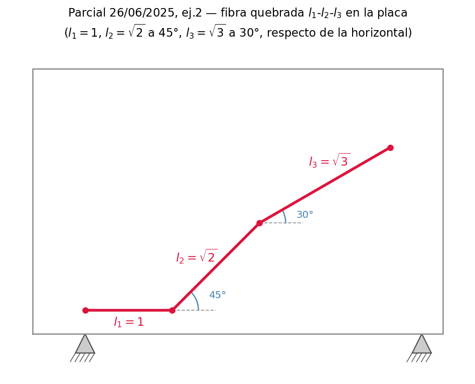

**(a) Térmica homogénea:** $\varepsilon_{ij} = \alpha\,\delta_{ij}\,\Delta T = 10^{-5}\cdot 10\cdot\delta_{ij} = 10^{-4}\,\delta_{ij}$. Como el tensor es **esférico**:
$$\varepsilon(\mathbf{n}) = 10^{-4}\,\delta_{ij}n_in_j = 10^{-4}\,\underbrace{n_in_i}_{=1} = 10^{-4} \quad \textbf{para toda dirección}$$
$$\Delta L_{\text{total}} = 10^{-4}(l_1 + l_2 + l_3) = 10^{-4}(1 + \sqrt2 + \sqrt3) \approx 3{,}15\times10^{-4}$$
💡 No hizo falta ningún ángulo: esa es la gracia del inciso, y la respuesta conceptual del (c).

**(b) Fibra $l_3$ con $\boldsymbol\varepsilon = 10^{-4}\begin{bmatrix}1 & 0{,}5\\ 0{,}5 & 1\end{bmatrix}$:** con $\mathbf{n} = (\cos30°, \sin30°) = (\tfrac{\sqrt3}{2}, \tfrac12)$:
$$\varepsilon(\mathbf{n}) = 10^{-4}\left[1\cdot\tfrac34 + 1\cdot\tfrac14 + 2\cdot0{,}5\cdot\tfrac{\sqrt3}{4}\right] = 10^{-4}\left[1 + \tfrac{\sqrt3}{4}\right] \approx 1{,}43\times10^{-4}$$
$$\Delta L_3 = \sqrt3 \times 1{,}43\times10^{-4} \approx 2{,}48\times10^{-4}$$

**(c) ¿Qué característica presenta el tensor del inciso a?** Es **isótropo/esférico** ($\alpha\delta_{ij}\Delta T$): 🔗 U8, rango 2 isótropo = escalar·δ. Consecuencias para responder: toda dirección es principal; estira igual en todas las direcciones; es **deformación puramente volumétrica, sin distorsión** (desviador nulo, $\varepsilon' = 0$); no hay corte en ningún sistema de ejes.

**⚠️ El criterio exacto para "darte cuenta" (la parte que rinde puntos):** $A_{ij}$ es isótropo $\iff A_{ij}=\alpha\,\delta_{ij}$ — eso exige **dos** cosas a la vez: (1) diagonal toda igual, **y** (2) fuera de la diagonal, todo cero. El tensor de (a), $10^{-4}\delta_{ij}$, cumple ambas. El de (b), $10^{-4}\begin{bmatrix}1&0{,}5\\0{,}5&1\end{bmatrix}$, tiene la diagonal igual (¡1 y 1!) pero el $0{,}5$ fuera de la diagonal lo saca de la forma $\alpha\delta_{ij}$ — **no es isótropo**, aunque a primera vista "se parezca" por tener la diagonal pareja. Esa mirada rápida a la diagonal sin chequear el resto es el error más común de este ítem.

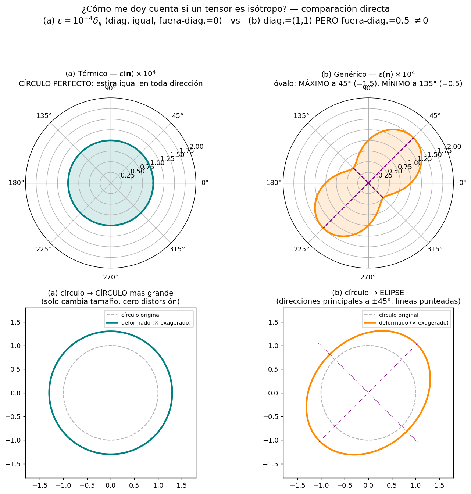

💡 **La figura es el criterio hecho dibujo.** Arriba, el diagrama polar de $\varepsilon(\mathbf{n})=\varepsilon_{ij}n_in_j$ recorriendo todos los $\theta$: para (a) es un **círculo perfecto** (mismo estiramiento en cualquier dirección — la firma geométrica de $\alpha\delta_{ij}$); para (b) es un **óvalo de dos lóbulos**, con máximo ($1{,}5\times10^{-4}$) a $45°$ y mínimo ($0{,}5\times10^{-4}$) a $135°$ — esas son sus direcciones principales, y no coinciden con los ejes $x,y$ originales. Abajo, el mismo hecho pero mirando qué le pasa a un círculo de material: en (a) un círculo se deforma en **otro círculo** (más grande, sin distorsión); en (b) se deforma en una **elipse** inclinada a 45°. Ver la elipse *es* ver la anisotropía.

> 🎛️ **App interactiva:** [¿Es isótropo? — comprobador de tensores 2D](https://claude.ai/code/artifact/914d98d2-44f5-4385-a7d5-e46ecee4a39d) — armá cualquier tensor con sliders ($A_{xx}, A_{yy}, A_{xy}$) y mirá en vivo el veredicto, el checklist (diagonal igual / fuera-diagonal cero), el diagrama polar y el círculo deformado. Trae de preset los dos tensores de este ejercicio, y algunos más para practicar el criterio con otros números.

**(d) ¿Las deformaciones de (a) y (b) son compatibles en todo el cuerpo?** Ambos campos son **uniformes** (constantes en el espacio) → todas las derivadas segundas de Saint-Venant son cero → **compatibles trivialmente**. Justificación completa: un ε constante integra a un campo $u_i = \varepsilon_{ij}x_j$ (+ mov. rígido), que existe y es continuo. 🔗 U6.5.

---

## II.3 — TIPO 2: Green-Lagrange/Almansi con deformación homogénea (U5) — *de figura*

**Aparece en:** 2025-06-24 Q2 (triángulo A-B-C → A'-B'-C'), recuperatorio 2024 Q1 (rectángulo → paralelogramo; pide u, E y e).

### La receta

"Deformación homogénea" = el mapeo es **afín**: $x_i = F_{ij}\,a_j + c_i$ con $F$ constante. Entonces:

1. **Construí F con dos vectores de arista.** Elegí un vértice base $P$ y dos aristas materiales $\mathbf{d}^{(1)} = Q - P$, $\mathbf{d}^{(2)} = R - P$; sus imágenes $\mathbf{d}'^{(1)} = Q' - P'$, $\mathbf{d}'^{(2)} = R' - P'$. Como el mapeo es lineal en diferencias: $\mathbf{d}' = F\,\mathbf{d}$. Si las aristas materiales son $(1,0)$ y $(0,1)$ (o proporcionales), **las columnas de F son directamente las aristas deformadas** (divididas por la longitud original).
2. **Green-Lagrange:** $\;E = \tfrac{1}{2}\left(F^TF - I\right)$ — comparar con $E_{ij} = \tfrac12\!\left(\tfrac{\partial x_\alpha}{\partial a_i}\tfrac{\partial x_\alpha}{\partial a_j} - \delta_{ij}\right)$: para mapeo afín, $\partial x_\alpha/\partial a_i = F_{\alpha i}$.
3. **Almansi:** $\;e = \tfrac{1}{2}\left(I - F^{-T}F^{-1}\right)$ (invertís F, que en 2D es directo).
4. **Desplazamientos** (si los piden): $u_i = x_i - a_i = (F_{ij}-\delta_{ij})a_j + c_i$, con $c$ fijado por un vértice.

⚠️ **Tres controles conceptuales que valen puntos:**
- La **traslación no afecta E ni e** (solo entra en $c$): si el cuerpo además se movió, no importa.
- Si el movimiento incluye **rotación** (como en el parcial 2025-06-24, donde el triángulo rota), $E$ la filtra sola gracias al término cuadrático: NO uses ε infinitesimal acá, daría deformación espuria. Que el enunciado pida Green-Lagrange y no Cauchy **es una pista de que hay rotación grande**.
- Verificá: si el mapeo fuera rotación pura, $F^TF = I$ y $E = 0$. Usalo como test del F que armaste.

### Resolución desarrollada — recuperatorio 2024 Q1 (corte simple)

Rectángulo $0\le a_1\le 2$, $0\le a_2\le 1$ → paralelogramo con la base fija y el lado inclinado un ángulo de 20° respecto de la vertical. El mapeo: los puntos se corren en $x_1$ proporcionalmente a su altura:

$$x_1 = a_1 + k\,a_2, \quad x_2 = a_2, \qquad k = \tan 20° \approx 0{,}364 \qquad\Longrightarrow\qquad F = \begin{bmatrix}1 & k\\ 0 & 1\end{bmatrix}$$

**(a) Desplazamientos:** $u_1 = x_1 - a_1 = k\,a_2$, $\;u_2 = 0$.

**(b) Green-Lagrange:**
$$F^TF = \begin{bmatrix}1 & 0\\ k & 1\end{bmatrix}\begin{bmatrix}1 & k\\ 0 & 1\end{bmatrix} = \begin{bmatrix}1 & k\\ k & 1+k^2\end{bmatrix} \quad\Longrightarrow\quad \boxed{E = \frac{1}{2}\begin{bmatrix}0 & k\\ k & k^2\end{bmatrix}}$$

**(c) Almansi:** $F^{-1} = \begin{bmatrix}1 & -k\\ 0 & 1\end{bmatrix}$ (verificá: $FF^{-1}=I$),
$$F^{-T}F^{-1} = \begin{bmatrix}1 & -k\\ -k & 1+k^2\end{bmatrix} \quad\Longrightarrow\quad \boxed{e = \frac{1}{2}\begin{bmatrix}0 & k\\ k & -k^2\end{bmatrix}}$$

💡 **Lectura del resultado (esto es lo que el corrector quiere ver):** $E_{12} = e_{12} = k/2$ — el corte coincide; pero $E_{22} = +k^2/2$ y $e_{22} = -k^2/2$: **los términos cuadráticos difieren en signo** (el $+$ de Green-Lagrange vs el $-$ de Almansi, sección 5.3-5.4). Para $k$ pequeño ambos → $\varepsilon = \tfrac12\begin{bmatrix}0&k\\k&0\end{bmatrix}$: todas las medidas coinciden en el régimen infinitesimal (sección 5.1). Un renglón con este comentario diferencia un 8 de un 10.

---

## II.4 — TIPO 3: Airy + equilibrio + compatibilidad + condiciones de borde (U6+U7)

**Aparece en:** 2024 Q2 ($\Phi = x^2y$), recuperatorio Q2 (solución de tensiones propuesta para placa cargada).

### Resolución desarrollada — 2024 Q2

**Las tensiones desde Airy** ($b_i = 0$):
$$\sigma_{xx} = \frac{\partial^2\Phi}{\partial y^2} = 0, \qquad \sigma_{yy} = \frac{\partial^2\Phi}{\partial x^2} = 2y, \qquad \sigma_{xy} = -\frac{\partial^2\Phi}{\partial x\partial y} = -2x$$

**(a) ¿Equilibrio?** Chequear $\partial\sigma_{ij}/\partial x_j = 0$:
$$\frac{\partial\sigma_{xx}}{\partial x} + \frac{\partial\sigma_{xy}}{\partial y} = 0 + 0 = 0 \;\checkmark \qquad \frac{\partial\sigma_{xy}}{\partial x} + \frac{\partial\sigma_{yy}}{\partial y} = -2 + 2 = 0 \;\checkmark$$

💡 **El concepto detrás (respuesta que justifica):** cualquier Φ con derivadas cuartas continuas cumple equilibrio **por construcción** — sustituí las definiciones en la ecuación de equilibrio y se cancela idénticamente. Airy es a equilibrio lo que la formulación en desplazamientos es a compatibilidad: 🔗 **la dualidad de la U6.5** — si tu incógnita es $u$ y derivás, compatibilidad sale gratis; si tu incógnita es Φ y derivás, equilibrio sale gratis. En cada formulación, la ecuación que queda por imponer es la otra. Por eso el inciso (b) pide verificar compatibilidad: es lo NO automático acá.

**(b) ¿Compatibilidad?** Necesitás ε desde σ: **Hooke inverso** (sección 7.3), con $\sigma_{kk} = \sigma_{xx}+\sigma_{yy}+\sigma_{zz} = 0 + 2y + 0 = 2y$:

$$\varepsilon_{xx} = \frac{1}{2\mu}\left(\sigma_{xx} - \frac{\lambda}{3\lambda+2\mu}\sigma_{kk}\right) = -\frac{\lambda}{\mu(3\lambda+2\mu)}\,y$$
$$\varepsilon_{yy} = \frac{1}{2\mu}\left(2y - \frac{2\lambda y}{3\lambda+2\mu}\right) = \frac{1}{\mu}\cdot\frac{(2\lambda+2\mu)-\lambda}{3\lambda+2\mu}\,y \quad(\text{lineal en } y), \qquad \varepsilon_{xy} = \frac{\sigma_{xy}}{2\mu} = -\frac{x}{\mu}$$

Todas las deformaciones son **lineales en las coordenadas** ⟹ toda derivada segunda es nula:
$$\frac{\partial^2\varepsilon_{xx}}{\partial y^2} + \frac{\partial^2\varepsilon_{yy}}{\partial x^2} = 0 + 0 = 0 = 2\frac{\partial^2\varepsilon_{xy}}{\partial x\partial y} \;\checkmark$$

💡 **Atajo que podés enunciar:** campos de tensión **lineales** en las coordenadas (Airy polinómico de grado ≤ 3) dan ε lineales → compatibilidad automática. Solo con Φ de grado ≥ 4 la compatibilidad puede fallar y hay que verificarla en serio.

**(c) Condiciones de borde:** en cada borde con normal $\mathbf{n}$, el vector tensión es $t_i = \sigma_{ij}n_j$; compará con la carga aplicada de la figura. Para bordes con esfuerzos resultantes, integrá: $N = \int t_n\,ds$, $Q = \int t_t\,ds$, $M_z = \int t_n\,\xi\,ds$ (brazo $\xi$ desde el centro). ⚠️ El signo de $\mathbf{n}$: siempre la **normal exterior** (en el borde inferior $\mathbf{n} = (0,-1)$: $t_x = -\sigma_{xy}$, $t_y = -\sigma_{yy}$ — clásico error de signo).

---

## II.5 — TIPO 4: Verificar isotropía de un tensor dado (U8)

**Aparece en:** 2024 Q3: verificar que $A_{ijkl} = \delta_{ik}\,\delta_{jl}$ es isótropo.

**Resolución (dos renglones si sabés qué usar):** transformar con la ley de rango 4 y aplicar **ortogonalidad** dos veces:

$$A'_{ijkl} = \beta_{ip}\,\beta_{jq}\,\beta_{kr}\,\beta_{ls}\,A_{pqrs} = \beta_{ip}\,\beta_{jq}\,\beta_{kr}\,\beta_{ls}\,\delta_{pr}\,\delta_{qs} = \underbrace{(\beta_{ip}\beta_{kp})}_{=\,\delta_{ik}}\,\underbrace{(\beta_{jq}\beta_{lq})}_{=\,\delta_{jl}} = \delta_{ik}\,\delta_{jl} = A_{ijkl} \;\checkmark$$

💡 **Todo el ejercicio es una sola idea:** las deltas "comen" índices de las β y las emparejan para que aparezca la condición de ortogonalidad $\beta_{ip}\beta_{kp} = \delta_{ik}$. Practicá esta manipulación hasta que sea automática: es la misma que demuestra que $\delta$ es isótropo en rango 2 (sección 8.1).

🔗 **Comentario que suma:** $\delta_{ik}\delta_{jl}$ es isótropo pero **no tiene la simetría $ij$** del tensor de módulos elásticos; en la base de generadores de la U8 es la combinación $\tfrac12(\delta_{ik}\delta_{jl}+\delta_{il}\delta_{jk}) + \tfrac12(\delta_{ik}\delta_{jl}-\delta_{il}\delta_{jk})$, es decir mitad generador simétrico + mitad antisimétrico ($\mu = \gamma = \tfrac12$, $\lambda = 0$).

> 🎛️ **App interactiva:** [Isotropía de orden 4 — 2024 Q3](https://claude.ai/code/artifact/7399be46-45b7-4251-b719-4f146a4632fa) — la misma idea del comprobador de rango 2 (círculo=isótropo), pero un escalón arriba: contrae $A_{ijkl}$ cuatro veces con el mismo versor, $A(\mathbf{n})=A_{ijkl}n_in_jn_kn_l$, y grafica eso contra $\theta$. Con sliders de $\lambda,\mu,\gamma$ (los generadores de 8.1) el círculo **nunca se rompe** — es el teorema de representación puesto a prueba. Con un término tipo "fibra" ($k\cdot n^{(0)}_in^{(0)}_jn^{(0)}_kn^{(0)}_l$, como la rigidez de una madera) el círculo se abolla en la dirección de la fibra. Bonus: subí $\gamma$ solo y mirá que el círculo **no se mueve** — la app te deja ver en vivo por qué el test direccional es ciego al generador antisimétrico, y por qué 8.1 necesita el argumento de simetría de $\sigma$ para matarlo.

---

## II.6 — TIPO 5: ¿Irrotacional? ¿Incompresible? (U6)

**Aparece en:** recuperatorio Q3 (campo desde función de corriente), 2025-06-26 Q3c, y en teóricas (potencial ⟹ irrotacional, demostrar).

### Resolución desarrollada — recuperatorio Q3

$$v_x = k\,\frac{\partial\theta}{\partial y}, \qquad v_y = -k\,\frac{\partial\theta}{\partial x}, \qquad v_z = 0$$

**¿Incompresible?**
$$\nabla\cdot\mathbf{v} = k\,\frac{\partial^2\theta}{\partial x\,\partial y} - k\,\frac{\partial^2\theta}{\partial y\,\partial x} = 0 \quad\textbf{siempre} \;\checkmark$$
por conmutación de derivadas cruzadas: la estructura del campo garantiza incompresibilidad **por construcción**, sea quien sea θ.

**¿Irrotacional?** Única componente no trivial del rotor:
$$(\mathrm{rot}\,\mathbf{v})_z = \frac{\partial v_y}{\partial x} - \frac{\partial v_x}{\partial y} = -k\left(\frac{\partial^2\theta}{\partial x^2} + \frac{\partial^2\theta}{\partial y^2}\right) = -k\,\nabla^2\theta$$
⟹ irrotacional **si y solo si θ es armónica** ($\nabla^2\theta = 0$). En general, NO.

**Tasa de deformación:** $V_{xx} = k\,\theta_{,xy}$, $V_{yy} = -k\,\theta_{,xy}$ (⟹ $\mathrm{tr}\,V = 0$, consistente ✔), $V_{xy} = \tfrac12(v_{x,y} + v_{y,x}) = \tfrac{k}{2}(\theta_{,yy} - \theta_{,xx})$.

**¿Qué nombre recibe $k\theta$?** La **función de corriente** (stream function): sus curvas de nivel son las líneas de corriente del flujo.

### 💡 La dualidad potencial ↔ corriente (teórica 2025-06-26 i, y 2025-06-24 iii)

Esta es LA idea del tipo de problema, y responde las teóricas asociadas:

| | Función **potencial** φ | Función de **corriente** ψ |
|---|---|---|
| Definición | $\mathbf{v} = \nabla\varphi$, $v_i = \varphi_{,i}$ | $v_x = \psi_{,y}$, $v_y = -\psi_{,x}$ |
| Garantiza **por construcción** | irrotacional: $(\mathrm{rot}\,\nabla\varphi)_k = \varepsilon_{kij}\,\varphi_{,ji} = 0$ | incompresible: $\psi_{,yx} - \psi_{,xy} = 0$ |
| Porque… | contracción de $\varepsilon_{kij}$ (antisimétrico en $ij$) con $\varphi_{,ji}$ (simétrico) es idénticamente nula | conmutación de derivadas cruzadas |
| Interpretación física | equipotenciales ⊥ al flujo; existe ⟺ el fluido no rota localmente | curvas de nivel = líneas de corriente (el fluido corre por ellas); existe ⟺ conserva volumen (2D) |
| La condición que queda por imponer | incompresibilidad → $\nabla^2\varphi = 0$ | irrotacionalidad → $\nabla^2\psi = 0$ |

⚠️ **La demostración "rot grad = 0"** (pedida explícita en 2025-06-24 iii) tiene que estar escrita en índices: $[\mathrm{rot}(\nabla\varphi)]_k = \varepsilon_{kij}\,\partial_i\partial_j\varphi = 0$ porque es la contracción de un objeto **antisimétrico** en $(i,j)$ con uno **simétrico** en $(i,j)$ — el mismo argumento estructural que usás en toda la materia (p.ej., por qué $\gamma$ desaparece en U8).

🔗 Y notá el patrón que ya viste tres veces: **"automático por construcción"** — desplazamientos → compatibilidad gratis; Airy → equilibrio gratis; potencial → irrotacional gratis; corriente → incompresible gratis. Los parciales aman preguntar *qué* garantiza cada formulación (teórica 2025-06-24 ii: "¿qué garantiza la ecuación de compatibilidad?" → **que exista un campo de desplazamientos continuo y univaluado del cual provengan las deformaciones**, es decir que el rompecabezas cierre sin huecos ni superposiciones).

---

## II.7 — TIPO 6: Derivada material + flujo con Gauss (puente U9-10) — *cae SIEMPRE*

**Aparece en:** 2025-06-26 Q3, 2025-06-24 Q3, 2024 Q5, recuperatorio Q5. **Es el ejercicio más repetido de todos los parciales.**

### Las dos fórmulas

$$\boxed{\frac{Dq_i}{Dt} = \underbrace{\frac{\partial q_i}{\partial t}}_{\text{local}} + \underbrace{v_j\,\frac{\partial q_i}{\partial x_j}}_{\text{convectivo}}} \qquad\qquad \boxed{\iint_S f_i\,n_i\,dS = \iiint_V \frac{\partial f_i}{\partial x_i}\,dV \;\;(\text{Gauss})}$$

💡 **Interpretación (teórica 2025-06-24 v):** $\partial q/\partial t$ = lo que ve un **sensor fijo** en el espacio (derivada espacial/local); $Dq/Dt$ = lo que ve una **sonda que flota** con la partícula (derivada material). Difieren en el término convectivo $v\cdot\nabla q$: aunque el campo sea estacionario ($\partial_t = 0$), la partícula puede ver variar $q$ porque **se muda** a zonas donde $q$ vale distinto. Gauss (teórica 2025-06-24 iv): relaciona el **flujo neto saliente** por la superficie cerrada con la **integral de la divergencia** en el volumen — convierte integrales de superficie en integrales de volumen, y es la herramienta con que se localizan las leyes de balance (de "para todo volumen" a la EDP puntual).

### Resolución desarrollada — 2025-06-26 Q3

$$\mathbf{q} = \begin{bmatrix} x_2\,t^2\\ x_1\,t\\ x_3\,e^t\end{bmatrix}, \qquad \mathbf{v} = \begin{bmatrix} x_1\,t\\ x_1\\ -x_3\end{bmatrix}$$

**(a) Derivada material.** Componente a componente, $\dfrac{Dq_i}{Dt} = \dfrac{\partial q_i}{\partial t} + v_1\dfrac{\partial q_i}{\partial x_1} + v_2\dfrac{\partial q_i}{\partial x_2} + v_3\dfrac{\partial q_i}{\partial x_3}$:

$$\frac{Dq_1}{Dt} = 2x_2t + (x_1t)(0) + (x_1)(t^2) + (-x_3)(0) = 2x_2\,t + x_1\,t^2$$
$$\frac{Dq_2}{Dt} = x_1 + (x_1t)(t) + 0 + 0 = x_1(1 + t^2)$$
$$\frac{Dq_3}{Dt} = x_3e^t + 0 + 0 + (-x_3)(e^t) = 0$$

💡 El cero de la tercera componente no es casualidad de cuentas: el crecimiento local $x_3e^t$ se cancela exactamente con lo que la partícula "pierde" al moverse hacia $x_3$ menores ($v_3 = -x_3$). Es el ejemplo perfecto de local + convectivo compitiendo.

**(b) Flujo neto de $f_i = Dq_i/Dt$.** Con Gauss, y como el volumen es fijo y arbitrario:
$$\frac{\partial f_i}{\partial x_i} = \frac{\partial}{\partial x_1}(2x_2t + x_1t^2) + \frac{\partial}{\partial x_2}\big(x_1(1+t^2)\big) + \frac{\partial}{\partial x_3}(0) = t^2 + 0 + 0 = t^2$$
$$\iint_S f_i\,n_i\,dS = \iiint_V t^2\,dV = \boxed{t^2\,V}$$

**(c) ¿El fluido es irrotacional? Demuestre.** Calculá el rotor de $\mathbf{v}$ (¡de v, no de q!):
$$(\mathrm{rot}\,\mathbf{v})_3 = \frac{\partial v_2}{\partial x_1} - \frac{\partial v_1}{\partial x_2} = 1 - 0 = 1 \neq 0 \quad\Longrightarrow\quad \textbf{NO es irrotacional}$$
(basta una componente no nula; las otras: $(\mathrm{rot}\,\mathbf{v})_1 = 0 - 0 = 0$, $(\mathrm{rot}\,\mathbf{v})_2 = 0 - 0 = 0$). 🔗 Recordá: rot v = vector vorticidad = 2× velocidad angular local (U6.2) — acá cada elemento rota con velocidad angular ½.

⚠️ **Trampas del tipo:**
- Derivar $q_i$ respecto de $t$ **con $x$ fijo** (las $x_i$ son coordenadas espaciales, no dependen de t en la parcial local). El enunciado siempre aclara "donde $x_i$ son las coordenadas actuales o espaciales" — esa frase te dice que estás en descripción euleriana y la receta es local + convectivo.
- Si te dan **el movimiento** $x_i = x_i(a,t)$ (como 2025-06-24 Q3b: $x_1 = a_2t^2$, $x_2 = a_1t^2$): la vía **Lagrangiana** es sustituir $x(a,t)$ dentro del campo y derivar respecto de $t$ a $a$ fijo — sin término convectivo, porque ya estás siguiendo a la partícula. Ambas vías deben dar lo mismo (expresado en variables distintas); si piden "en su expresión Lagrangiana", terminá en función de $(a,t)$; si piden euleriana (recuperatorio Q5), volvé a sustituir $a = a(x,t)$ al final.
- **Aceleración** = derivada material **de la velocidad**: $a_i = Dv_i/Dt = \partial_t v_i + v_j v_{i,j}$ (2025-06-24 Q3c). E "¿incompresible?" ahí mismo: $\nabla\cdot\mathbf{v} \stackrel{?}{=} 0$.

---

## II.8 — TIPO 7 (la demostración estrella): Navier-Stokes / ecuación de Navier — *cae SIEMPRE y vale mucho*

**Aparece en:** 2025-06-26 Q4, 2025-06-24 Q4 (versión fluido), 2024 Q4 (versión sólido elástico). Integra U5+U6+U7+U8+balance: es EL ejercicio síntesis del curso.

### Versión fluido: Navier-Stokes incompresible

**Datos del enunciado:** balance de cantidad de movimiento lineal
$$\rho\,\frac{Dv_i}{Dt} = \frac{\partial\sigma_{ij}}{\partial x_j} + \rho\,b_i$$
y constitutiva Newtoniana isótropa $\sigma_{ij} = -p\,\delta_{ij} + \lambda\,V_{kk}\,\delta_{ij} + 2\mu\,V_{ij}$.

**Paso 0 — citá las simplificaciones previas (el enunciado lo pide explícitamente: "indique la razón de las simplificaciones"):**
1. $\sigma_{ij} = \sigma_{ji}$ ← **balance de momento angular** (por eso la constitutiva puede ser simétrica; 🔗 es lo que mató a γ en U8).
2. Isotropía ← colapsa $D_{ijkl}$ de 81/36 componentes a **2 constantes** λ, μ (teorema U8; el parcial 2025-06-26 te da el $C_{ijkl}$ de cuarto orden general y espera que digas esto).
3. **Incompresibilidad** ← de continuidad (conservación de masa): $\tfrac{D\rho}{Dt} + \rho\,V_{kk} = 0$; con ρ constante siguiendo la partícula ⟹ $V_{kk} = \nabla\cdot\mathbf{v} = 0$ (esta es también la teórica 2025-06-26 iv). Entonces el término λ muere:
$$\sigma_{ij} = -p\,\delta_{ij} + 2\mu\,V_{ij} = -p\,\delta_{ij} + \mu\left(\frac{\partial v_i}{\partial x_j} + \frac{\partial v_j}{\partial x_i}\right)$$

**Paso 1 — divergencia de la tensión** (μ uniforme ← simplificación 4, material homogéneo):
$$\frac{\partial\sigma_{ij}}{\partial x_j} = -\frac{\partial p}{\partial x_j}\,\delta_{ij} + \mu\,\frac{\partial^2 v_i}{\partial x_j\partial x_j} + \mu\,\frac{\partial^2 v_j}{\partial x_i\partial x_j}$$
- Primer término: $-\partial p/\partial x_i$ (la delta come el índice).
- Tercer término: $\mu\,\dfrac{\partial}{\partial x_i}\underbrace{\left(\dfrac{\partial v_j}{\partial x_j}\right)}_{=\,\nabla\cdot\mathbf{v}\,=\,0} = 0$ ← **acá se usa incompresibilidad por segunda vez** (conmutando derivadas). ⚠️ Este es el paso que la gente olvida justificar.

**Paso 2 — resultado:**
$$\boxed{\rho\,\frac{Dv_i}{Dt} = -\frac{\partial p}{\partial x_i} + \mu\,\frac{\partial^2 v_i}{\partial x_j\,\partial x_j} + \rho\,b_i} \qquad\text{(Navier-Stokes incompresible)}$$

en notación vectorial: $\rho\,D\mathbf{v}/Dt = -\nabla p + \mu\,\nabla^2\mathbf{v} + \rho\,\mathbf{b}$, con $D\mathbf{v}/Dt = \partial_t\mathbf{v} + (\mathbf{v}\cdot\nabla)\mathbf{v}$ (🔗 tipo 6: la aceleración es derivada material).

**Pregunta final del enunciado (2025-06-26 Q4b): ¿qué nombre recibe μ y cuál es su interpretación física?** μ es la **viscosidad dinámica** del fluido. Interpretación: es el precio de la distorsión — la constante de proporcionalidad entre la tensión de corte y la tasa de deformación angular ($\sigma_{xy} = 2\mu V_{xy}$); mide la resistencia interna del fluido a cambiar de forma, la "fricción interna" entre capas que deslizan a distinta velocidad. 🔗 Es el módulo de corte del diccionario sólido↔fluido (U7.2): en Hooke el desviador paga $2\mu\varepsilon'$, en Newton paga $2\mu V'$.

### Versión sólido: ecuación de Navier (2024 Q4) — la gemela

Mismo esqueleto con el diccionario $V \to \varepsilon$, $v \to u$: partís de $\rho\,D^2u_i/Dt^2 = \sigma_{ij,j} + b_i$ con Hooke $\sigma_{ij} = \lambda\,\varepsilon_{kk}\,\delta_{ij} + 2\mu\,\varepsilon_{ij}$ (acá NO hay incompresibilidad: el término λ vive):

$$\frac{\partial\sigma_{ij}}{\partial x_j} = \lambda\,\frac{\partial\varepsilon_{kk}}{\partial x_i} + 2\mu\,\frac{\partial\varepsilon_{ij}}{\partial x_j}, \qquad 2\mu\,\varepsilon_{ij,j} = \mu\,(u_{i,jj} + u_{j,ij}) = \mu\,\nabla^2 u_i + \mu\,\frac{\partial\varepsilon_{jj}}{\partial x_i}$$

(usando $u_{j,ij} = (u_{j,j})_{,i} = \varepsilon_{jj,i}$, con λ y μ uniformes). Sumando los términos en $\varepsilon_{jj,i}$:

$$\boxed{\rho\,\frac{D^2u_i}{Dt^2} = \mu\,\frac{\partial^2 u_i}{\partial x_j\partial x_j} + (\lambda + \mu)\,\frac{\partial\varepsilon_{jj}}{\partial x_i} + b_i} \qquad\text{(ecuación de Navier, elasticidad)}$$

💡 **Puestas lado a lado, Navier-Stokes y Navier son la misma demostración** con la variable del diccionario cambiada — y la diferencia estructural es exactamente que el fluido incompresible perdió su término de traza y el sólido lo conserva como $(\lambda+\mu)\nabla(\nabla\cdot\mathbf{u})$. Si entendés una, tenés la otra gratis. Practicá las dos hasta hacerlas sin mirar: son los puntos más seguros del parcial.

---

## II.9 — Banco de teóricas resueltas (respuestas sintéticas modelo)

Las preguntas "responda en forma sintética" evalúan si tenés la interpretación, no la fórmula. Respuestas de 2-4 renglones, como las quiere el corrector:

**¿En qué se diferencian ε y V?** *(2025-06-24 i)* — ε mide deformación acumulada respecto de una configuración de referencia (comparación de fotos, tiene memoria de forma; aproximado, requiere gradientes pequeños); V mide la tasa instantánea de deformación (la película; exacto siempre porque en dt el desplazamiento v·dt es genuinamente infinitesimal; no requiere referencia — por eso es la variable natural de los fluidos). 🔗 secc. 6.1.

**¿Qué garantiza la compatibilidad?** *(2025-06-24 ii)* — Que el campo de deformaciones provenga de un campo de desplazamientos continuo y univaluado: que el cuerpo deformado siga siendo un continuo, sin huecos ni superposiciones (el rompecabezas de cubitos deformados cierra). Sin ella, las 6 componentes de ε (3 incógnitas u) pueden ser inconsistentes entre sí. 🔗 secc. 6.5.

**Rotor del campo de velocidad: ¿qué indica y con qué tensores se relaciona? ¿Si v = ∇φ?** *(2025-06-24 iii)* — rot v = vector vorticidad Ω = vector dual del tensor de vorticidad (parte antisimétrica de ∇v) = **el doble** de la velocidad angular local de cada elemento fluido: indica rotación local sobre sí mismo (no curvatura de trayectorias). Si $v_i = \varphi_{,i}$: $(\mathrm{rot}\,\mathbf{v})_k = \varepsilon_{kij}\varphi_{,ji} = 0$ (antisimétrico × simétrico) ⟹ flujo potencial es irrotacional por construcción. 🔗 secc. 6.2, II.6.

**¿Qué relaciona Gauss?** *(2025-06-24 iv)* — El flujo neto de un campo a través de una superficie cerrada con la integral de volumen de su divergencia: $\iint_S f_in_i\,dS = \iiint_V f_{i,i}\,dV$. Convierte información de superficie en información de volumen; es la herramienta para localizar leyes de balance (pasar de "vale para todo volumen" a la ecuación diferencial puntual).

**Derivada material vs espacial, e interpretación.** *(2025-06-24 v)* — $\partial f/\partial t$: variación vista por un observador fijo en el espacio (sensor anclado). $Df/Dt = \partial f/\partial t + v_j f_{,j}$: variación vista siguiendo a la partícula (sonda flotante); el término convectivo captura que la partícula se muda a zonas con otro valor de f. Coinciden si v = 0 o si f es espacialmente uniforme.

**¿Interpretación física de función potencial y de corriente?** *(2025-06-26 i)* — Ver tabla de II.6: φ existe ⟺ flujo irrotacional, equipotenciales ⊥ velocidad; ψ existe (2D) ⟺ flujo incompresible, sus curvas de nivel SON las líneas de corriente.

**¿Homogéneo vs isótropo? ¿Puede un cuerpo ser ambos?** *(2025-06-26 ii)* — Homogéneo: mismas propiedades **en todo punto** (invariancia ante traslación de la posición). Isótropo: mismas propiedades **en toda dirección** en un punto dado (invariancia ante rotación). Son independientes: la madera es (aprox.) homogénea pero anisótropa (la fibra marca dirección); un material con gradiente de composición puede ser isótropo punto a punto pero inhomogéneo. Y sí: un cuerpo puede presentar ambas (acero común: homogéneo e isótropo). ⚠️ Clásica de confundir: homogeneidad habla de *dónde*, isotropía de *hacia dónde*.

**¿Qué conclusión da el balance de momento angular?** *(2025-06-26 iii; demostración completa pedida en recuperatorio Q4)* — Que el tensor de tensiones es **simétrico**: $\sigma_{ij} = \sigma_{ji}$ (usando además la ecuación de movimiento y conservación de masa, los términos de volumen se cancelan y queda $\varepsilon_{ijk}\sigma_{jk} = 0$ ⟹ la parte antisimétrica de σ es nula). Consecuencia en cadena: constitutivas simétricas, γ = 0 en U8, solo 2 constantes elásticas.

**¿Qué se asume para reducir continuidad con la incompresibilidad?** *(2025-06-26 iv)* — Continuidad: $\tfrac{D\rho}{Dt} + \rho\,\nabla\cdot\mathbf{v} = 0$. Se asume densidad constante siguiendo a la partícula ($D\rho/Dt = 0$, fluido incompresible) ⟹ la continuidad se reduce a $\nabla\cdot\mathbf{v} = 0$ (campo solenoidal): la conservación de masa se vuelve una condición puramente cinemática sobre v. 🔗 secc. 6.4.

---

## II.10 — TIPO 8: Más ejercicios de Unidad 6 en parciales anteriores (2014–2023)

**Aparece en:** recuperatorio 26/06/2014, recuperatorio 02/07/2016, recuperatorio 30/06/2023, parcial 26/06/2015. Cuatro variantes de U6 que no salieron en los parciales 2024-2025 ya resueltos arriba, pero usan exactamente las mismas herramientas de las secciones 6.1–6.4 — sirven para ver esas herramientas actuar sobre números distintos.

### (a) Fuente puntual 2D = flujo potencial — RECP2_2016 ej.1

$$\mathbf{v} = \left(\frac{x_1}{r^2},\ \frac{x_2}{r^2},\ 0\right), \qquad r^2 = x_1^2+x_2^2$$

**¿Incompresible?**
$$\frac{\partial v_1}{\partial x_1} = \frac{x_2^2-x_1^2}{r^4}, \qquad \frac{\partial v_2}{\partial x_2} = \frac{x_1^2-x_2^2}{r^4} \qquad\Longrightarrow\qquad \nabla\cdot\mathbf{v} = 0 \quad\checkmark$$

**¿Irrotacional?**
$$(\mathrm{rot}\,\mathbf{v})_3 = \frac{\partial v_2}{\partial x_1}-\frac{\partial v_1}{\partial x_2} = \frac{-2x_1x_2}{r^4} - \frac{-2x_1x_2}{r^4} = 0 \quad\checkmark$$

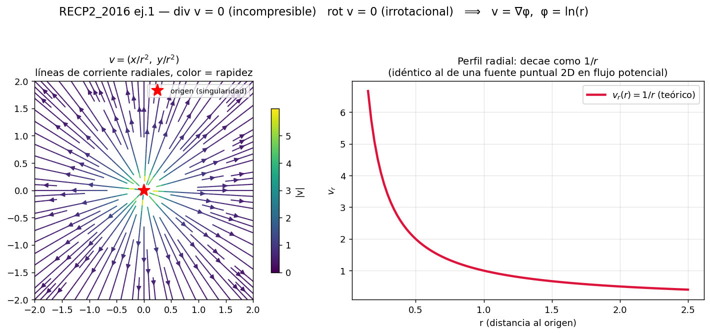

💡 **Por qué vale la pena pararse en este ejercicio (más allá de repetir la cuenta):** el campo es exactamente $\mathbf{v} = \nabla\varphi$ con $\varphi = \ln r$ — verificalo: $\partial_{x_1}\ln r = x_1/r^2$ ✔. Es la **fuente puntual del flujo potencial** (la misma que aparece en aerodinámica/hidráulica como singularidad elemental), y conecta directo con la dualidad potencial↔corriente de la sección II.6: acá tenés el ejemplo concreto de "$\varphi$ existe ⟹ irrotacional por construcción" con números reales, no abstracto. El panel derecho muestra que $v_r$ decae como $1/r$ — la firma de cualquier fuente/sumidero puntual en 2D.

### (b) Dos perfiles de corte en z: uno incompresible, otro no — recuperatorio 2023 ej.2

$$\text{(a) } \mathbf{v} = \lambda\left\{H^4-(H-z)^4,\ 0,\ 0\right\} \qquad\qquad \text{(b) } \mathbf{v} = \left\{U+\alpha z,\ 0,\ -\alpha z\right\}$$

**Caso (a):** $\partial v_1/\partial x_3 = 4\lambda(H-x_3)^3 \Rightarrow V_{13}=V_{31}=\lambda(H-x_3)^3$, el resto de las componentes es nulo. $\nabla\cdot\mathbf{v}=0$ trivialmente (ninguna componente depende de su propia coordenada) ⟹ **incompresible**.

**Caso (b):** $V_{13}=V_{31}=\alpha/2$, $V_{33}=-\alpha$ (el resto nulo). $\nabla\cdot\mathbf{v} = 0+0-\alpha = -\alpha \neq 0$ ⟹ **NO incompresible**, salvo que $\alpha=0$.

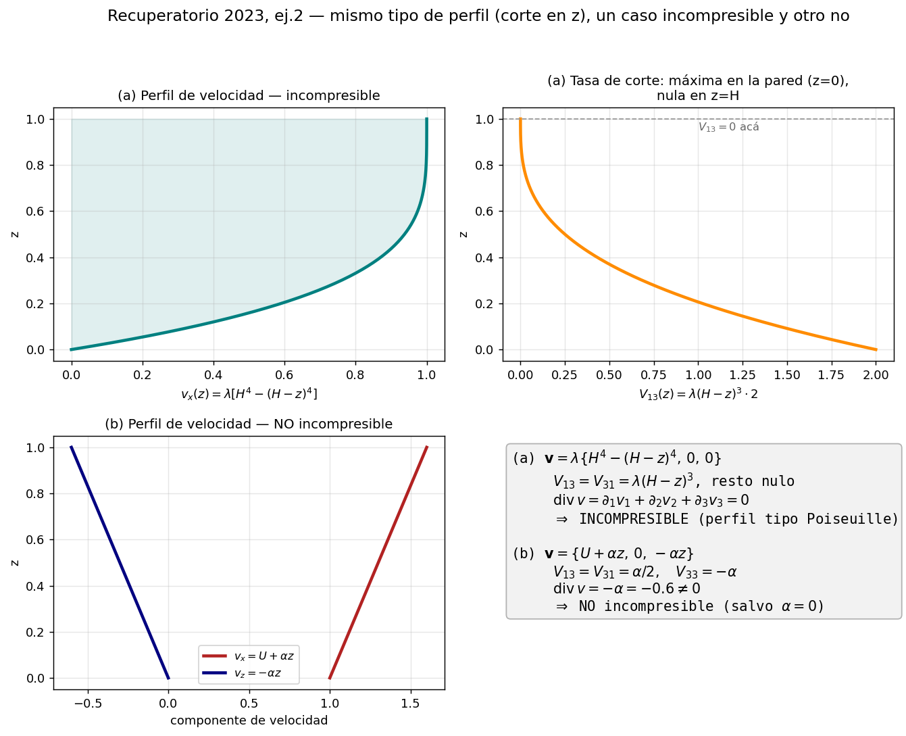

💡 **La comparación es el punto del ejercicio:** ambos son perfiles de corte "tipo capa límite" con la misma estructura algebraica superficial ($v_x$ función de $z$), pero (a) tiene la forma particular que hace que la tasa de corte se **anule en $z=H$** (pensalo como el centro de un conducto: ahí no hay deslizamiento relativo) mientras que (b) le agregó una componente $v_z=-\alpha z$ que, sola, ya rompe la incompresibilidad — **el termino de corte $V_{13}$ nunca es el problema para la traza; el problema es cualquier componente que dependa linealmente de "su propia" coordenada** (aquí $v_3$ de $x_3$). Es el mismo diagnóstico de 6.4 aplicado sin rodeos.

### (c) Movimiento de cuerpo rígido con eje de rotación oblicuo — RECP2_2014 ej.2

$$\mathbf{v} = (-3x_2+x_3,\ \ 3x_1-5x_3,\ \ -x_1+5x_2)$$

$$\nabla\mathbf{v} = \begin{bmatrix}0&-3&1\\3&0&-5\\-1&5&0\end{bmatrix} \qquad\text{— puramente antisimétrica}\qquad\Longrightarrow\qquad V \equiv 0 \ \ \textbf{en todo punto}$$

$$\boldsymbol\Omega_{\text{vector}} = \mathrm{rot}\,\mathbf{v} = (10,\,2,\,6) \qquad\Longrightarrow\qquad \text{velocidad angular local} = \tfrac12\boldsymbol\Omega_{\text{vector}} = (5,\,1,\,3)$$

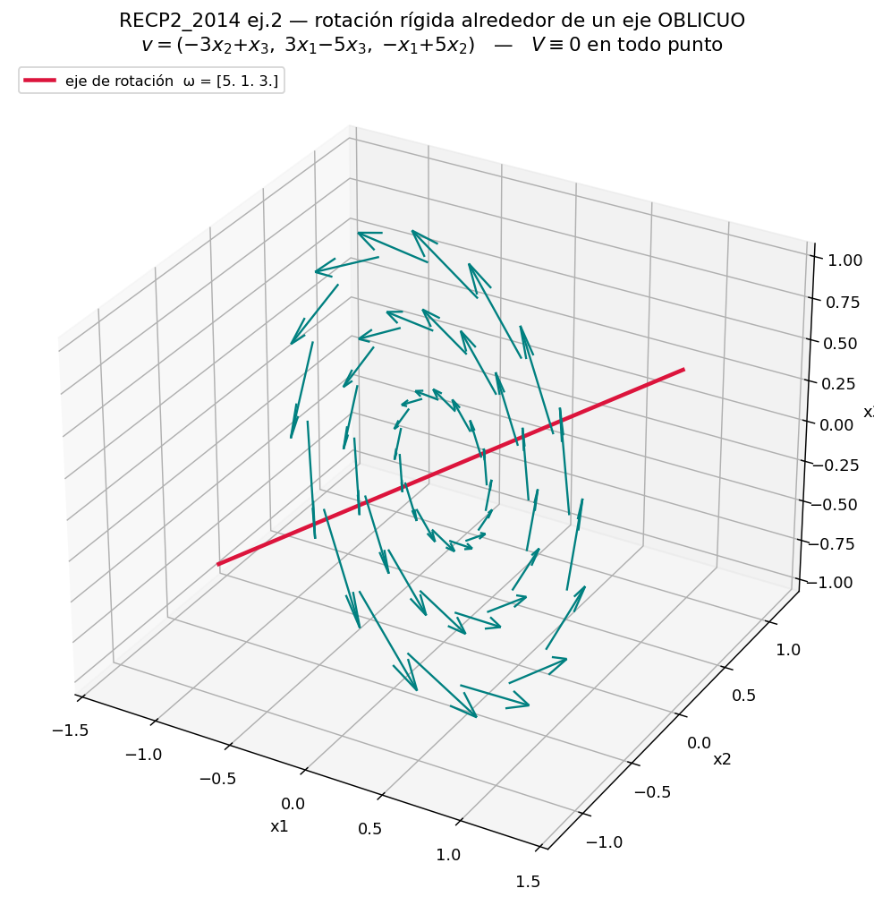

💡 **Qué agrega este ejercicio frente al caso "de manual" de 6.3(a):** ahí la rotación rígida era en el plano $xy$, alrededor del eje $z$ — el caso más fácil de imaginar. Acá el eje de rotación **no coincide con ningún eje coordenado**: es la dirección $(5,1,3)$, escondida dentro de una matriz que a primera vista no "se ve" como una rotación. La receta para destaparlo es mecánica y no depende de adivinar el eje: calculás $\nabla v$, verificás que es antisimétrica ($V=0$), y el vector dual (= rot v / 2) **te da el eje y la velocidad angular directamente**, sin necesidad de imaginarte la geometría de antemano. La figura confirma: en el plano perpendicular a $(5,1,3)$ el campo dibuja círculos concéntricos con rapidez proporcional al radio — exactamente la firma de una rotación de cuerpo rígido, solo que vista de costado.

⚠️ **Chequeo de sanidad que vale la pena hacer siempre:** si $\nabla v$ (o $\nabla u$ en U5) resulta ser antisimétrica pura con solo mirarla, ni siquiera hace falta calcular $V=\tfrac12(\nabla v+\nabla v^T)$ aparte — ya sabés que da cero. Ahorra cuentas en el parcial.

### (d) La identidad de Lamb: aceleración = local + vorticidad×velocidad + gradiente de energía cinética — parcial 26/06/2015 ej.1

$$\text{Demostrar: } \quad \boldsymbol\alpha = \frac{D\mathbf{v}}{Dt} = \frac{\partial\mathbf{v}}{\partial t} + \boldsymbol\omega\times\mathbf{v} + \frac{1}{2}\nabla(v^2), \qquad \boldsymbol\omega = \mathrm{rot}\,\mathbf{v},\ \ v^2=\mathbf{v}\cdot\mathbf{v}$$

**Demostración (índices):** partiendo de $\alpha_i = \partial v_i/\partial t + \varepsilon_{ijk}\omega_j v_k + \tfrac12\,\partial(v_kv_k)/\partial x_i$, se expande el término del rotor con la identidad $\varepsilon_{ijk}\varepsilon_{jlm}=\delta_{kl}\delta_{im}-\delta_{km}\delta_{il}$ (🔗 la misma contracción de deltas que en U8) y todo colapsa a:

$$\alpha_i = \frac{\partial v_i}{\partial t} + v_k\,\frac{\partial v_i}{\partial x_k} = \frac{Dv_i}{Dt} \qquad \blacksquare$$

💡 **Qué te dice esta identidad que la fórmula "local + convectivo" (sección II.7) no muestra tan claro:** el término convectivo $v_k\partial v_i/\partial x_k$ —que parece una sola cosa— en realidad son **dos efectos físicos distintos** empaquetados: la parte de $(\mathbf{v}\cdot\nabla)\mathbf{v}$ que gira la velocidad sin cambiar su módulo ($\boldsymbol\omega\times\mathbf{v}$, como la aceleración centrípeta) y la parte que viene de que el módulo de $\mathbf{v}$ cambia de un punto a otro ($\tfrac12\nabla v^2$). En un flujo **irrotacional** ($\boldsymbol\omega=0$) toda la aceleración convectiva es gradiente de energía cinética — la base de la ecuación de Bernoulli.

**Verificación numérica (con el propio campo del ejercicio (c) de arriba, que es estacionario):** en $\mathbf{p}=(0{,}7,\,-0{,}4,\,0{,}3)$, calculando ambos lados por separado (`U6/visualizacion_parciales_viejos.py`, función `figura_rotacion_eje_oblicuo`):

$$(\mathbf{v}\cdot\nabla)\mathbf{v} = (-4{,}5,\ 18{,}0,\ 1{,}5) \qquad = \qquad \boldsymbol\omega\times\mathbf{v} + \tfrac12\nabla(v^2) = (-4{,}5,\ 18{,}0,\ 1{,}5) \quad\checkmark$$

### Práctica adicional (mismo tipo, sin figura nueva — ya cubierto por II.7)

- **P2_2015 ej.2** y **RECP2_2016 ej.2**: campos de velocidad concretos con movimiento dado $x_i(a,t)$; piden aceleración Lagrangiana y Euleriana y verificar que coinciden. Es exactamente la receta de II.7 (Tipo 6) aplicada a otro movimiento — buena práctica cronometrada si querés un ejercicio más antes del parcial.

---

## II.11 — Estrategia de examen (síntesis operativa)

1. **Leé las palabras-gatillo** (tabla II.1): cada enunciado declara su herramienta en la primera línea. "Uniforme"/"homogénea" = sin derivadas espaciales que te compliquen; "coordenadas actuales o espaciales" = euleriano = derivada material con convectivo; "demuestre" = argumento en índices, casi siempre simetría×antisimetría u ortogonalidad.
2. **Los puntos seguros:** fibra (II.2) y derivada material + Gauss (II.7) son mecánicos si practicaste; hacelos primero. Navier-Stokes (II.8) es larga pero idéntica todos los años: llevala sabida de memoria **con las justificaciones**, que es donde están los puntos.
3. **Las justificaciones valen tanto como las cuentas.** Los enunciados piden explícitamente "justifique", "indique la razón de las simplificaciones", "¿cuál es su interpretación física?". Para cada paso tené lista la frase: qué ley lo habilita (momento angular → simetría; masa → incompresibilidad; isotropía → 2 constantes; conmutación de derivadas → compatibilidad/dualidades).
4. **Chequeos de sanidad** que detectan errores: ¿E da 0 si el mapeo es rotación pura? ¿tr(V) da 0 si dijiste incompresible? ¿el versor es unitario? ¿usaste la normal exterior? ¿ε de Cauchy solo si NO hay rotaciones grandes?
5. El **formulario del parcial** (al pie del 2025-06-26) da $ds^2 - ds_0^2 = 2E_{ij}da_ida_j$ y las fórmulas de rotación de ejes $\varepsilon_{x'x'}, \varepsilon_{y'y'}, \varepsilon_{x'y'}$: esas no hay que memorizarlas, pero sí saber **cuándo** usarlas (la de rotación de ejes es la alternativa a $\mathbf{n}\cdot\boldsymbol\varepsilon\,\mathbf{n}$ para el tipo fibra: $\varepsilon_{x'x'}$ con $\theta$ = ángulo de la fibra es exactamente $\varepsilon(\mathbf{n})$).

---

# 📖 UNIDADES 9 Y 10 — ECUACIONES DE CAMPO Y PRINCIPIOS VARIACIONALES

*(U5-6 dieron el lenguaje cinemático, U7-8 el material; acá se cierran las leyes universales de balance y se recorre el camino inverso con los principios variacionales. Teoría + demostraciones + banco de preguntas sintéticas + recetario de parciales reales, 2023–2026. De acá en adelante la numeración de "PARTE" reinicia en 0 — es la estructura propia de este bloque.)*

---

# PARTE 0 — El mapa mental (leer primero, releer último)

Todo el bloque se sostiene sobre **una sola receta** aplicada cuatro veces:

> **Ley física global (integral) → Gauss + derivada material + volumen arbitrario → ecuación local**

| Ley global | Resultado local |
|---|---|
| Conservación de masa | Ecuación de continuidad (1 PDE) |
| Momento lineal (Newton) | Ecuación de Cauchy (3 PDEs) |
| Momento angular | **Ninguna PDE nueva**: σ = σᵀ (3 ecs. algebraicas) |
| Primera ley (energía) | Balance térmico (1 PDE) |

**Cerrar el sistema** = enchufar constitutiva: Cauchy + Newtoniano → **Navier-Stokes**; Cauchy + Hooke → **Navier**; balance térmico + Fourier + ε=cT → **ecuación del calor**.

El capítulo variacional recorre el camino **al revés**: forma fuerte (PDE + bordes) → forma débil (δW_ext = δW_int ∀ variación admisible), equivalencia demostrable en ambos sentidos → discretización → **Kα = f**.

**La cuenta de cierre:** 15 incógnitas = 3 de movimiento + 6 cinemáticas + 6 constitutivas. El momento angular no suma ecuaciones: ya está gastado en reducir σ de 9 a 6.

---

# TABLA MAESTRA DE FÓRMULAS (forma abreviada · forma completa · significado)

> Referencia rápida. La "forma abreviada" es la que conviene memorizar; la "completa" es en índices/coordenadas para las cuentas; el "significado" es la frase para el examen.

## Herramientas matemáticas

| Abreviada | Completa (índices) | Significado |
|---|---|---|
| $\displaystyle\int_V \text{div}\,\mathbf w\,dV=\int_S\mathbf w\cdot\boldsymbol\nu\,dS$ | $\displaystyle\int_V A_{jkl\ldots,i}\,dV=\int_S\nu_i A_{jkl\ldots}\,dS$ | **Gauss.** La integral de volumen de una derivada = integral de superficie del campo por la normal. Convierte superficie ↔ volumen. La $\nu_i$ de afuera ↔ $\partial_i$ adentro. |
| $\dfrac{DF}{Dt}=\dfrac{\partial F}{\partial t}+\mathbf v\cdot\nabla F$ | $\dfrac{DF}{Dt}=\dfrac{\partial F}{\partial t}+v_j\dfrac{\partial F}{\partial x_j}$ | **Derivada material.** Tasa de cambio de la propiedad *de la partícula*. Término 1 = el campo cambia (sensor fijo); término 2 = la partícula se muda (convectivo). |
| $\dfrac{D}{Dt}\!\displaystyle\int_V A\,dV=\int_V\!\left[\dot A+A\,\text{div}\,\mathbf v\right]dV$ | $\dfrac{D}{Dt}\!\displaystyle\int_V A\,dV=\int_V\!\left[\dfrac{\partial A}{\partial t}+\dfrac{\partial(Av_i)}{\partial x_i}\right]dV$ | **Reynolds.** Derivar una integral sobre volumen material. El término extra $A\,\text{div}\,\mathbf v$ = dilatación del volumen (por eso D/Dt no conmuta con ∫). |
| $\dfrac{D}{Dt}\!\displaystyle\int_V\rho A\,dV=\int_V\rho\dot A\,dV$ | $\dfrac{D}{Dt}\!\displaystyle\int_V\rho A\,dV=\int_V\rho\dfrac{DA}{Dt}\,dV$ | **Lema oro.** Con ρ adelante, la D/Dt entra "limpia" (el término de continuidad se anula). Base de las demos de momento y energía. |
| $\displaystyle\int_V f\,dV=0\ \forall V\Rightarrow f=0$ | — | **Volumen arbitrario.** Si una integral se anula para todo volumen, el integrando es nulo punto a punto. Cierra toda derivación local. |

## Cinemática (repaso, unidades 5-6)

| Abreviada | Completa | Significado |
|---|---|---|
| $\boldsymbol\varepsilon=\tfrac12(\nabla\mathbf u+\nabla\mathbf u^T)$ | $\varepsilon_{ij}=\tfrac12(u_{i,j}+u_{j,i})$ | **Deformación** (pequeña): parte simétrica del gradiente de desplazamientos. Mide estiramiento/corte. |
| $\mathbf V=\tfrac12(\nabla\mathbf v+\nabla\mathbf v^T)$ | $V_{ij}=\tfrac12(v_{i,j}+v_{j,i})$ | **Tasa de deformación:** versión con velocidades. Propia de fluidos. |
| $\text{tr}\,\boldsymbol\varepsilon=e$ | $\varepsilon_{kk}=u_{k,k}=\nabla\cdot\mathbf u$ | **Dilatación volumétrica:** cambio relativo de volumen ΔV/V₀. La traza = parte "de tamaño". |
| $\boldsymbol\Omega=\text{rot}\,\mathbf v$ | $(\text{rot}\,\mathbf v)_i=e_{ijk}v_{k,j}$ | **Vorticidad.** ½ rot v = velocidad angular local (¡factor 2!). rot v = 0 ⟺ irrotacional. |
| $\varepsilon_n=\mathbf n^T\boldsymbol\varepsilon\,\mathbf n$ | $\varepsilon_n=n_i\varepsilon_{ij}n_j$ | **Deformación de una fibra** en dirección unitaria n. Cambio de longitud: $\Delta l=\varepsilon_n\,l$. |

## Leyes de balance (el corazón de la unidad 10)

| Abreviada | Completa | Significado |
|---|---|---|
| $\dot\rho+\rho\,\text{div}\,\mathbf v=0$ | $\dfrac{\partial\rho}{\partial t}+\dfrac{\partial(\rho v_j)}{\partial x_j}=0$ | **Continuidad** (conservación de masa). La densidad cae a la tasa a la que el elemento se expande. |
| $\text{div}\,\mathbf v=0$ | $\dfrac{\partial v_k}{\partial x_k}=0$ | **Incompresibilidad.** Caso de continuidad con Dρ/Dt=0. No cambia volumen (sí forma). |
| $\rho\dfrac{D\mathbf v}{Dt}=\text{div}\,\boldsymbol\sigma+\mathbf X$ | $\rho\dfrac{Dv_i}{Dt}=\sigma_{ji,j}+X_i$ | **Cauchy** (momento lineal = Newton local). Masa×aceleración material = divergencia de σ + fuerza de cuerpo. La fuerza interna neta es la *divergencia* de σ. |
| $\boldsymbol\sigma=\boldsymbol\sigma^T$ | $\sigma_{ij}=\sigma_{ji}$ | **Simetría de σ** (momento angular). No es una PDE: es la condición algebraica que baja σ de 9 a 6 incógnitas. |
| $\boldsymbol\sigma\,\mathbf n=\mathbf T^{(n)}$ | $\overset{n}{T}_i=\sigma_{ji}n_j$ | **Fórmula de Cauchy.** La tracción sobre una cara = σ actuando sobre su normal. Eslabón que permite volumetrizar fuerzas de superficie. |
| $\rho\dfrac{\partial\varepsilon}{\partial t}=q-\text{div}\,\mathbf h$ | $\rho\dfrac{\partial\varepsilon}{\partial t}=q-\dfrac{\partial h_i}{\partial x_i}$ | **Balance de energía** (1ª ley, cuerpo en reposo). Cambio de energía interna = calor generado − calor que sale. |

## Constitutivas (el "material", unidades 7-8)

| Abreviada | Completa | Significado |
|---|---|---|
| $\boldsymbol\sigma=\lambda\,\text{tr}(\boldsymbol\varepsilon)\,\mathbf I+2\mu\boldsymbol\varepsilon$ | $\sigma_{ij}=\lambda\varepsilon_{kk}\delta_{ij}+2\mu\varepsilon_{ij}$ | **Hooke isótropo** (sólido). σ acoplado a la deformación ε. λ, μ (=G) = constantes de Lamé. |
| $\boldsymbol\sigma=-p\mathbf I+\lambda\,\text{tr}(\mathbf V)\mathbf I+2\mu\mathbf V$ | $\sigma_{ij}=-p\delta_{ij}+\lambda V_{kk}\delta_{ij}+2\mu V_{ij}$ | **Newtoniano isótropo** (fluido). σ acoplado a la *tasa* V. Misma estructura que Hooke + presión. |
| $\mathbb C_{ijkl}=\lambda\delta_{ij}\delta_{kl}+\mu(\delta_{ik}\delta_{jl}+\delta_{il}\delta_{jk})$ | $\sigma_{ij}=\mathbb C_{ijkl}A_{kl}=\lambda A_{kk}\delta_{ij}+2\mu A_{ij}$ | **Tensor isótropo de 4º orden.** Al contraerlo con las deltas recuperás Hooke/Newton. Exactamente 2 constantes (teorema de isotropía). |
| $\boldsymbol\varepsilon=\tfrac{1}{2\mu}\boldsymbol\sigma-\tfrac{\lambda}{2\mu(3\lambda+2\mu)}\text{tr}(\boldsymbol\sigma)\mathbf I$ | $\varepsilon_{ij}=\tfrac{\sigma_{ij}}{2\mu}-\tfrac{\lambda\,\sigma_{kk}}{2\mu(3\lambda+2\mu)}\delta_{ij}$ | **Hooke invertido** (ε desde σ). Para verificar placas. ⚠ En tensión plana ε_zz≠0 (Poisson). |
| $\mathbf h=-\kappa\nabla T$ | $h_i=-\kappa\,T_{,i}$ | **Fourier.** Flujo de calor contra el gradiente de temperatura. κ escalar por isotropía. |
| $\lambda=\dfrac{2\mu\nu}{1-2\nu}$, $\ E=2\mu(1+\nu)$ | — | **Relaciones entre constantes elásticas.** Si un hookeano "no da cero", suele faltar usar una de estas. |

## Grandes PDEs (balance + constitutiva)

| Abreviada | Completa | Significado |
|---|---|---|
| $\rho\dfrac{D\mathbf v}{Dt}=\rho\mathbf b-\nabla p+\mu\nabla^2\mathbf v$ | $\rho\dfrac{Dv_i}{Dt}=\rho b_i-\dfrac{\partial p}{\partial x_i}+\mu\dfrac{\partial^2v_i}{\partial x_j\partial x_j}$ | **Navier-Stokes incompr.** Cauchy + Newtoniano con ∇·v=0. p = incógnita/multiplicador. Con ν=μ/ρ. |
| $\rho\ddot{\mathbf u}=\mu\nabla^2\mathbf u+(\lambda+\mu)\nabla e+\mathbf b$ | $\rho\dfrac{D^2u_i}{Dt^2}=\mu\dfrac{\partial^2u_i}{\partial x_j\partial x_j}+(\lambda+\mu)\dfrac{\partial\varepsilon_{jj}}{\partial x_i}+b_i$ | **Navier elasticidad.** Cauchy + Hooke + pequeñas def. El término cruzado *sobrevive* (a diferencia del fluido). |
| $\rho c\,\dot T=q+\nabla\cdot(\kappa\nabla T)$ | $\rho c\dfrac{\partial T}{\partial t}=q+\dfrac{\partial}{\partial x_i}\!\left(\kappa\dfrac{\partial T}{\partial x_i}\right)$ | **Ecuación del calor.** Balance de energía + Fourier + ε=cT. |

## Principios variacionales

| Abreviada | Completa | Significado |
|---|---|---|
| $\delta W_{ext}=\delta W_{int}$ | (ver filas siguientes) | **Trabajos virtuales.** Equilibrio ⟺ para toda perturbación admisible δ, el trabajo externo iguala al interno. Equivale a la forma fuerte. |
| **(calor)** $\displaystyle\int_{\Gamma_\phi}\!\bar\phi\,\delta T+\int_V q\,\delta T=\int_V\kappa\nabla T\!\cdot\!\nabla\delta T$ | mismo, con $dS$ y $dV$ | Forma débil del calor. Izq = datos (fuente + flujo); der = "rigidez" (gradiente contra gradiente). |
| **(elast.)** $\displaystyle\int_V X_i\delta u_i+\int_{\Gamma_\sigma}\!\overset{n}{T}_i\delta u_i=\int_V\sigma_{ij}\delta e_{ij}$ | mismo, con $dV$ y $d\Gamma$ | Forma débil de elasticidad. Izq = fuerzas externas·desplaz. virtual; der = tensión·deform. virtual. |
| $\sigma_{ij}\delta u_{i,j}=\sigma_{ij}\delta e_{ij}$ | $\delta u_{i,j}=\delta e_{ij}+\delta\omega_{ij}$, y $\sigma_{ij}\delta\omega_{ij}=0$ | **Paso estrella.** σ (simétrico) solo trabaja contra la parte simétrica del gradiente virtual (deformación), no contra la rotación. |
| $\delta=0$ en (Γ_T, Γ_u); libre en (Γ_φ, Γ_σ) | — | **Admisibilidad.** La perturbación se anula donde el *valor* está impuesto (esencial); es libre donde se impone la *fuerza* (natural). |
| $\mathbf K\boldsymbol\alpha=\mathbf f$ | $\mathbf K=\int\mathbf B^T\kappa\,\mathbf B\,dV$, $\ \mathbf f=\int\mathbf N^T q\,dV$ | **Sistema discreto.** Campo admisible finito + arbitrariedad de δα. K simétrica (hereda la simetría de κ/C). Antesala de elementos finitos. |

## Los "operadores mecánicos" que se repiten en las cuentas

| Truco | Qué hace | Dónde aparece |
|---|---|---|
| $\partial_j(f\,\delta_{ij})=\partial_i f$ | La delta convierte el índice de derivación | Divergencia de σ en Navier-Stokes/Navier |
| $\partial_j\partial_i=\partial_i\partial_j$ | Conmutar derivadas parciales | Matar el término cruzado en NS |
| (simétrico):(antisimétrico) $=0$ | Anula la contracción | $e_{ijk}v_jv_k=0$; $\sigma\delta\omega=0$; rot(∇φ)=0 |
| $a_{ip}a_{kp}=\delta_{ik}$ | Ortogonalidad de la rotación | Verificar isotropía de un tensor |

---

# PARTE 1 — Las tres herramientas (con demostración)

## 1.1 Teorema de Gauss

$$\int_V A_{jkl\ldots,i}\, dV = \int_S \nu_i\, A_{jkl\ldots}\, dS$$

**Mnemónica:** al cruzar la frontera, la normal $\nu_i$ de afuera ↔ $\partial/\partial x_i$ adentro.

**Demostración (dirección x₁):** (1) rebanar V en tubos paralelos a x₁; teorema fundamental del cálculo a lo largo del tubo → diferencia de valores en las caras de entrada/salida sobre proyecciones $dx_2dx_3$. (2) Geometría: $dx_2dx_3 = \nu_1^*dS^*$ (coseno director = componente de la normal) y $-dx_2dx_3 = \nu_1^{**}dS^{**}$. (3) El signo lo absorbe la normal de entrada; las dos integrales se unifican sobre S. ∎

**Tres formas útiles:**
$$\int_V \text{div}\,\mathbf{w}\,dV = \int_S \mathbf{w}\cdot\boldsymbol\nu\,dS \qquad \int_V\nabla\phi\,dV=\int_S\phi\boldsymbol\nu\,dS \qquad \int_V\text{rot}\,\mathbf{u}\,dV=\int_S\boldsymbol\nu\times\mathbf{u}\,dS$$

## 1.2 Derivada material

**Concepto:** tasa de cambio de la propiedad **de la partícula** que pasa por x en t. NO es ∂/∂t (esa es la del sensor fijo; la material es la de la hoja que flota).

**Derivación:** la partícula en x pasa a x+vΔt; Taylor a primer orden en ambas dependencias; cancelar y tomar límite:

$$\boxed{\frac{DF}{Dt}=\underbrace{\frac{\partial F}{\partial t}}_{\text{el campo cambia}}+\underbrace{v_j\frac{\partial F}{\partial x_j}}_{\text{la partícula se muda (convectivo)}}}$$

Vale para CUALQUIER propiedad transportada (velocidad, temperatura, cada componente de un vector). Con F = vᵢ: el convectivo es **cuadrático en v** → no-linealidad de Navier-Stokes.

**Los dos caminos:**

| Euleriano | Lagrangiano |
|---|---|
| Datos: F(x,t) y v(x,t) | Datos: F y el mapeo xᵢ = xᵢ(a,t) |
| $DF/Dt = \partial_tF + v_j\partial_jF$ | Sustituir el mapeo en F, luego $\partial/\partial t\big|_{\mathbf a}$ (SIN convectivo) |
| Pagás el convectivo | Pagás la sustitución |

**Deben dar lo mismo** (convertir con el mapeo para chequear). Verificación extra: $v_i=\partial x_i/\partial t|_\mathbf{a}$ debe reproducir el campo dado.

### 🖼️ Visualización: observador fijo vs. observador que viaja con la partícula (parcial 2023-1, tipo T2)

La trampa conceptual de este tramo se vuelve intuitiva con un ejemplo concreto. El campo $\mathbf{v}=(0,z,y)$ es **estacionario** (no depende de $t$) y sale de derivar el mapeo del ejercicio 2023-1 (resuelto completo en la Parte 6, tipo T2):

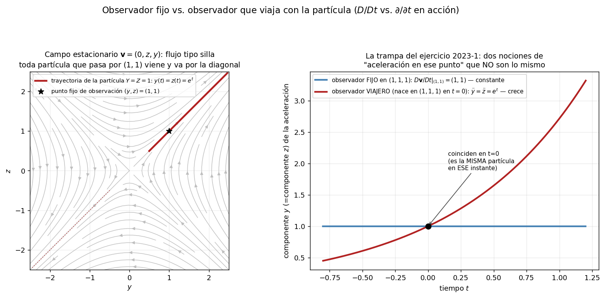

**Panel izquierdo:** es un flujo tipo *silla*: las líneas de corriente se alejan del origen a lo largo de la diagonal $y=z$ y se acercan por la otra. La partícula que en $t=0$ está en $(1,1)$ se queda **para siempre** sobre esa diagonal, alejándose como $e^t$.

**Panel derecho** es el núcleo de la trampa: un observador **fijo** en $(1,1,1)$ mide $D\mathbf{v}/Dt$ evaluado en ese punto espacial — como el campo es estacionario, ese valor es **siempre el mismo**, $(1,1)$, aunque a cada instante sea una partícula distinta la que está pasando por ahí. Un observador que **viaja** con la partícula que nació en $(1,1,1)$ mide la aceleración de esa partícula específica, que crece como $e^t$. Coinciden solo en $t=0$, porque ahí —y solo ahí— ambas descripciones señalan a la misma partícula en el mismo lugar. Es exactamente la diferencia $\partial/\partial t$ (sensor fijo) vs. $D/Dt$ (la hoja que flota) de la sección 1.2, hecha número.

*(Generado con `U9-U10/visualizacion_derivada_material_2023_1.py`.)*

## 1.3 Transporte de Reynolds

$$\boxed{\frac{D}{Dt}\int_VA\,dV=\int_V\left[\frac{\partial A}{\partial t}+\frac{\partial(Av_i)}{\partial x_i}\right]dV=\int_V\left[\frac{DA}{Dt}+A\frac{\partial v_i}{\partial x_i}\right]dV}$$

**Derivación:** separar (cambio del integrando a dominio quieto) + (aporte de la cáscara ΔV barrida por S: cada dS barre $(\mathbf v\cdot\mathbf n)\Delta t\,dS$) → integral de superficie → Gauss.

**⚠ D/Dt NO conmuta con ∫**: el término $A\,\partial_iv_i$ es la dilatación del volumen material.

**LEMA ORO** (aparece en TODAS las demos; acá entra la conservación de masa):

$$\boxed{\frac{D}{Dt}\int_V\rho A\,dV=\int_V\rho\frac{DA}{Dt}\,dV}$$

*Demo:* Reynolds con integrando ρA + regla del producto; el paréntesis $(D\rho/Dt+\rho\,\partial_iv_i)$ muere **por continuidad**. ∎

### 🖼️ Visualización: las dos geometrías detrás de todo el bloque

Gauss (1.1) y Reynolds (esta sección) son ambas, en el fondo, el mismo tipo de argumento: relacionar lo que pasa **en el borde** con lo que pasa **adentro**. Verlas una al lado de la otra deja clara la familia:

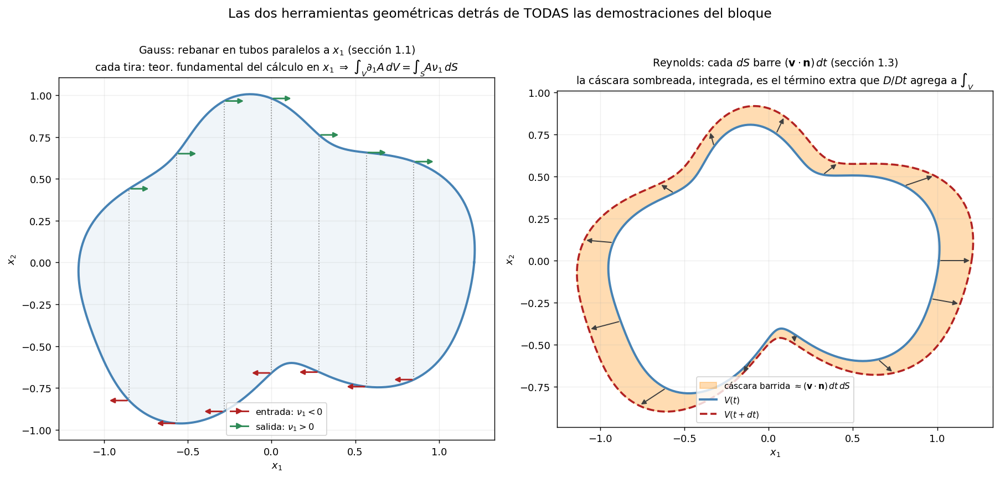

**Izquierda (Gauss):** la demostración de 1.1 rebana el volumen en tubos paralelos a $x_1$; cada tubo entra con normal $\nu_1<0$ (flecha roja) y sale con $\nu_1>0$ (flecha verde), y el teorema fundamental del cálculo a lo largo de cada tubo, sumado sobre todos, ES la demostración.

**Derecha (Reynolds):** el mismo volumen material en $t$ y $t+dt$, bajo un campo que lo expande. La cáscara sombreada entre ambos contornos es exactamente $(\mathbf{v}\cdot\mathbf{n})\,dt\,dS$ integrada sobre el borde — el término extra que hace que $D/Dt$ no conmute con $\int_V$. 🔗 Es la misma "geometría de superficie" de Gauss, ahora con el borde moviéndose en vez de quieto.

*(Generado con `U9-U10/visualizacion_gauss_reynolds.py`.)*

## 1.4 Volumen arbitrario / lema fundamental

$\int_Vf\,dV=0$ ∀ V ⇒ f=0 punto a punto. Parientes: lema fundamental ($\int f\,\delta u\,dV=0$ ∀ δu ⇒ f=0) y su versión discreta ($\delta\boldsymbol\alpha^T(\mathbf K\boldsymbol\alpha-\mathbf f)=0$ ∀ δα ⇒ Kα=f).

---

# PARTE 2 — Las cuatro leyes de balance

## 2.1 Conservación de masa

**Lagrangiana:** cambio de variables con $J=|\partial x_i/\partial a_j|$ + volumen arbitrario:
$$\boxed{\rho_0(\mathbf a)=\rho(\mathbf x)\,J}$$
J = factor local de cambio de volumen; J≠0 obligatorio (J=0 ⇒ densidad infinita; J<0 ⇒ material invertido).

**Euleriana (continuidad):** Dm/Dt=0 + Reynolds + volumen arbitrario:
$$\boxed{\frac{\partial\rho}{\partial t}+\frac{\partial(\rho v_j)}{\partial x_j}=0}\iff\boxed{\frac{D\rho}{Dt}+\rho\frac{\partial v_j}{\partial x_j}=0}\iff\int_V\partial_t\rho\,dV+\int_S\rho v_jn_j\,dS=0$$
La integral es la más general (vale con choques). Conexión: $\partial_jv_j=\text{tr}\,\mathbf V$. Incompresible ⇒ Dρ/Dt=0 ⇒ ∇·v=0.

## 2.2 Momento lineal → Cauchy

$$\frac{D}{Dt}\int_V\rho v_i\,dV=\int_S\overset{n}{T}_i\,dS+\int_VX_i\,dV$$

1. Izquierda: Reynolds → $\int[\partial_t(\rho v_i)+\partial_j(\rho v_iv_j)]dV$.
2. Derecha: **fórmula de Cauchy** $\overset{n}{T}_i=\sigma_{ji}n_j$ + Gauss → $\int(\sigma_{ji,j}+X_i)dV$.
3. Volumen arbitrario; reagrupar la izquierda:
$$v_i\underbrace{[\partial_t\rho+\partial_j(\rho v_j)]}_{=0\text{ continuidad}}+\rho\underbrace{[\partial_tv_i+v_j\partial_jv_i]}_{Dv_i/Dt}$$

$$\boxed{\rho\frac{Dv_i}{Dt}=\sigma_{ji,j}+X_i}$$

Lecturas: la fuerza interna neta es la **divergencia** de σ (tensión uniforme no acelera); con v=0 recuperás la estática; las leyes colaboran (masa simplifica a momento).

## 2.3 Momento angular → simetría de σ (DEMO DE EXAMEN — cayó en 2024R)

**Ley:** $\dfrac{D}{Dt}\int_Ve_{ijk}x_j\rho v_k\,dV=\int_Ve_{ijk}x_jX_k\,dV+\int_Se_{ijk}x_j\overset{n}{T}_k\,dS$

1. **Lema oro** (masa): LHS $=\int\rho\,e_{ijk}\left(v_jv_k+x_j\frac{Dv_k}{Dt}\right)dV$, usando $Dx_j/Dt=v_j$.
2. $e_{ijk}v_jv_k=0$ (antisimétrico : simétrico; es v×v).
3. **Cauchy + Gauss** en el torque, derivando el producto (¡x_j también se deriva, $\partial x_j/\partial x_l=\delta_{jl}$!):
$$\int_Se_{ijk}x_j\sigma_{lk}n_l\,dS=\int_Ve_{ijk}(\sigma_{jk}+x_j\sigma_{lk,l})\,dV$$
El término huérfano $e_{ijk}\sigma_{jk}$ nace de derivar el brazo de palanca — es el protagonista.
4. Agrupar lo que lleva x_j:
$$\int_Ve_{ijk}x_j\underbrace{\left[\rho\frac{Dv_k}{Dt}-\sigma_{lk,l}-X_k\right]}_{=0\text{ ec. de movimiento}}dV=\int_Ve_{ijk}\sigma_{jk}\,dV\ \Rightarrow\ \int_Ve_{ijk}\sigma_{jk}\,dV=0$$
5. Volumen arbitrario: $e_{ijk}\sigma_{jk}=0$ para i=1,2,3 ⇒ σ₂₃=σ₃₂, σ₃₁=σ₁₃, σ₁₂=σ₂₁:

$$\boxed{\sigma_{jk}=\sigma_{kj}}\ \blacksquare$$

**Checklist de ingredientes (declararlos en el examen):** masa→lema; Dx/Dt=v + antisimetría; Cauchy+Gauss con derivada del brazo; ec. de movimiento; volumen arbitrario. **Conclusión conceptual:** el momento angular no da PDE nueva, solo la condición algebraica.

## 2.4 Energía → ecuación del calor

Primera ley con cuerpo en reposo: $\int\rho\partial_t\varepsilon\,dV=\int q\,dV-\int\text{div}\,\mathbf h\,dV$ (Gauss en el flujo entrante $-\int h_in_i\,dS$; ∂ρ/∂t=0 por continuidad con v=0). Volumen arbitrario + DOS constitutivas (Fourier $\mathbf h=-\kappa\nabla T$, con κ escalar por isotropía; almacenamiento ε=cT):

$$\boxed{\rho c\frac{\partial T}{\partial t}=q+\frac{\partial}{\partial x_i}\left(\kappa\frac{\partial T}{\partial x_i}\right)}$$

+ inicial T=T₀ + bordes T=T̄ en Γ_T (esencial) y κ∇T·n=φ̄ en Γ_φ (natural).

---

# PARTE 3 — Cierre con constitutivas

## 3.0 Mecánica de índices que se repite siempre

- La delta convierte el índice de derivación: $\partial_j(f\delta_{ij})=\partial_if$.
- Contracción del isótropo de 4º orden (aparece en el parcial 2025/2026):
$$\mathbb{C}_{ijkl}A_{kl}=\lambda\delta_{ij}\delta_{kl}A_{kl}+\mu(\delta_{ik}\delta_{jl}+\delta_{il}\delta_{jk})A_{kl}=\lambda A_{kk}\delta_{ij}+2\mu A_{ij}\ (A\text{ sim.})$$
- Conmutar derivadas: $\partial_j\partial_i=\partial_i\partial_j$.
- **Simétrico : antisimétrico = 0**: mata $e_{ijk}v_jv_k$, mata $\sigma_{ij}\delta\omega_{ij}$, demuestra rot(∇φ)=0.

## 3.1 Navier-Stokes incompresible (con razones — cayó 2025 y 2026)

Datos: Cauchy + $\sigma_{ij}=-p\delta_{ij}+\lambda V_{kk}\delta_{ij}+2\mu V_{ij}$ (si viene con ℂ: contraer primero, §3.0); ρ, λ, μ ctes.

- **[R0]** Si pide "partir del balance": derivar Cauchy (§2.2). Si menciona momento angular: "⇒ σ simétrico, habilita $\sigma_{ji,j}=\sigma_{ij,j}$".
- **[R1]** Continuidad + ρ cte ⇒ $V_{kk}=\partial_kv_k=0$.
- **[R2]** Muere el término λ (la viscosidad volumétrica no tiene cambio de volumen contra qué trabajar).
- **[R3]** $\mu\,\partial_j(\partial_iv_j)=\mu\,\partial_i(\partial_jv_j)=0$: conmutar derivadas + **otra vez** incompresibilidad.
- **[R4]** μ cte sale de las derivadas.
- **[R5]** p queda sin constitutiva: incógnita/multiplicador de ∇·v=0. Sistema 4×4.

$$\boxed{\rho\frac{Dv_i}{Dt}=\rho b_i-\frac{\partial p}{\partial x_i}+\mu\nabla^2v_i\qquad\partial_kv_k=0}$$

**μ = viscosidad dinámica** (pregunta 2026-4b): constante de proporcionalidad tensión ↔ gradiente de velocidad (σ₁₂=μU/h en corte entre placas; eso DEFINE newtoniano). Fricción interna entre capas; término difusivo de momento. El sólido resiste *estar* deformado; el fluido solo resiste *estar deformándose*.

## 3.2 Navier elasticidad (cayó 2024-4)

Datos: Cauchy + Hooke $\sigma_{ij}=\lambda\varepsilon_{kk}\delta_{ij}+2\mu\varepsilon_{ij}$; pequeñas deformaciones; ρ,λ,μ uniformes.

- **[R1]** Pequeñas def. ⇒ convectivo de 2º orden ⇒ $Dv_i/Dt\approx\partial_t^2u_i$.
- **[R2]** Masa + pequeñas def. ⇒ ρ ≈ cte.
- **[R3]** Divergencia de Hooke: término λ → $\lambda\,\partial_i\varepsilon_{jj}$; términos μ → $\mu\nabla^2u_i+\mu\,\partial_i(\partial_ju_j)$.
- **⚠ EL término cruzado acá SOBREVIVE** ($\varepsilon_{jj}=e\neq0$: el sólido cambia volumen) y se suma al de λ. En el fluido incompresible moría. Misma cuenta, destino opuesto.

$$\boxed{\rho\frac{D^2u_i}{Dt^2}=\mu\frac{\partial^2u_i}{\partial x_j\partial x_j}+(\mu+\lambda)\frac{\partial\varepsilon_{jj}}{\partial x_i}+b_i}$$

## 3.3 Tabla comparativa

| | Navier-Stokes incompr. | Navier elasticidad |
|---|---|---|
| Campo / constitutiva acopla a | v / **tasa** V | u / **deformación** ε |
| Inercia | Dv/Dt completo (no lineal) | ∂²u/∂t² (linealizada) |
| Término λ | muere (V_kk=0) | vive (ε_kk=e) |
| Término cruzado μ | muere | vive → (λ+μ)∂e |
| Presión | incógnita | no hay |

---

# PARTE 4 — Principios Variacionales

## 4.0 Conceptos

**Fuerte:** PDE + bordes punto a punto. **Débil:** δW_ext = δW_int ∀ perturbación admisible (el "∀" es lo que la hace equivalente). **Para qué:** menos regularidad (integración por partes bajó un orden a la variación), absorbe gratis las naturales, se discretiza a Kα=f.

**Admisible:** perturbación hipotética (δ ≠ d: compara campos en el MISMO instante), diferenciable, **δ=0 donde el valor está impuesto** (Γ_T/Γ_u), libre donde no.

**Esencial** (T=T̄, u=ū): se construye a mano en el campo (factor: x·𝒫ₙ, (x−ℓₓ)·𝒫ₙ). **Natural** (flujo/tracción): NO se impone; queda absorbida en δW_ext y la vuelta la recupera sola.

## 4.1 DEMO — Ida, calor (5 movimientos)

Hipótesis: $\nabla\cdot(\kappa\nabla T)+q=0$; $T=\bar T$ en Γ_T; $\kappa\nabla T\cdot\mathbf n=\bar\phi$ en Γ_φ; $\mathbf h=-\kappa\nabla T$.

$$\delta W_{ext}=\int_Vq\,\delta T\,dV+\int_{\Gamma_\phi}\bar\phi\,\delta T\,dS$$

1. **Extender a Γ** (δT=0 en Γ_T; $\bar\phi=-\mathbf h\cdot\mathbf n$): $\int_{\Gamma_\phi}\bar\phi\delta T\,dS=\int_\Gamma(-\mathbf h\cdot\mathbf n)\delta T\,dS$.
2. **Gauss** del producto: $=-\int_V\text{div}(\mathbf h\,\delta T)dV$.
3. **Regla del producto** (= integración por partes): $=-\int\mathbf h\cdot\nabla(\delta T)dV-\int\delta T(\nabla\cdot\mathbf h)dV$.
4. **Balance:** $\nabla\cdot\mathbf h=q$.
5. **Constitutiva:** $\mathbf h=-\kappa\nabla T$.

$$\boxed{\int_{\Gamma_\phi}\delta T\,\bar\phi\,dS+\int_V\delta T\,q\,dV=\int_V\nabla(\delta T)\cdot(\kappa\nabla T)\,dV\quad\forall\,\delta T\text{ adm.}}\ \blacksquare$$

## 4.2 DEMO — Ida, elasticidad (con el paso estrella)

Igual con el diccionario, más un paso propio:

1-2. Extender a Γ (δu=0 en Γ_u) con Cauchy $\overset{n}{T}_i=\sigma_{ij}n_j$ + Gauss: $\int_{\Gamma_\sigma}\overset{n}{T}_i\delta u_i\,d\Gamma=\int_V\sigma_{ij,j}\delta u_i\,dV+\int_V\sigma_{ij}\delta u_{i,j}\,dV$.
3. Equilibrio: $\sigma_{ij,j}=-X_i$ (cancela con δW_ext volumétrico).
4. **PASO ESTRELLA** (simetrización por índices mudos, con σ simétrico):
$$\sigma_{ij}\delta u_{i,j}=\tfrac12(\sigma_{ij}\delta u_{i,j}+\sigma_{ji}\delta u_{i,j})\overset{i\leftrightarrow j}{=}\sigma_{ij}\underbrace{\tfrac12(\delta u_{i,j}+\delta u_{j,i})}_{\delta e_{ij}}$$
Lectura: $\sigma_{ij}\delta\omega_{ij}=0$ — **las tensiones no trabajan contra rotaciones virtuales**.

$$\boxed{\int_VX_i\delta u_i\,dV+\int_{\Gamma_\sigma}\overset{n}{T}_i\delta u_i\,d\Gamma=\int_V\sigma_{ij}\,\delta e_{ij}\,dV\quad\forall\,\delta u\text{ adm.}}\ \blacksquare$$

## 4.3 DEMO — Vuelta: débil ⇒ fuerte

Hipótesis: u=ū en Γ_u y δW_ext=δW_int ∀ δu admisible.

1. Desandar: $\sigma_{ij}\delta e_{ij}=\sigma_{ij}\delta u_{i,j}=(\sigma_{ij}\delta u_i)_{,j}-\sigma_{ij,j}\delta u_i$; Gauss: $\int\sigma\delta e\,dV=\int_\Gamma\sigma_{ij}n_j\delta u_i\,d\Gamma-\int\sigma_{ij,j}\delta u_i\,dV$.
2. Sustituir, usar δu=0 en Γ_u, agrupar:
$$\int_V(\sigma_{ij,j}+X_i)\delta u_i\,dV+\int_{\Gamma_\sigma}(\overset{n}{T}_i-\sigma_{ij}n_j)\delta u_i\,d\Gamma=0$$
3. **Lema fundamental en dos etapas:** primero δu nulas en frontera ⇒ paréntesis de volumen = 0; luego δu libres en Γ_σ ⇒ el otro también.

$$\boxed{\sigma_{ji,j}+X_i=0\ \text{en }V\qquad\sigma_{ij}n_j=\overset{n}{T}_i\ \text{en }\Gamma_\sigma}\ \blacksquare$$

**Remarcar:** la condición natural SALE SOLA — nunca fue impuesta.

## 4.4 Diccionario calor ↔ elasticidad

T↔u_i · ∇T↔e (con simetrización extra) · h=−κ∇T↔σ=Ce · q↔X · φ̄,Γ_φ↔T̄ⁿ,Γ_σ · T̄,Γ_T↔ū,Γ_u. Sabiendo una demo + diccionario + paso estrella, tenés las dos.

## 4.5 Discretización → Kα=f

Campo admisible finito T=**N**α (base × factor de la esencial); variación en la MISMA base δT=**N**δα (Galerkin); ∇T=**B**α; sustituir; constantes fuera de la integral; arbitrariedad de δα:

$$\mathbf K=\int\mathbf B^T\kappa\,\mathbf B\,dV\qquad\mathbf f=\int\mathbf N^Tq\,dV\qquad\boxed{\mathbf K\boldsymbol\alpha=\mathbf f}$$

K simétrica porque κ (o C) lo es — la simetría constitutiva baja al álgebra lineal. El método da la mejor aproximación dentro del espacio elegido.

---

# PARTE 5 — BANCO DE PREGUNTAS SINTÉTICAS (pregunta 1 de los parciales, con respuestas modelo)

> Todos los años la pregunta 1 es "responda en forma sintética". Estas son las que cayeron en 2025 y 2026, con la respuesta que hay que dar: 3-6 líneas, concepto + fórmula clave.

## P1. Interpretación física de la función potencial y la función de línea de corriente (2026-i)

**Potencial φ:** si $\mathbf v=\nabla\phi$, el flujo es automáticamente **irrotacional** (rot∇φ=0, ver P7). Recíproco: rot v=0 (dominio simplemente conexo) ⇒ existe φ. Interpretación: la velocidad "baja el gradiente" de φ; las superficies φ=cte son ortogonales al flujo.

**Función de corriente ψ (2D):** $v_x=\partial\psi/\partial y$, $v_y=-\partial\psi/\partial x$. Su existencia garantiza automáticamente la **incompresibilidad** ($\partial_xv_x+\partial_yv_y=\psi_{,yx}-\psi_{,xy}=0$). Interpretación: las curvas ψ=cte **son las líneas de corriente** (el flujo es tangente a ellas); la diferencia de ψ entre dos líneas es el caudal que pasa entre ellas.

**Síntesis:** potencial ↔ irrotacional; corriente ↔ incompresible. Un flujo potencial incompresible 2D tiene ambas y las dos son armónicas (∇²φ=∇²ψ=0). *(Conecta con el ejercicio 2024R-3, ver T4.)*

## P2. Homogéneo vs. isótropo; ¿puede un cuerpo presentar ambas? (2026-ii)

**Homogéneo:** las propiedades del material no dependen de la **posición** (invariancia ante traslación: todos los puntos son iguales). **Isótropo:** no dependen de la **dirección** (invariancia ante rotación: en un punto, todas las direcciones son iguales). Son propiedades **independientes**, y sí, un cuerpo puede tener ambas (acero estructural típico). Contraejemplos cruzados: madera = homogénea pero anisótropa (dirección de la fibra); material funcionalmente graduado = isótropo punto a punto pero no homogéneo.

## P3. ¿Qué conclusión se obtiene del balance de cantidad de movimiento angular? (2026-iii)

Que el tensor de tensiones es **simétrico**: $\sigma_{ij}=\sigma_{ji}$. No aporta ninguna PDE nueva (todo lo que lleva brazo de palanca ya lo garantiza el momento lineal): solo la condición algebraica que reduce σ de 9 a 6 componentes. (Demo completa: §2.3.)

## P4. ¿Qué se asume para reducir continuidad a la condición de incompresibilidad ∇·v=0 (descripción euleriana)? (2026-iv)

Se asume **incompresibilidad**: $D\rho/Dt=0$ — la densidad de cada partícula no cambia al moverse. Entonces la continuidad $D\rho/Dt+\rho\,\partial_jv_j=0$ deja $\rho\,\partial_jv_j=0\Rightarrow\partial_jv_j=0$. (Caso particular más fuerte: ρ = cte en todo el campo, que requiere además homogeneidad.)

## P5. Diferencia entre tensor de pequeñas deformaciones ε y tensor de tasa de deformación V (2025-i)

ε compara la configuración **actual contra una referencia** (se construye con desplazamientos; adimensional; propio de sólidos, que "recuerdan" su forma); vale solo si deformaciones Y rotaciones son pequeñas. V es la **tasa instantánea** (se construye con velocidades; unidades 1/s; propio de fluidos, sin configuración de referencia). El diccionario u→v, ε→V es **exacto** (no aproximado) porque una tasa es intrínsecamente infinitesimal.

## P6. ¿Qué garantiza la ecuación de compatibilidad? (2025-ii)

Que un campo de deformaciones dado **derive de un campo de desplazamientos continuo y univaluado**: 6 componentes de ε salen de solo 3 uᵢ (sistema sobredeterminado en el camino inverso ε→u), y compatibilidad es la condición para que "el rompecabezas deformado cierre" sin huecos ni solapamientos.

## P7. Rotor del campo de velocidad: qué indica, con qué tensores se relaciona; ¿qué pasa si v=∇φ? DEMOSTRAR (2025-iii)

Indica **rotación local** del fluido: $\boldsymbol\Omega=\text{rot}\,\mathbf v$ es la vorticidad, con $\frac12\text{rot}\,\mathbf v$ = velocidad angular local (¡factor 2!). Se relaciona con el **tensor de vorticidad/spin** $\Omega_{ij}$, la parte antisimétrica del gradiente de velocidades (la simétrica es V).

**Demostración de que v=∇φ ⇒ irrotacional:**
$$(\text{rot}\,\nabla\phi)_i=e_{ijk}\frac{\partial}{\partial x_j}\left(\frac{\partial\phi}{\partial x_k}\right)=e_{ijk}\,\phi_{,kj}=0$$
porque es la contracción del símbolo $e_{ijk}$, **antisimétrico** en (j,k), con $\phi_{,jk}$, **simétrico** en (j,k) (Schwarz). Contracción simétrico:antisimétrico = 0. ∎

## P8. ¿Qué relaciona el teorema de Gauss? (2025-iv)

La **integral de volumen de una derivada** (divergencia) con la **integral de superficie del campo por la normal externa**: $\int_VA_{,i}\,dV=\int_S\nu_iA\,dS$. Físicamente: lo que se "genera" dentro del volumen con lo que atraviesa su frontera. Es la herramienta que convierte términos de superficie (tracciones, flujos) en términos de volumen para derivar las ecuaciones locales.

## P9. Derivada material vs. derivada espacial de un campo f euleriano; ¿cómo se relacionan? (2025-v)

**Espacial** ∂f/∂t: tasa de cambio en un **punto fijo del espacio** (lo que mide un sensor anclado). **Material** Df/Dt: tasa de cambio de la propiedad **de la partícula** que pasa por ese punto (lo que siente una hoja que flota). Relación:
$$\frac{Df}{Dt}=\frac{\partial f}{\partial t}+\mathbf v\cdot\nabla f$$
El convectivo v·∇f existe porque la partícula se muda dentro de un campo no homogéneo. Pueden diferir incluso con campo estacionario (∂f/∂t=0 pero Df/Dt≠0 si la partícula viaja hacia zonas de otro valor) — ver T2.

---

# PARTE 6 — RECETARIO LIGADO A LOS PARCIALES REALES (2023–2026)

> Cada tipo con: dónde cayó, cómo leer el enunciado, receta y resolución/resultados clave.

## T1 — Derivada material de un campo dado (euleriana)
**Cayó:** 2026-3a, 2025-3a, 2024-5a, 2024R-5.

**Lectura del enunciado:** "xᵢ son las coordenadas actuales o espaciales" = descripción euleriana = usar la fórmula con convectivo. Escribir SIEMPRE la fórmula general primero.

**Receta:** ∂q/∂t (posición congelada) → matriz ∂qᵢ/∂xⱼ → producto con v → sumar.

**Resolución 2024-5a** — $\mathbf q=(x_1t^2,\ x_2\cos t,\ x_3e^t)$, $\mathbf v=(x_1/t,\ x_2\tan t,\ x_3)$:
$$\frac{\partial\mathbf q}{\partial t}=(2x_1t,\ -x_2\sin t,\ x_3e^t)\qquad v_j\partial_jq=(x_1t,\ x_2\tan t\cos t,\ x_3e^t)=(x_1t,\ x_2\sin t,\ x_3e^t)$$
$$\boxed{\frac{D\mathbf q}{Dt}=(3x_1t,\ 0,\ 2x_3e^t)}$$
La segunda componente se cancela exacta: la partícula "ve" constante lo que el sensor ve oscilar — interpretarlo suma puntos.

**Resolución 2026-3a** — $\mathbf q=(x_2t^2, x_1t, x_3e^t)$, $\mathbf v=(x_1t, x_1, -x_3)$: $D\mathbf q/Dt=(2x_2t+x_1t^2,\ x_1(1+t^2),\ 0)$ (la tercera se cancela).

**Variante mixta 2024R-5** (mapeo dado + campo euleriano, resultado pedido en euleriana): primero obtener v en euleriana desde el mapeo ($v_i=\partial x_i/\partial t|_\mathbf a$, luego invertir el mapeo para eliminar las a): con $x_1=a_1e^{-t}, x_2=a_2e^t, x_3=a_3+a_2(e^{-t}-1)$ sale $v=(-x_1,\ x_2,\ -x_2e^{-2t})$. Con $s=x_1-2x_2+3x_3$ y $A_i=e^{-it}s$:
$$\frac{DA_i}{Dt}=e^{-it}\left[-i\,s+(v_1-2v_2+3v_3)\right]=e^{-it}\left[-i(x_1-2x_2+3x_3)-x_1-2x_2-3x_2e^{-2t}\right]$$
(p.ej. i=1: $e^{-t}[-2x_1-3x_3-3x_2e^{-2t}]$). La estructura A_i = f_i(t)·s permite factorizar: $v\cdot\nabla A_i=f_i(t)\,(v\cdot\nabla s)$ — buscá siempre esa factorización.

## T2 — Observador fijo vs. observador que viaja con la partícula
**Cayó:** 2023-1 (con solución oficial).

**Lectura:** "cambio de velocidad por unidad de tiempo que observaría..." — (a) fijo en un punto vs. (b) viajando con la partícula. Es LA pregunta conceptual material/espacial hecha ejercicio.

**Resolución 2023-1** — $x=X$, $y=\frac12[(Y{+}Z)e^t+(Y{-}Z)e^{-t}]$, $z=\frac12[(Y{+}Z)e^t-(Y{-}Z)e^{-t}]$:
- Velocidades materiales: $\dot y=z$, $\dot z=y$ (¡el campo euleriano $\mathbf v=(0,z,y)$ es **estacionario**!).
- **(a) Observador fijo en (1,1,1):** registra la aceleración de la partícula que pasa en cada instante: $D\mathbf v/Dt=\mathbf v\cdot\nabla\mathbf v=(0,y,z)$ (equivalente: $\ddot y=y$, $\ddot z=z$ del mapeo, expresado espacialmente). En (1,1,1): $(0,1,1)$, **constante en el tiempo** (a cada rato pasa una partícula distinta con la misma aceleración).
- **(b) Observador viajero** (partícula que en t=0 estaba en (1,1,1), o sea Y=Z=1): su trayectoria es $y=z=e^t$, y su aceleración $\boldsymbol\alpha=(0,e^t,e^t)$, **creciente**.
- **(c)** La aceleración de LA partícula es **(b)**: la aceleración es una propiedad de la partícula seguida en el tiempo; (a) da en cada instante la de una partícula distinta. Consistencia: en t=0 ambas dan (0,1,1); y la fórmula de (a) evaluada en la posición actual de la partícula ($y=z=e^t$) reproduce (b). ✔

## T3 — Flujo sobre superficie de volumen arbitrario
**Cayó:** 2026-3b, 2024-5b; variante "verificar la divergencia por cálculo directo" en 2023R-1b.

**Lectura:** superficie NO especificada + "volumen fijo, arbitrario" = **Gauss inmediato** (nadie parametriza nada).

$$\iint_Sf_in_i\,dS=\int_V\text{div}\,\mathbf f\,dV$$

**2024-5b** con $\mathbf f=Dq/Dt=(3x_1t,0,2x_3e^t)$: div = $3t+2e^t$ (constante en el espacio) ⇒ flujo $=(3t+2e^t)\cdot A$ (A = volumen). **2026-3b**: div = t² ⇒ flujo = t²·V. Si la divergencia da constante, es señal de que vas bien.

**Variante 2023R-1b** (verificar Gauss por cálculo): calcular las 6 integrales de cara $\int\sigma n\,dS$ (con la normal de CADA cara, atentos a los signos de las caras "negativas") y la integral de volumen de $\sigma_{ij,j}$, y comprobar que coinciden. Trabajoso pero mecánico.

## T4 — ¿Irrotacional? ¿Incompresible? + función de corriente
**Cayó:** 2026-3c, 2024R-3, 2023R-2.

**Receta:** incompresible ⟺ $\partial_jv_j=\text{tr}\mathbf V=0$; irrotacional ⟺ rot v=0 componente a componente ($e_{ijk}\partial_jv_k$). Basta UNA componente ≠0 para responder que no. Son condiciones **independientes**. Evaluar sobre **v** (no sobre otros campos del enunciado).

**Resolución 2024R-3** — $v_x=k\,\partial\theta/\partial y$, $v_y=-k\,\partial\theta/\partial x$, $v_z=0$:
- **Incompresible SIEMPRE:** $\partial_xv_x+\partial_yv_y=k\theta_{,yx}-k\theta_{,xy}=0$ por Schwarz — por construcción, para cualquier θ.
- **Irrotacional solo si θ es armónica:** $(\text{rot}\,\mathbf v)_z=\partial_xv_y-\partial_yv_x=-k(\theta_{,xx}+\theta_{,yy})=-k\nabla^2\theta$ (las otras componentes son 0). ⇒ irrotacional ⟺ ∇²θ=0. En general NO.
- **Tasa de deformación:** $V_{11}=k\theta_{,xy}$, $V_{22}=-k\theta_{,xy}$, $V_{12}=\frac k2(\theta_{,yy}-\theta_{,xx})$, resto 0. (Chequeo: tr V=0 ✓, coherente con incompresible.)
- **kθ se llama función de corriente** — y esto conecta directo con la pregunta sintética P1 del parcial 2026: sus curvas de nivel son las líneas de corriente.

**2026-3c** — $\mathbf v=(x_1t, x_1, -x_3)$: $(\text{rot}\,\mathbf v)_3=\partial_1v_2-\partial_2v_1=1\neq0$ ⇒ NO irrotacional (corte simple en el plano 12, que siempre trae rotación).

## T5 — Demostración Navier-Stokes / Navier
**Cayó:** 2025-4, 2026-4a (con ℂ de 4º orden), 2024-4 (elasticidad).

Receta completa en §3.1 y §3.2 con las razones numeradas — el enunciado SIEMPRE pide "indicar la razón de las simplificaciones": cada tachado con su porqué al lado. Leer con lupa: ¿"partiendo del balance"? (derivar Cauchy primero); ¿menciona momento angular? (una línea de simetría); ¿constitutiva con ℂ? (contraer las deltas primero, §3.0); ¿b por masa o X por volumen? (define si aparece ρb o X solo).

## T6 — Demostración simetría de σ
**Cayó:** 2024R-4. Demo completa en §2.3 con checklist de ingredientes.

## T7 — Demostraciones variacionales / identidades tipo Green
**Cayó:** 2023-3 (con solución oficial); anunciadas para este año.

**Resolución 2023-3** — demostrar, con $\boldsymbol\phi=0$ en S:
$$\int_V\phi_i\,\Delta\psi_i\,dV=-\int_V\nabla\phi_i\cdot\nabla\psi_i\,dV$$

Es exactamente la jugada central de las demos variacionales (Gauss del producto + condición de borde que mata la superficie):

1. Considerar el producto $\phi_i\psi_{i,j}$ y su divergencia (regla del producto):
$$(\phi_i\psi_{i,j})_{,j}=\phi_{i,j}\psi_{i,j}+\phi_i\psi_{i,jj}$$
2. Integrar en V y aplicar **Gauss** al lado izquierdo:
$$\int_V(\phi_i\psi_{i,j})_{,j}\,dV=\int_S\phi_i\,\psi_{i,j}\,n_j\,dS=0$$
porque $\phi_i=0$ en S (este es el rol de "δT=0 en Γ_T" de las demos del apunte).
3. Entonces $\int_V(\phi_{i,j}\psi_{i,j}+\phi_i\psi_{i,jj})\,dV=0$, es decir:
$$\int_V\phi_i\Delta\psi_i\,dV=-\int_V\nabla\phi_i\cdot\nabla\psi_i\,dV\ \blacksquare$$

**Patrón general de estas demos** (si te dan otra identidad): (i) identificar el producto cuya divergencia genera los dos términos de la identidad; (ii) Gauss; (iii) usar la condición de borde dada para anular la superficie (o dejarla si la identidad la incluye); (iv) despejar. Las demos 4.1–4.3 del apunte son este patrón + usar balance y constitutiva en el camino.

## T8 — Verificar solución de tensiones propuesta (placa / Airy)
**Cayó:** 2024R-2 (placa, análoga a 2026-2 de práctica), 2024-2 (Airy).

**Receta placa (2024R-2):**
1. **Equilibrio:** $\sigma_{ji,j}+X_i=0$ (acá X=0): derivar polinomios; definir $k=\frac34\frac q{c^3}$ para el factor común; debe dar cancelación exacta (si no: error propio).
2. **Deformaciones en 3D:** Hooke invertido
$$\varepsilon_{ij}=\frac{\sigma_{ij}}{2\mu}-\frac{\lambda}{2\mu(3\lambda+2\mu)}\sigma_{kk}\delta_{ij}$$
(deducción exprés: traza de Hooke ⇒ $\sigma_{kk}=(3\lambda+2\mu)\varepsilon_{kk}$, despejar, sustituir). **⚠ Trampa "considerar en 3D":** en tensión plana $\sigma_{zz}=0$ pero $\varepsilon_{zz}=-\frac{\lambda}{2\mu(3\lambda+2\mu)}(\sigma_{xx}+\sigma_{yy})\neq0$ — efecto Poisson.
3. **Compatibilidad** (te dan la ecuación): segundas derivadas de cada ε, verificar la identidad; los términos de Poisson se cancelan entre sí.

**Receta Airy (2024-2)** — $\Phi=x^2y$: tensiones $\sigma_{xx}=\Phi_{,yy}=0$, $\sigma_{yy}=\Phi_{,xx}=2y$, $\sigma_{xy}=-\Phi_{,xy}=-2x$ (con b=0).
- **Equilibrio:** automático por construcción de Airy — pero verificarlo igual: $0+\partial_y(-2x)=0$ ✓; $\partial_x(-2x)+\partial_y(2y)=-2+2=0$ ✓.
- **Compatibilidad:** tensiones lineales ⇒ ε lineales (Hooke inverso) ⇒ todas las segundas derivadas son 0 ⇒ 0=0 ✓ (equivalente: Φ cúbica ⇒ ∇⁴Φ=0 trivial).
- **Bordes:** en cada lado, la tracción es $\mathbf T=\boldsymbol\sigma\,\mathbf n$ con la normal EXTERNA de ese lado; comparar con las cargas del dibujo. Para resultantes en el lado superior: $N=\int\sigma_{yy}\,dx\cdot e$, $Q=\int\sigma_{xy}\,dx\cdot e$, $M_z=\int\sigma_{yy}\,x\,dx\cdot e$ (e = espesor), integrando a lo ancho del lado.

## T9 — Hooke directo desde desplazamientos + verificar equilibrio (viga 2023-2)

**Receta:** ε desde u por derivación ($\varepsilon_{ij}=\frac12(u_{i,j}+u_{j,i})$) → Hooke directo $\sigma=2\mu\varepsilon+\lambda\,\text{tr}(\varepsilon)\delta$ → verificar $\text{div}\,\boldsymbol\sigma=0$.

**Resolución (viga en flexión):** $\varepsilon=\frac YR\,\text{diag}(-1,\nu,\nu)$, cortes todos nulos (se cancelan de a pares), $\text{tr}\,\varepsilon=\frac{(2\nu-1)Y}{R}$. Tensiones:
$$\sigma_{xx}=\frac YR[-2\mu+\lambda(2\nu-1)]=-\frac{EY}{R}\qquad\sigma_{yy}=\sigma_{zz}=\frac YR[2\mu\nu-\lambda(1-2\nu)]=0$$
**El punto clave:** para que $\sigma_{yy}=\sigma_{zz}=0$ y div σ=0 hay que usar la identidad $\lambda=\dfrac{2\mu\nu}{1-2\nu}$ (relación entre Lamé y Poisson; y $E=2\mu(1+\nu)$). **Moraleja de examen:** si "no da cero", antes de buscar el error revisá si falta una identidad entre constantes elásticas. Resultado físico limpio: flexión pura = tensión uniaxial $\sigma_{xx}=-EY/R$ (comprime arriba, tracciona abajo del eje neutro).

## T10 — Incisos de otras unidades que aparecen en los mismos parciales (referencia rápida)

- **Fibras con ε homogénea** (2024-1, 2026-2): deformación de una fibra recta en dirección unitaria n: $\varepsilon_n=\mathbf n^T\boldsymbol\varepsilon\,\mathbf n$; cambio de longitud $\Delta l=\varepsilon_n\,l$; fibra compuesta: sumar por segmento con el n de cada uno. **Térmica** $\varepsilon=\alpha\,\delta\,\Delta T$: puramente esférica ⇒ $\varepsilon_n=\alpha\Delta T$ para CUALQUIER dirección ⇒ $\Delta l_{tot}=\alpha\Delta T\sum l_i$. Característica (2026-2c): el tensor térmico es esférico/volumétrico puro (cambia tamaño, no forma, igual en toda dirección); uno con componentes de corte tiene parte desviadora (cambia forma).
- **Verificar isotropía de un tensor** (2024-3, $A_{ijkl}=\delta_{ik}\delta_{jl}$): transformar con la ley de rango 4 y usar ortogonalidad $a_{ip}a_{kp}=\delta_{ik}$: $A'_{ijkl}=a_{ip}a_{jq}a_{kr}a_{ls}\delta_{pr}\delta_{qs}=a_{ip}a_{kp}\,a_{jq}a_{lq}=\delta_{ik}\delta_{jl}=A_{ijkl}$ ✓.
- **Green-Lagrange desde figura** (2025-2, 2024R-1): armar el mapeo lineal $x_i=F_{ij}a_j$ desde los vértices, luego $E=\frac12(F^TF-I)$; Almansi con $F^{-1}$.

---

# PARTE 7 — Lista negra de errores

1. **∂/∂t donde va D/Dt** (o al revés); la lagrangiana NO lleva convectivo.
2. **Meter D/Dt en la integral sin el término de dilatación** (solo entra gratis con ρ adelante — lema §1.3).
3. **Cancelar $\mu\,\partial_i(\partial_ju_j)$ en elasticidad** por reflejo de fluidos: SOBREVIVE.
4. **Olvidar ε_zz≠0 en tensión plana** (Poisson).
5. **Confundir X por volumen vs. b por masa** (define si aparece ρb).
6. **Evaluar irrotacionalidad sobre el campo equivocado** (es sobre v).
7. **δ = d** (la variación compara campos en el MISMO instante).
8. **No declarar la admisibilidad** antes de una demo variacional.
9. **Cancelar sin razón escrita** (cada tachado con su porqué).
10. **Perder el término de derivar el brazo x_j** en la demo del momento angular — es el que da la simetría.
11. **No cerrar con "volumen arbitrario"** (o lema fundamental): sin eso no hay resultado local.
12. **Olvidar que la continuidad se usa DOS veces en Navier-Stokes** (bajar a Cauchy + matar términos de la constitutiva).
13. **"No me da cero" en un hookeano:** revisar primero si falta una identidad entre constantes (λ=2μν/(1−2ν), E=2μ(1+ν)) — caso viga 2023-2.
14. **Responder las sintéticas con desarrollo largo:** piden síntesis — concepto + fórmula clave + (si corresponde) demo de 2 líneas.
15. **Normales de las caras "negativas"** en cálculos directos de tracciones (2023R-1): la normal externa de la cara x₁=0 es (−1,0,0).

---

# PARTE 8 — El cierre conceptual (pregunta teórica abierta)

Las unidades 5-6 dieron el **lenguaje cinemático** (ε, V, ω, Ω, invariantes, compatibilidad). Las 7-8, el **material** (constitutivas; isotropía ⇒ exactamente dos constantes). Las ecuaciones de campo traducen las **leyes universales** (masa, Newton, termodinámica) a PDEs con tres herramientas (Gauss, derivada material, volumen arbitrario); balance + cinemática + constitutiva **cierran las 15 ecuaciones** y producen Navier-Stokes, Navier y la ecuación del calor como una única estructura con distintos materiales enchufados. Los principios variacionales reescriben ese problema de contorno como **una identidad de trabajos virtuales equivalente** (ida y vuelta demostrables), que pide menos regularidad, absorbe sola las condiciones naturales, y al discretizarse colapsa en **Kα=f simétrico**: la puerta de elementos finitos.

**Plan de repaso sugerido (orden de prioridad según los parciales):**
1. Reproducir a mano, sin mirar, las 5 demos: simetría de σ (§2.3), Navier-Stokes (§3.1), Navier (§3.2), ida variacional (§4.1-4.2), vuelta (§4.3) + la identidad tipo Green (T7).
2. Automatizar T1-T4 (derivada material en ambos caminos, Gauss para flujos, irrotacional/incompresible, función de corriente).
3. Memorizar el banco de sintéticas (Parte 5) — cae SIEMPRE como pregunta 1.
4. Una pasada por T8-T9 (hookeanos de verificación) con la lista negra al lado.
